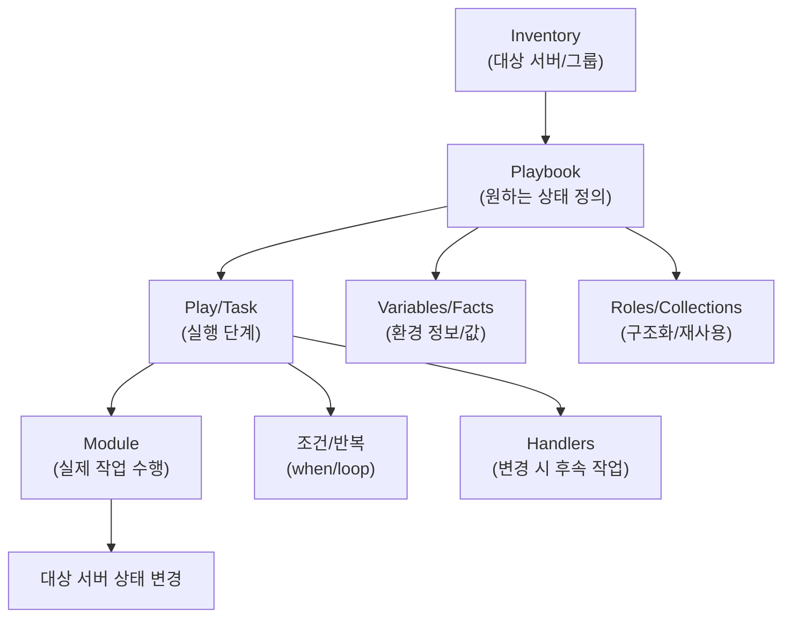

# Ansible
- 여러 서버의 설정/배포/운영 작업을 코드 기반으로 자동화하는 도구.
- 사람이 직접 커맨드를 쳐가며 수행했던 작업을 코드로 만드는 것이 핵심이다.
- Agentless: 관리 대상 서버에 별도의 프로그램 설치 없이도, SSH로 접속 후 작업한다.

## Keywords
- 인벤토리(Inventory): 관리할 서버 목록. IP/호스트명/그룹을 적어두는 파일이다.
- 플레이북(Playbook): 무엇을 어떻게 할지 적은 yaml 파일. 작업 순서를 선언적으로 정의한다.
- 태스크(Task): 플레이북 안의 개별 작업 단위. (ex: nginx 설치/설정 변경, 서비스 재시작)
- 모듈(Module): 실제 작업을 수행하는 단위 기능. (ex: `apt`, `yum`, `service`, `copy` 같은 표준 모듈 등)
- 멱등성(Idempotent): 같은 작업을 여러번 실행해도 결과가 같아야 함. Ansible의 중요한 설계 철학.
- 변수(Variables): 환경별로 값이 다른 설정을 분리하여 관리. (ex: 포트 번호, 패키지 버전, 경로 등)
- 핸들러(Handler): 특정 변화가 있을 때만 실행되는 작업. (ex: 설정 파일이 바뀌면 -> 서비스 재시작)
- 롤(Role): 플레이북을 구조화해서 재사용하는 방식. 역할별(웹, DB 등)로 디렉토리 구조가 정해진다.
- 팩트(Facts): Ansible이 대상 서버에서 자동 수집하는 시스템 정보. (ex: OS 종류, IP, 메모리 등)


## Node
- Control Node(제어 노드): Ansible이 실행되는 머신.
  - 인벤토리/플레이북/롤을 보관하고 ansible/ansible-playbook으로 작업을 실행한다.
  - 보통 관리자가 직접 사용하는 운영/CI 서버가 된다.
- Managed Node(관리 대상 노드): Ansible이 제어하는 서버/장비.
  - Control Node가 SSH(또는 WinRM)로 접속해 모듈을 실행해 원하는 상태로 만든다.
  - 별도 에이전트 없이 동작하는 것이 기본이다.

### Managed Node의 기본 전제
- SSH 접속 가능: 관리 노드에서 대상 서버로 SSH 접속이 되어야 한다.
- Python Interpreter: 대부분의 모듈은 대상 서버에 Python이 필요하다. (특수한 경량 환경은 `raw` 모듈로 가능.)
- 권한/계정: 필요한 작업을 수행할 수 있는 계정(ex: sudo)이 있어야 한다.
- 네트워크/방화벽: 관리 노드 -> 대상 서버로 SSH 포트(tcp/22) 통신이 열려 있어야 한다.

## Ansible Core
- Ansible의 핵심 엔진만 담은 최소 구성 패키지이다.
- Control Node에 설치되며, 플레이북 실행과 모듈 전송/실행을 담당한다.
- 자동화 실행 엔진, 기본 CLI(`ansible`, `ansible-playbook`), 그리고 꼭 필요한 최소한의 built-in 모듈만 포함된다.
  - 범위: 실행 엔진 + 기본 CLI + 최소 모듈
  - 제외: 다양한 추가 모듈/플러그인/클라우드 연동은 컬렉션(Collections)로 분리
  - 즉, 가볍고 안정적인 기본 런타임을 제공하고, 필요한 기능은 컬렉션으로 확장


## 실행 흐름
```
인벤토리 구성 -> 플렉이북 실행 -> 모듈이 원격 서버에서 작업 수행 -> 결과 리포트
```



## Ansible은 어떻게 멱등성(Idempotent)를 유지할 수 있는가?
- 모듈이 현재 상태를 먼저 확인: 대부분의 모듈은 실행 전에 대상 시스템 상태를 읽고, 원하는 상태와 다를 때만 변경한다.
- 선언적 파라미터: `state: present/absent`, `enable: true` 같은 선언으로 원하는 결과를 정의한다.
- 변경 여부 반환: 모듈은 실제로 변경했는지 `changed` 결과를 반환해, 후속 작업(handler)도 필요한 경우에만 실행된다.
- 체크모드/diff: `--check`로 변경없이 시뮬레이션, `--diff`로 변경 내용을 비교 가능하다.
- 예외도 있음: `command`, `shell`, `raw` 같은 모듈은 상태를 추적하지 않으므로, 멱등성이 깨질 수 있으니 주의.


## Terraform과의 비교

공통점
- 모두 IaC 원칙으로 인프라/운영 작업을 코드로 관리할 수 있다는 것.
- 선언적, Desired State 정의, 자동화/재현성/버전관리와 잘 맞다.

차이
- Ansible은 서버 구성/배포/운영 자동화에 강하다. Terraform은 인프라 리소스 생성/변경/삭제에 강하다.
- Ansible은 주로 SSH로 원격 명령 실행. Terraform은 각 클라우드/호환API를 호출해 리소스 상태를 관리한다.
- Terraform은 state 파일로 리소스의 현재 상태를 추적한다. 그래서 `plan` 시점에 “현재 상태 vs 선언한 상태”의 차이를 비교해 어떤 리소스가 **추가/변경/삭제**될지 명확히 보여준다.
- Ansible의 `--check`는 실제 상태를 저장하지 않고 모듈별로 “변경될 것 같은지”를 추정하므로, 모듈에 따라 정확도가 다르고 전체 변경 내역을 Terraform처럼 일관되게 보여주기는 어렵다.
- Terraform은 리소스간 의존성을 **연결 관계**(누가 누구를 참조하는지)로 관리한다. 예를 들어 EC2가 보안그룹/서브넷을 참조하면 Terraform이 이를 **의존 관계로 자동 인식**해 올바른 순서로 생성·삭제하고, 서로 독립인 리소스는 병렬로 실행한다.
- 반면 Ansible은 플레이북의 **태스크 순서대로** 실행되므로, “DB를 먼저 구성한 뒤 앱을 배포” 같은 의존 관계를 `when`, `handlers`, `block` 등으로 **직접 설계**해야 한다.
