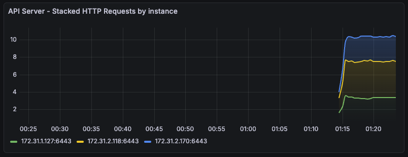
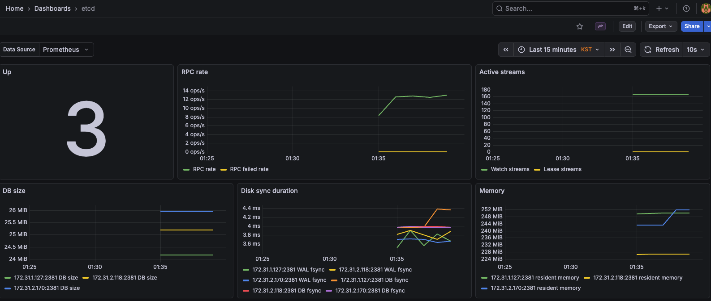

# 모니터링 컴포넌트 추가

## NFS subdir external provisioner 설치
```bash

# NFS subdir external provisioner 설치: admin-lb 에 NFS Server(/srv/nfs/share) 설정 되어 있음.
[root@admin-lb kubespray]# k create ns nfs-provisioner
namespace/nfs-provisioner created

[root@admin-lb kubespray]# helm repo add nfs-subdir-external-provisioner https://kubernetes-sigs.github.io/nfs-subdir-external-provisioner/
"nfs-subdir-external-provisioner" has been added to your repositories

[root@admin-lb kubespray]# helm install nfs-provisioner nfs-subdir-external-provisioner/nfs-subdir-external-provisioner -n nfs-provisioner \
    --set nfs.server=172.31.4.90 \
    --set nfs.path=/srv/nfs/share \
    --set storageClass.defaultClass=true
NAME: nfs-provisioner
LAST DEPLOYED: Sat Feb  7 16:04:22 2026
NAMESPACE: nfs-provisioner
STATUS: deployed
REVISION: 1
TEST SUITE: None

# 스토리지 클래스 확인
[root@admin-lb kubespray]# k get sc
NAME                   PROVISIONER                                                     RECLAIMPOLICY   VOLUMEBINDINGMODE   ALLOWVOLUMEEXPANSION   AGE
nfs-client (default)   cluster.local/nfs-provisioner-nfs-subdir-external-provisioner   Delete          Immediate           true                   17s

# 파드 확인
[root@admin-lb kubespray]# k get pod -n nfs-provisioner -owide
NAME                                                              READY   STATUS    RESTARTS   AGE   IP            NODE        NOMINATED NODE   READINESS GATES
nfs-provisioner-nfs-subdir-external-provisioner-597d49bc9fpr58q   1/1     Running   0          35s   10.233.69.2   k8s-node5   <none>           <none>
```

## kube-prometheus-stack 설치 & 대시보드 추가
```bash
[root@admin-lb kubespray]# helm repo add prometheus-community https://prometheus-community.github.io/helm-charts
"prometheus-community" has been added to your repositories

# 파라미터 파일 생성
cat <<EOT > monitor-values.yaml
prometheus:
  prometheusSpec:
    scrapeInterval: "20s"
    evaluationInterval: "20s"
    storageSpec:
      volumeClaimTemplate:
        spec:
          accessModes: ["ReadWriteOnce"]
          resources:
            requests:
              storage: 10Gi
    additionalScrapeConfigs:
      - job_name: 'haproxy-metrics'
        static_configs:
          - targets:
              - '172.31.4.90:8405'
    externalLabels:
      cluster: "myk8s-cluster"
  service:
    type: NodePort
    nodePort: 30001

grafana:
  defaultDashboardsTimezone: Asia/Seoul
  adminPassword: prom-operator
  service:
    type: NodePort
    nodePort: 30002

alertmanager:
  enabled: false
defaultRules:
  create: false
kubeProxy:
  enabled: false
prometheus-windows-exporter:
  prometheus:
    monitor:
      enabled: false
EOT

# 배포
[root@admin-lb kubespray]# helm install kube-prometheus-stack prometheus-community/kube-prometheus-stack --version 80.13.3 -f monitor-values.yaml --create-namespace --namespace monitoring
NAME: kube-prometheus-stack
LAST DEPLOYED: Sat Feb  7 16:13:13 2026
NAMESPACE: monitoring
STATUS: deployed
REVISION: 1
NOTES:
kube-prometheus-stack has been installed. Check its status by running:
  kubectl --namespace monitoring get pods -l "release=kube-prometheus-stack"

Get Grafana 'admin' user password by running:

  kubectl --namespace monitoring get secrets kube-prometheus-stack-grafana -o jsonpath="{.data.admin-password}" | base64 -d ; echo

Access Grafana local instance:

  export POD_NAME=$(kubectl --namespace monitoring get pod -l "app.kubernetes.io/name=grafana,app.kubernetes.io/instance=kube-prometheus-stack" -oname)
  kubectl --namespace monitoring port-forward $POD_NAME 3000

Get your grafana admin user password by running:

  kubectl get secret --namespace monitoring -l app.kubernetes.io/component=admin-secret -o jsonpath="{.items[0].data.admin-password}" | base64 --decode ; echo


Visit https://github.com/prometheus-operator/kube-prometheus for instructions on how to create & configure Alertmanager and Prometheus instances using the Operator.


# 확인
[root@admin-lb kubespray]# helm list -n monitoring
NAME                    NAMESPACE       REVISION        UPDATED                                 STATUS      CHART                           APP VERSION
kube-prometheus-stack   monitoring      1               2026-02-07 16:13:13.099235382 +0000 UTC deployed    kube-prometheus-stack-80.13.3   v0.87.1   

[root@admin-lb kubespray]# k get pod,svc,ingress,pvc -n monitoring
NAME                                                            READY   STATUS    RESTARTS   AGE
pod/kube-prometheus-stack-grafana-5cb7c586f9-64q95              3/3     Running   0          77s
pod/kube-prometheus-stack-kube-state-metrics-7846957b5b-9fjvs   1/1     Running   0          77s
pod/kube-prometheus-stack-operator-584f446c98-8s9pk             1/1     Running   0          77s
pod/kube-prometheus-stack-prometheus-node-exporter-9n2d4        1/1     Running   0          77s
pod/kube-prometheus-stack-prometheus-node-exporter-bk45p        1/1     Running   0          77s
pod/kube-prometheus-stack-prometheus-node-exporter-fsjm8        1/1     Running   0          77s
pod/kube-prometheus-stack-prometheus-node-exporter-n2dj7        1/1     Running   0          77s
pod/kube-prometheus-stack-prometheus-node-exporter-wkm9k        1/1     Running   0          77s
pod/prometheus-kube-prometheus-stack-prometheus-0               2/2     Running   0          72s

NAME                                                     TYPE        CLUSTER-IP      EXTERNAL-IP   PORT(S)                         AGE
service/kube-prometheus-stack-grafana                    NodePort    10.233.9.216    <none>        80:30002/TCP                    77s
service/kube-prometheus-stack-kube-state-metrics         ClusterIP   10.233.49.193   <none>        8080/TCP                        77s
service/kube-prometheus-stack-operator                   ClusterIP   10.233.63.148   <none>        443/TCP                         77s
service/kube-prometheus-stack-prometheus                 NodePort    10.233.7.75     <none>        9090:30001/TCP,8080:32362/TCP   77s
service/kube-prometheus-stack-prometheus-node-exporter   ClusterIP   10.233.13.224   <none>        9100/TCP                        77s
service/prometheus-operated                              ClusterIP   None            <none>        9090/TCP                        73s

NAME                                                                                                                 STATUS   VOLUME                                     CAPACITY   ACCESS MODES   STORAGECLASS   VOLUMEATTRIBUTESCLASS   AGE
persistentvolumeclaim/prometheus-kube-prometheus-stack-prometheus-db-prometheus-kube-prometheus-stack-prometheus-0   Bound    pvc-e7981564-82df-424b-9cf5-6723dcf919f2   10Gi       RWO            nfs-client     <unset>                 72s

[root@admin-lb kubespray]# k get prometheus,servicemonitors,alertmanagers -n monitoring
NAME                                                                VERSION   DESIRED   READY   RECONCILED   AVAILABLE   AGE
prometheus.monitoring.coreos.com/kube-prometheus-stack-prometheus   v3.9.1    1         1       True         True        89s

NAME                                                                                  AGE
servicemonitor.monitoring.coreos.com/kube-prometheus-stack-apiserver                  89s
servicemonitor.monitoring.coreos.com/kube-prometheus-stack-coredns                    89s
servicemonitor.monitoring.coreos.com/kube-prometheus-stack-grafana                    89s
servicemonitor.monitoring.coreos.com/kube-prometheus-stack-kube-controller-manager    89s
servicemonitor.monitoring.coreos.com/kube-prometheus-stack-kube-etcd                  89s
servicemonitor.monitoring.coreos.com/kube-prometheus-stack-kube-scheduler             89s
servicemonitor.monitoring.coreos.com/kube-prometheus-stack-kube-state-metrics         89s
servicemonitor.monitoring.coreos.com/kube-prometheus-stack-kubelet                    89s
servicemonitor.monitoring.coreos.com/kube-prometheus-stack-operator                   89s
servicemonitor.monitoring.coreos.com/kube-prometheus-stack-prometheus                 89s
servicemonitor.monitoring.coreos.com/kube-prometheus-stack-prometheus-node-exporter   89s

[root@admin-lb kubespray]# k get crd | grep monitoring
alertmanagerconfigs.monitoring.coreos.com   2026-02-07T16:11:20Z
alertmanagers.monitoring.coreos.com         2026-02-07T16:11:20Z
podmonitors.monitoring.coreos.com           2026-02-07T16:11:20Z
probes.monitoring.coreos.com                2026-02-07T16:11:20Z
prometheusagents.monitoring.coreos.com      2026-02-07T16:11:21Z
prometheuses.monitoring.coreos.com          2026-02-07T16:11:21Z
prometheusrules.monitoring.coreos.com       2026-02-07T16:11:21Z
scrapeconfigs.monitoring.coreos.com         2026-02-07T16:11:21Z
servicemonitors.monitoring.coreos.com       2026-02-07T16:11:21Z
thanosrulers.monitoring.coreos.com          2026-02-07T16:11:22Z

# NodePort로 웹 접속
open http://{NODE_PUBLIC_IP}:30001 # prometheus
open http://{NODE_PUBLIC_IP}:30002 # grafana : 접속 계정 admin / prom-operator
```

### Grafana 대시보드 추가
```bash
# 대시보드 다운로드
curl -o 12693_rev12.json https://grafana.com/api/dashboards/12693/revisions/12/download
curl -o 15661_rev2.json https://grafana.com/api/dashboards/15661/revisions/2/download
curl -o k8s-system-api-server.json https://raw.githubusercontent.com/dotdc/grafana-dashboards-kubernetes/refs/heads/master/dashboards/k8s-system-api-server.json

# sed 명령어로 uid 일괄 변경 : 기본 데이터소스의 uid 'prometheus' 사용
sed -i -e 's/${DS_PROMETHEUS}/prometheus/g' 12693_rev12.json
sed -i -e 's/${DS__VICTORIAMETRICS-PROD-ALL}/prometheus/g' 15661_rev2.json
sed -i -e 's/${DS_PROMETHEUS}/prometheus/g' k8s-system-api-server.json

# my-dashboard configmap 생성 : Grafana Pod 내의 사이드카 컨테이너가 grafana_dashboard="1" 라벨 탐지함.
[root@admin-lb kubespray]# k create configmap my-dashboard --from-file=12693_rev12.json --from-file=15661_rev2.json --from-file=k8s-system-api-server.json -n monitoring
configmap/my-dashboard created

[root@admin-lb kubespray]# k label configmap my-dashboard grafana_dashboard="1" -n monitoring
configmap/my-dashboard labeled

# 대시보드 경로에 추가 확인
[root@admin-lb kubespray]# k exec -it -n monitoring deploy/kube-prometheus-stack-grafana -- ls -l /tmp/dashboards
total 976
-rw-r--r--    1 grafana  472         333790 Feb  7 16:17 12693_rev12.json
-rw-r--r--    1 grafana  472         198839 Feb  7 16:17 15661_rev2.json
-rw-r--r--    1 grafana  472          12367 Feb  7 16:13 apiserver.json
-rw-r--r--    1 grafana  472          15598 Feb  7 16:13 cluster-total.json
-rw-r--r--    1 grafana  472           8600 Feb  7 16:13 controller-manager.json
-rw-r--r--    1 grafana  472           8340 Feb  7 16:13 etcd.json
-rw-r--r--    1 grafana  472           7282 Feb  7 16:13 grafana-overview.json
-rw-r--r--    1 grafana  472          25210 Feb  7 16:13 k8s-coredns.json
-rw-r--r--    1 grafana  472          26811 Feb  7 16:13 k8s-resources-cluster.json
-rw-r--r--    1 grafana  472           9837 Feb  7 16:13 k8s-resources-multicluster.json
-rw-r--r--    1 grafana  472          27310 Feb  7 16:13 k8s-resources-namespace.json
-rw-r--r--    1 grafana  472          11208 Feb  7 16:13 k8s-resources-node.json
-rw-r--r--    1 grafana  472          25881 Feb  7 16:13 k8s-resources-pod.json
-rw-r--r--    1 grafana  472          24677 Feb  7 16:13 k8s-resources-workload.json
-rw-r--r--    1 grafana  472          27747 Feb  7 16:13 k8s-resources-workloads-namespace.json
-rw-r--r--    1 grafana  472          35173 Feb  7 16:17 k8s-system-api-server.json
-rw-r--r--    1 grafana  472          19009 Feb  7 16:13 kubelet.json
-rw-r--r--    1 grafana  472          11767 Feb  7 16:13 namespace-by-pod.json
-rw-r--r--    1 grafana  472          19013 Feb  7 16:13 namespace-by-workload.json
-rw-r--r--    1 grafana  472           8222 Feb  7 16:13 node-cluster-rsrc-use.json
-rw-r--r--    1 grafana  472           7833 Feb  7 16:13 node-rsrc-use.json
-rw-r--r--    1 grafana  472           9750 Feb  7 16:13 nodes-aix.json
-rw-r--r--    1 grafana  472          10987 Feb  7 16:13 nodes-darwin.json
-rw-r--r--    1 grafana  472          10339 Feb  7 16:13 nodes.json
-rw-r--r--    1 grafana  472           5971 Feb  7 16:13 persistentvolumesusage.json
-rw-r--r--    1 grafana  472           6775 Feb  7 16:13 pod-total.json
-rw-r--r--    1 grafana  472          11115 Feb  7 16:13 prometheus.json
-rw-r--r--    1 grafana  472           9731 Feb  7 16:13 scheduler.json
-rw-r--r--    1 grafana  472          11025 Feb  7 16:13 workload-total.json
```

`Kubernetes / System / API Server` 대시보드에서 상태를 확인해보자.


## etcd 메트릭 수집 설정 추가
```bash
# 기본적으로 2381 메트릭 포트/설정 없음.
[root@admin-lb kubespray]# ssh k8s-node1 ss -tnlp | grep etcd
LISTEN 0      4096       127.0.0.1:2379       0.0.0.0:*    users:(("etcd",pid=4596,fd=7))           
LISTEN 0      4096    172.31.1.127:2379       0.0.0.0:*    users:(("etcd",pid=4596,fd=8))           
LISTEN 0      4096    172.31.1.127:2380       0.0.0.0:*    users:(("etcd",pid=4596,fd=6)) 

# 오버라이딩용 변수 목록 확인
[root@admin-lb kubespray]# cat roles/etcd/templates/etcd.env.j2 | grep -i metric
ETCD_METRICS={{ etcd_metrics }}

ETCD_LISTEN_METRICS_URLS={{ etcd_listen_metrics_urls }}

ETCD_LISTEN_METRICS_URLS=http://{{ etcd_address | ansible.utils.ipwrap }}:{{ etcd_metrics_port }},http://127.0.0.1:{{ etcd_metrics_port }}

# 변수 수정
cat << EOF >> inventory/mycluster/group_vars/k8s_cluster/k8s-cluster.yml
etcd_metrics: true
etcd_listen_metrics_urls: "http://0.0.0.0:2381"
EOF

[root@admin-lb kubespray]# tail -n 5 inventory/mycluster/group_vars/k8s_cluster/k8s-cluster.yml
# Set to true to remove the role binding to anonymous users created by kubeadm
remove_anonymous_access: false
enable_dns_autoscaler: false
etcd_metrics: true
etcd_listen_metrics_urls: "http://0.0.0.0:2381"

# etcd 재시작!
ansible-playbook -i inventory/mycluster/inventory.ini -v cluster.yml --tags "etcd" --list-tasks
ansible-playbook -i inventory/mycluster/inventory.ini -v cluster.yml --tags "etcd" --limit etcd -e kube_version="1.32.9"


# 확인
[root@admin-lb kubespray]# ssh k8s-node1 ss -tnlp | grep etcd
LISTEN 0      4096       127.0.0.1:2379       0.0.0.0:*    users:(("etcd",pid=47033,fd=7))          
LISTEN 0      4096    172.31.1.127:2379       0.0.0.0:*    users:(("etcd",pid=47033,fd=8))          
LISTEN 0      4096    172.31.1.127:2380       0.0.0.0:*    users:(("etcd",pid=47033,fd=6))          
LISTEN 0      4096               *:2381             *:*    users:(("etcd",pid=47033,fd=21)) 

# 호출 확인
curl -s http://172.31.1.127:2381/metrics
curl -s http://172.31.2.170:2381/metrics
curl -s http://172.31.2.118:2381/metrics

# 스크래핑 설정 추가
cat <<EOF > monitor-add-values.yaml
prometheus:
  prometheusSpec:
    additionalScrapeConfigs:
      - job_name: 'etcd'
        metrics_path: /metrics 
        static_configs:
          - targets:
              - '172.31.1.127:2381'
              - '172.31.2.170:2381'
              - '172.31.2.118:2381'
EOF

# helm upgrade 로 적용
[root@admin-lb kubespray]# helm get values -n monitoring kube-prometheus-stack
USER-SUPPLIED VALUES:
alertmanager:
  enabled: false
defaultRules:
  create: false
grafana:
  adminPassword: prom-operator
  defaultDashboardsTimezone: Asia/Seoul
  service:
    nodePort: 30002
    type: NodePort
kubeProxy:
  enabled: false
prometheus:
  prometheusSpec:
    additionalScrapeConfigs:
    - job_name: haproxy-metrics
      static_configs:
      - targets:
        - 172.31.4.90:8405
    evaluationInterval: 20s
    externalLabels:
      cluster: myk8s-cluster
    scrapeInterval: 20s
    storageSpec:
      volumeClaimTemplate:
        spec:
          accessModes:
          - ReadWriteOnce
          resources:
            requests:
              storage: 10Gi
  service:
    nodePort: 30001
    type: NodePort
prometheus-windows-exporter:
  prometheus:
    monitor:
      enabled: false

[root@admin-lb kubespray]# helm upgrade kube-prometheus-stack prometheus-community/kube-prometheus-stack --version 80.13.3 \
--reuse-values -f monitor-add-values.yaml --namespace monitoring
Release "kube-prometheus-stack" has been upgraded. Happy Helming!
NAME: kube-prometheus-stack
LAST DEPLOYED: Sat Feb  7 16:32:24 2026
NAMESPACE: monitoring
STATUS: deployed
REVISION: 2
```

이후, `etcd` 대시보드에서 상태를 확인해보자.
