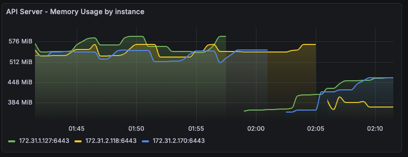

# kubespray로 k8s 업그레이드
- 1.32.9 → 1.32.10 (패치 업그레이드) → 1.33.7 (마이너 업그레이드) → 1.34.3 : 최소 중단(무중단) 업그레이드 수행

## 사전 작업: cni plugin upgrade
```bash
# 관련 변수 검색
[root@admin-lb kubespray]# grep -Rni "flannel" inventory/mycluster/ playbooks/ roles/ --include="*.yml" -A2 -B1 | grep version
roles/kubespray_defaults/defaults/main/download.yml:115:flannel_version: 0.27.3
roles/kubespray_defaults/defaults/main/download.yml:116:flannel_cni_version: 1.7.1-flannel1
roles/kubespray_defaults/defaults/main/download.yml-117-cni_version: "{{ (cni_binary_checksums['amd64'] | dict2items)[0].key }}"
roles/kubespray_defaults/defaults/main/download.yml-218-etcd_image_tag: "v{{ etcd_version }}"
roles/kubespray_defaults/defaults/main/download.yml:220:flannel_image_tag: "v{{ flannel_version }}"
roles/kubespray_defaults/defaults/main/download.yml:222:flannel_init_image_tag: "v{{ flannel_cni_version }}"
roles/kubespray_defaults/defaults/main/download.yml-224-calico_node_image_tag: "v{{ calico_version }}"
roles/network_plugin/flannel/tasks/main.yml:3:- name: Flannel | Stop if kernel version is too low for Flannel Wireguard encryption
roles/network_plugin/flannel/tasks/main.yml-5-    that: ansible_kernel.split('-')[0] is version('5.6.0', '>=')

# 현재 정보 확인
[root@admin-lb kubespray]# k get ds -n kube-system -owide
NAME                      DESIRED   CURRENT   READY   UP-TO-DATE   AVAILABLE   NODE SELECTOR            AGE    CONTAINERS     IMAGES                               SELECTOR
kube-flannel              5         5         5       5            5           <none>                   126m   kube-flannel   docker.io/flannel/flannel:v0.27.3    app=flannel
kube-flannel-ds-arm       0         0         0       0            0           <none>                   126m   kube-flannel   docker.io/flannel/flannel:v0.27.3    app=flannel
kube-flannel-ds-arm64     0         0         0       0            0           <none>                   126m   kube-flannel   docker.io/flannel/flannel:v0.27.3    app=flannel
kube-flannel-ds-ppc64le   0         0         0       0            0           <none>                   126m   kube-flannel   docker.io/flannel/flannel:v0.27.3    app=flannel
kube-flannel-ds-s390x     0         0         0       0            0           <none>                   126m   kube-flannel   docker.io/flannel/flannel:v0.27.3    app=flannel
kube-proxy                5         5         5       5            5           kubernetes.io/os=linux   128m   kube-proxy     registry.k8s.io/kube-proxy:v1.32.9   k8s-app=kube-proxy

[root@admin-lb kubespray]# ssh k8s-node1 crictl images
IMAGE                                                 TAG                 IMAGE ID            SIZE
docker.io/flannel/flannel-cni-plugin                  v1.7.1-flannel1     48b5d33f9a21f       4.88MB
docker.io/flannel/flannel                             v0.27.3             3475d115f79b6       34MB
quay.io/prometheus/node-exporter                      v1.10.2             2715d223fd463       13.1MB
registry.k8s.io/coredns/coredns                       v1.11.3             c69fa2e9cbf5f       18.6MB
registry.k8s.io/cpa/cluster-proportional-autoscaler   v1.8.8              b6d1a4be0743f       11.6MB
registry.k8s.io/kube-apiserver                        v1.32.9             abd2b525baf42       28.8MB
registry.k8s.io/kube-controller-manager               v1.32.9             0debe32fbb722       26.4MB
registry.k8s.io/kube-proxy                            v1.32.9             fa3fdca615a50       30.9MB
registry.k8s.io/kube-scheduler                        v1.32.9             6934c23b154fc       20.8MB
registry.k8s.io/metrics-server/metrics-server         v0.8.0              b9e1e3849e070       22.5MB
registry.k8s.io/pause                                 3.10                873ed75102791       320kB


# flannel 설정 수정
cat << EOF >> inventory/mycluster/group_vars/k8s_cluster/k8s-net-flannel.yml
flannel_version: 0.27.4
EOF

[root@admin-lb kubespray]# grep "^[^#]" inventory/mycluster/group_vars/k8s_cluster/k8s-net-flannel.yml
flannel_interface: ens5
flannel_version: 0.27.4

# 반영: 단, flannel 은 ds 이므로 특정 대상 노드로 수행 불가. (production 환경이면 CNI는 kubespray와는 별도로 관리하자.)
ansible-playbook -i inventory/mycluster/inventory.ini -v upgrade-cluster.yml --tags "flannel" -e kube_version="1.32.9"

# 확인
[root@admin-lb kubespray]# k get ds -n kube-system -owide
NAME                      DESIRED   CURRENT   READY   UP-TO-DATE   AVAILABLE   NODE SELECTOR            AGE    CONTAINERS     IMAGES                               SELECTOR
kube-flannel              5         5         5       5            5           <none>                   131m   kube-flannel   docker.io/flannel/flannel:v0.27.4    app=flannel
kube-flannel-ds-arm       0         0         0       0            0           <none>                   131m   kube-flannel   docker.io/flannel/flannel:v0.27.4    app=flannel
kube-flannel-ds-arm64     0         0         0       0            0           <none>                   131m   kube-flannel   docker.io/flannel/flannel:v0.27.4    app=flannel
kube-flannel-ds-ppc64le   0         0         0       0            0           <none>                   131m   kube-flannel   docker.io/flannel/flannel:v0.27.4    app=flannel
kube-flannel-ds-s390x     0         0         0       0            0           <none>                   131m   kube-flannel   docker.io/flannel/flannel:v0.27.4    app=flannel
kube-proxy                5         5         5       5            5           kubernetes.io/os=linux   132m   kube-proxy     registry.k8s.io/kube-proxy:v1.32.9   k8s-app=kube-proxy

[root@admin-lb kubespray]# ssh k8s-node1 crictl images
IMAGE                                                 TAG                 IMAGE ID            SIZE
docker.io/flannel/flannel-cni-plugin                  v1.7.1-flannel1     48b5d33f9a21f       4.88MB
docker.io/flannel/flannel                             v0.27.3             3475d115f79b6       34MB
docker.io/flannel/flannel                             v0.27.4             17a808f509707       34.1MB
quay.io/prometheus/node-exporter                      v1.10.2             2715d223fd463       13.1MB
registry.k8s.io/coredns/coredns                       v1.11.3             c69fa2e9cbf5f       18.6MB
registry.k8s.io/cpa/cluster-proportional-autoscaler   v1.8.8              b6d1a4be0743f       11.6MB
registry.k8s.io/kube-apiserver                        v1.32.9             abd2b525baf42       28.8MB
registry.k8s.io/kube-controller-manager               v1.32.9             0debe32fbb722       26.4MB
registry.k8s.io/kube-proxy                            v1.32.9             fa3fdca615a50       30.9MB
registry.k8s.io/kube-scheduler                        v1.32.9             6934c23b154fc       20.8MB
registry.k8s.io/metrics-server/metrics-server         v0.8.0              b9e1e3849e070       22.5MB
registry.k8s.io/pause                                 3.10                873ed75102791       320kB

[root@admin-lb kubespray]# k get pod -n kube-system -l app=flannel -owide
NAME                 READY   STATUS    RESTARTS   AGE    IP             NODE        NOMINATED NODE   READINESS GATES
kube-flannel-5m6vl   1/1     Running   0          89s    172.31.2.118   k8s-node3   <none>           <none>
kube-flannel-fnd59   1/1     Running   0          105s   172.31.1.127   k8s-node1   <none>           <none>
kube-flannel-lx8q9   1/1     Running   0          73s    172.31.7.101   k8s-node4   <none>           <none>
kube-flannel-m6fvr   1/1     Running   0          81s    172.31.2.170   k8s-node2   <none>           <none>
kube-flannel-zrnhg   1/1     Running   0          97s    172.31.1.69    k8s-node5   <none>           <none>
```

## k8s upgrade : 1.32.9 → 1.32.10

```bash
ansible-playbook -i inventory/mycluster/inventory.ini upgrade-cluster.yml --list-tags
ANSIBLE_FORCE_COLOR=true ansible-playbook -i inventory/mycluster/inventory.ini -v upgrade-cluster.yml -e kube_version="1.32.10" --limit "kube_control_plane:etcd" | tee kubespray_upgrade-1.log

# 업그레이드 확인
[root@admin-lb kubespray]# k get node -owide
NAME        STATUS   ROLES           AGE    VERSION    INTERNAL-IP    EXTERNAL-IP   OS-IMAGE                        KERNEL-VERSION                  CONTAINER-RUNTIME
k8s-node1   Ready    control-plane   152m   v1.32.10   172.31.1.127   <none>        Rocky Linux 10.1 (Red Quartz)   6.12.0-124.29.1.el10_1.x86_64   containerd://2.1.5
k8s-node2   Ready    control-plane   152m   v1.32.10   172.31.2.170   <none>        Rocky Linux 10.1 (Red Quartz)   6.12.0-124.29.1.el10_1.x86_64   containerd://2.1.5
k8s-node3   Ready    control-plane   152m   v1.32.10   172.31.2.118   <none>        Rocky Linux 10.1 (Red Quartz)   6.12.0-124.29.1.el10_1.x86_64   containerd://2.1.5
k8s-node4   Ready    <none>          151m   v1.32.9    172.31.7.101   <none>        Rocky Linux 10.1 (Red Quartz)   6.12.0-124.29.1.el10_1.x86_64   containerd://2.1.5
k8s-node5   Ready    <none>          68m    v1.32.9    172.31.1.69    <none>        Rocky Linux 10.1 (Red Quartz)   6.12.0-124.28.1.el10_1.x86_64   containerd://2.1.5


# apiserver, kcm, scheduler 와 kube-proxy 가 1.32.10 업그레이드됨.
# coredns, pause, etcd 는 기존 버전 그대로.
[root@admin-lb kubespray]# ssh k8s-node1 crictl images
IMAGE                                                 TAG                 IMAGE ID            SIZE
docker.io/flannel/flannel-cni-plugin                  v1.7.1-flannel1     48b5d33f9a21f       4.88MB
docker.io/flannel/flannel                             v0.27.3             3475d115f79b6       34MB
docker.io/flannel/flannel                             v0.27.4             17a808f509707       34.1MB
quay.io/prometheus/node-exporter                      v1.10.2             2715d223fd463       13.1MB
registry.k8s.io/coredns/coredns                       v1.11.3             c69fa2e9cbf5f       18.6MB
registry.k8s.io/cpa/cluster-proportional-autoscaler   v1.8.8              b6d1a4be0743f       11.6MB
registry.k8s.io/kube-apiserver                        v1.32.10            77f8b0de97da9       29.1MB
registry.k8s.io/kube-apiserver                        v1.32.9             abd2b525baf42       28.8MB
registry.k8s.io/kube-controller-manager               v1.32.10            34e0beef266f1       26.6MB
registry.k8s.io/kube-controller-manager               v1.32.9             0debe32fbb722       26.4MB
registry.k8s.io/kube-proxy                            v1.32.10            db4bcdca85a39       31.2MB
registry.k8s.io/kube-proxy                            v1.32.9             fa3fdca615a50       30.9MB
registry.k8s.io/kube-scheduler                        v1.32.10            fd6f6aae834c2       21.1MB
registry.k8s.io/kube-scheduler                        v1.32.9             6934c23b154fc       20.8MB
registry.k8s.io/metrics-server/metrics-server         v0.8.0              b9e1e3849e070       22.5MB
registry.k8s.io/pause                                 3.10                873ed75102791       320kB
```

대시보드에서 kube-apiserver 재기동 확인.


## k8s upgrade : 1.32.10 → 1.33.7 

### control plane upgrade
```bash
[root@admin-lb kubespray]# cat roles/kubespray_defaults/vars/main/checksums.yml | grep kubelet -A30
kubelet_checksums:
  arm64:
    1.33.7: sha256:3035c44e0d429946d6b4b66c593d371cf5bbbfc85df39d7e2a03c422e4fe404a
    1.33.6: sha256:7d8b7c63309cfe2da2331a1ae13cce070b9ba01e487099e7881a4281667c131d
    1.33.5: sha256:c6ad0510c089d49244eede2638b4a4ff125258fd29a0649e7eef05c7f79c737f
    1.33.4: sha256:623329b1a5f4858e3a5406d3947807b75144f4e71dde11ef1a71362c3a8619cc
    1.33.3: sha256:3f69bb32debfaf25fce91aa5e7181e1e32f3550f3257b93c17dfb37bed621a9c
    1.33.2: sha256:0fa15aca9b90fe7aef1ed3aad31edd1d9944a8c7aae34162963a6aaaf726e065
    1.33.1: sha256:10540261c311ae005b9af514d83c02694e12614406a8524fd2d0bad75296f70d
    1.33.0: sha256:ae5a4fc6d733fc28ff198e2d80334e21fcb5c34e76b411c50fff9cb25accf05a
    1.32.10: sha256:21cc3d98550d3a23052d649e77956f2557e7f6119ff1e27dc82b852d006136cd
    1.32.9: sha256:29037381c79152409adacee83448a2bdb67e113f003613663c7589286200ded8
    1.32.8: sha256:d5527714fac08eac4c1ddcbd8a3c6db35f3acd335d43360219d733273b672cce
    1.32.7: sha256:b862a8d550875924c8abed6c15ba22564f7e232c239aa6a2e88caf069a0ab548
    1.32.6: sha256:b045d4f8f96bf934c894f9704ab2931ffa3c6cf78a8d98e457482a6c455dab6d
    1.32.5: sha256:034753a2e308afeb4ce3cf332d38346c6e660252eac93b268fac0e112a56ff46
    1.32.4: sha256:91117b71eb2bb3dd79ec3ed444e058a347349108bf661838f53ee30d2a0ff168
    1.32.3: sha256:5c3c98e6e0fa35d209595037e05022597954b8d764482417a9588e15218f0fe2
    1.32.2: sha256:d74b659bbde5adf919529d079975900e51e10bc807f0fda9dc9f6bb07c4a3a7b
    1.32.1: sha256:8e6d0eeedd9f0b8b38d4f600ee167816f71cf4dacfa3d9a9bb6c3561cc884e95
    1.32.0: sha256:bda9b2324c96693b38c41ecea051bab4c7c434be5683050b5e19025b50dbc0bf
    1.31.14: sha256:e2842f132933b990a8cbc285be3a28ff1cd213fe1a3380e24e37b1d2ce5e0ca6
    1.31.13: sha256:37e8f83b7bc4cb1b6f49d99cb0d23c2c692f9782abc4f03aad37cc7bd504af68
    1.31.12: sha256:3dab6925a2beb59fbfa7df2897e001af95886145f556cafdbde8c4facd7ca516
    1.31.11: sha256:3a0e07fd72709736cd85ce64a2f5505b2bb085fe697417b96ff249febd5357b1
    1.31.10: sha256:bdb7b70e6f17e6a6700c275c0a3e3632252cf34bf482b6a9fb8448efe8a0e287
    1.31.9: sha256:2debf321e74f430c3832e2426766271f4d51e54927e6ad4be0235d31453dace6
    1.31.8: sha256:c071aa506071db5f03a03ea3f406b4250359b08b7ae10eeee3cfb3da05411925
    1.31.7: sha256:c6624e9e0bbf31334893f991f9a85c7018d8073c32147f421f6338bc92ac6f33
    1.31.6: sha256:79b2bae5f578bae643e44ae1a40c834221983ac8e695c82aad79f2dc96c50ada
    1.31.5: sha256:922a96405fdc3ae41e403565d06c5a6c3b733b0c3d0d1d61086b39c6760103d3

# control plane upgrade: 1.32.10 → 1.33.7
ansible-playbook -i inventory/mycluster/inventory.ini upgrade-cluster.yml --list-tags
ANSIBLE_FORCE_COLOR=true ansible-playbook -i inventory/mycluster/inventory.ini -v upgrade-cluster.yml -e kube_version="1.33.7" --limit "kube_control_plane:etcd" | tee kubespray_upgrade-2.log

# 업그레이드 확인
[root@admin-lb kubespray]# k get node -owide
NAME        STATUS   ROLES           AGE   VERSION   INTERNAL-IP    EXTERNAL-IP   OS-IMAGE                        KERNEL-VERSION                  CONTAINER-RUNTIME
k8s-node1   Ready    control-plane   3h    v1.33.7   172.31.1.127   <none>        Rocky Linux 10.1 (Red Quartz)   6.12.0-124.29.1.el10_1.x86_64   containerd://2.1.5
k8s-node2   Ready    control-plane   3h    v1.33.7   172.31.2.170   <none>        Rocky Linux 10.1 (Red Quartz)   6.12.0-124.29.1.el10_1.x86_64   containerd://2.1.5
k8s-node3   Ready    control-plane   3h    v1.33.7   172.31.2.118   <none>        Rocky Linux 10.1 (Red Quartz)   6.12.0-124.29.1.el10_1.x86_64   containerd://2.1.5
k8s-node4   Ready    <none>          3h    v1.32.9   172.31.7.101   <none>        Rocky Linux 10.1 (Red Quartz)   6.12.0-124.29.1.el10_1.x86_64   containerd://2.1.5
k8s-node5   Ready    <none>          96m   v1.32.9   172.31.1.69    <none>        Rocky Linux 10.1 (Red Quartz)   6.12.0-124.28.1.el10_1.x86_64   containerd://2.1.5

# apiserver, kcm, scheduler 와 kube-proxy 가 1.32.10 + coredns 업그레이드.
# pause, etcd 는 기존 버전 그대로.
[root@admin-lb kubespray]# ssh k8s-node1 crictl images
IMAGE                                                 TAG                 IMAGE ID            SIZE
docker.io/flannel/flannel-cni-plugin                  v1.7.1-flannel1     48b5d33f9a21f       4.88MB
docker.io/flannel/flannel                             v0.27.3             3475d115f79b6       34MB
docker.io/flannel/flannel                             v0.27.4             17a808f509707       34.1MB
quay.io/prometheus/node-exporter                      v1.10.2             2715d223fd463       13.1MB
registry.k8s.io/coredns/coredns                       v1.11.3             c69fa2e9cbf5f       18.6MB
registry.k8s.io/coredns/coredns                       v1.12.0             1cf5f116067c6       20.9MB
registry.k8s.io/cpa/cluster-proportional-autoscaler   v1.8.8              b6d1a4be0743f       11.6MB
registry.k8s.io/kube-apiserver                        v1.32.10            77f8b0de97da9       29.1MB
registry.k8s.io/kube-apiserver                        v1.32.9             abd2b525baf42       28.8MB
registry.k8s.io/kube-apiserver                        v1.33.7             021d1ceeffb11       30.1MB
registry.k8s.io/kube-controller-manager               v1.32.10            34e0beef266f1       26.6MB
registry.k8s.io/kube-controller-manager               v1.32.9             0debe32fbb722       26.4MB
registry.k8s.io/kube-controller-manager               v1.33.7             29c7cab9d8e68       27.7MB
registry.k8s.io/kube-proxy                            v1.32.10            db4bcdca85a39       31.2MB
registry.k8s.io/kube-proxy                            v1.32.9             fa3fdca615a50       30.9MB
registry.k8s.io/kube-proxy                            v1.33.7             0929027b17fc3       31.9MB
registry.k8s.io/kube-scheduler                        v1.32.10            fd6f6aae834c2       21.1MB
registry.k8s.io/kube-scheduler                        v1.32.9             6934c23b154fc       20.8MB
registry.k8s.io/kube-scheduler                        v1.33.7             f457f6fcd712a       21.8MB
registry.k8s.io/metrics-server/metrics-server         v0.8.0              b9e1e3849e070       22.5MB
registry.k8s.io/pause                                 3.10                873ed75102791       320kB
```

### worker node upgrade
```bash
# worker node upgrade
ansible-playbook -i inventory/mycluster/inventory.ini -v upgrade-cluster.yml -e kube_version="1.33.7" --limit "kube_node"

# 확인
k get node -owide
```

## k8s upgrade : 1.33.7 → 1.34.3

```bash
# 현재 정보 확인 : etcd 3.5.25
[root@admin-lb kubespray]# for i in {1..3}; do echo ">> k8s-node$i <<"; ssh k8s-node$i etcdctl.sh endpoint status -w table; echo; done
>> k8s-node1 <<
+----------------+------------------+---------+---------+-----------+------------+-----------+------------+--------------------+--------+
|    ENDPOINT    |        ID        | VERSION | DB SIZE | IS LEADER | IS LEARNER | RAFT TERM | RAFT INDEX | RAFT APPLIED INDEX | ERRORS |
+----------------+------------------+---------+---------+-----------+------------+-----------+------------+--------------------+--------+
| 127.0.0.1:2379 | 635d9c5b30212e41 |  3.5.25 |   25 MB |      true |      false |         7 |      44167 |              44167 |        |
+----------------+------------------+---------+---------+-----------+------------+-----------+------------+--------------------+--------+

>> k8s-node2 <<
+----------------+------------------+---------+---------+-----------+------------+-----------+------------+--------------------+--------+
|    ENDPOINT    |        ID        | VERSION | DB SIZE | IS LEADER | IS LEARNER | RAFT TERM | RAFT INDEX | RAFT APPLIED INDEX | ERRORS |
+----------------+------------------+---------+---------+-----------+------------+-----------+------------+--------------------+--------+
| 127.0.0.1:2379 | b045dbd4c3a05170 |  3.5.25 |   27 MB |     false |      false |         7 |      44168 |              44168 |        |
+----------------+------------------+---------+---------+-----------+------------+-----------+------------+--------------------+--------+

>> k8s-node3 <<
+----------------+------------------+---------+---------+-----------+------------+-----------+------------+--------------------+--------+
|    ENDPOINT    |        ID        | VERSION | DB SIZE | IS LEADER | IS LEARNER | RAFT TERM | RAFT INDEX | RAFT APPLIED INDEX | ERRORS |
+----------------+------------------+---------+---------+-----------+------------+-----------+------------+--------------------+--------+
| 127.0.0.1:2379 | dffeb1a4bc2cbb3e |  3.5.25 |   26 MB |     false |      false |         7 |      44168 |              44168 |        |
+----------------+------------------+---------+---------+-----------+------------+-----------+------------+--------------------+--------+

# containerd 2.1.5
[root@admin-lb kubespray]# k get node -owide
NAME        STATUS   ROLES           AGE    VERSION   INTERNAL-IP    EXTERNAL-IP   OS-IMAGE                        KERNEL-VERSION                  CONTAINER-RUNTIME
k8s-node1   Ready    control-plane   3h8m   v1.33.7   172.31.1.127   <none>        Rocky Linux 10.1 (Red Quartz)   6.12.0-124.29.1.el10_1.x86_64   containerd://2.1.5
k8s-node2   Ready    control-plane   3h8m   v1.33.7   172.31.2.170   <none>        Rocky Linux 10.1 (Red Quartz)   6.12.0-124.29.1.el10_1.x86_64   containerd://2.1.5
k8s-node3   Ready    control-plane   3h8m   v1.33.7   172.31.2.118   <none>        Rocky Linux 10.1 (Red Quartz)   6.12.0-124.29.1.el10_1.x86_64   containerd://2.1.5
k8s-node4   Ready    <none>          3h8m   v1.33.7   172.31.7.101   <none>        Rocky Linux 10.1 (Red Quartz)   6.12.0-124.29.1.el10_1.x86_64   containerd://2.1.5
k8s-node5   Ready    <none>          104m   v1.33.7   172.31.1.69    <none>        Rocky Linux 10.1 (Red Quartz)   6.12.0-124.28.1.el10_1.x86_64   containerd://2.1.5


# 지원 버전 정보 확인
git --no-pager tag
git describe --tags
[root@admin-lb kubespray]# cat roles/kubespray_defaults/vars/main/checksums.yml | grep -i kube -A40 | grep "1.34"
    1.31.7: sha256:c6624e9e0bbf31334893f991f9a85c7018d8073c32147f421f6338bc92ac6f33
    1.31.7: sha256:870d919f8ef5f5c608bd69c57893937910de6a8ed2c077fc4f0945375f61734d
    1.33.5: sha256:6761219749c6c67a56a5668dfe65d669e0c1f34d4b280b72de6d74d47c601f1e

[root@admin-lb kubespray]# cat /root/kubespray/requirements.txt | grep -v "^#"
ansible==10.7.0
cryptography==46.0.2
jmespath==1.0.1
netaddr==1.3.0

[root@admin-lb kubespray]# git checkout v2.30.0
Previous HEAD position was 0c6a29553 Patch versions updates (#12782)
HEAD is now at f4ccdb5e7 Docs: update 2.29.0 to 2.30.0 (#12899)
git describe --tags
[root@admin-lb kubespray]# cat roles/kubespray_defaults/vars/main/checksums.yml | grep -i kube -A40 | grep "1.34"
    1.34.3: sha256:765b740e3ad9c590852652a2623424ec60e2dddce2c6280d7f042f56c8c98619
    1.34.2: sha256:3e31b1bee9ab32264a67af8a19679777cd372b1c3a04b5d7621289cf137b357c
    1.34.1: sha256:6a66bc08d6c637fcea50c19063cf49e708fde1630a7f1d4ceca069a45a87e6f1
    1.34.0: sha256:e45a7795391cd62ee226666039153832d3096c0f892266cd968936e18b2b40b0
    1.34.3: sha256:0e759f40bbc717c05227ae3994b77786f58f59ffa0137a34958c6b26fa5bcbbd
    1.34.2: sha256:9c5e717b774ee9b9285ce47e7d2150c29e84837eb19a7eaa24b60b1543c9d58f
    1.34.1: sha256:5a72c596c253ea0b0e5bcc6f29903fd41d1d542a7cadf3700c165a2a041a8d82
    1.34.0: sha256:5c0d28cea2a3a5c91861dda088a29d56c1b027e184dae1d792686f0710750076
    1.34.3: sha256:e0cf1eddede6abfd539e30ccbb4e50f65b2d6ff44b3bb9d9107ea8775a90a7e4
    1.34.2: sha256:18e03c1c6ab1dbff6d2a648bf944213f627369d1daeea5b43a7890181ab33abf
    1.34.1: sha256:ca6218ae8bf366bd8ccdcb440b756c67422a4e04936163845f74d8c056e786ee
    1.34.0: sha256:69d2ce88274caf9d9117b359cc27656fb6f9dd6517c266cfd93c6513043968b8
    1.34.3: sha256:46913a7aa0327f6cc2e1cc2775d53c4a2af5e52f7fd8dacbfbfd098e757f19e9
    1.34.2: sha256:95df604e914941f3172a93fa8feeb1a1a50f4011dfbe0c01e01b660afc8f9b85
    1.34.1: sha256:420e6110e3ba7ee5a3927b5af868d18df17aae36b720529ffa4e9e945aa95450
    1.34.0: sha256:00b182d103a8a73da7a4d11e7526d0543dcf352f06cc63a1fde25ce9243f49a0
    1.34.3: sha256:697cf3aa54f1a5740b883a3b18a5d051b4032fd68ba89af626781a43ec9bccc3
    1.34.2: sha256:065f7de266c59831676cc48b50f404fd18d1f6464502d53980957158e4cab3a7
    1.34.1: sha256:b0dc5cf091373caf87d069dc3678e661464837e4f10156f1436bd35a9a7db06b
    1.34.0: sha256:6b7108016bb2b74132f7494e200501d6522682c01759db91892051a052079c77
    1.34.3: sha256:f9ce265434d306e59d800b26f3049b8430ba71f815947f4bacdcdc33359417fb
    1.34.2: sha256:6a2346006132f6e1ed0b5248e518098cf5abbce25bf11b8926fb1073091b83f4
    1.34.1: sha256:20654fd7c5155057af5c30b86c52c9ba169db6229eee6ac7abab4309df4172e7
    1.34.0: sha256:aecc23726768d1753fd417f6e7395cb1a350373295e8e9d9f80e95ed3618e38e
    1.33.5: sha256:6761219749c6c67a56a5668dfe65d669e0c1f34d4b280b72de6d74d47c601f1e


# Upgrade Python Dependencies
[root@admin-lb kubespray]# cat /root/kubespray/requirements.txt | grep -v "^#"
ansible==10.7.0
cryptography==46.0.3
jmespath==1.1.0
netaddr==1.3.0

pip3 install -r /root/kubespray/requirements.txt

[root@admin-lb kubespray]# pip list | grep -E 'cryptography|jmespath'
cryptography              46.0.3
jmespath                  1.1.0

# upgrade control plane: etcd 버전 업그레이드 후 재시작 포함
ansible-playbook -i inventory/mycluster/inventory.ini -v upgrade-cluster.yml -e kube_version="1.34.3" --limit "kube_control_plane:etcd" | tee kubespray_upgrade-3.log

[root@admin-lb kubespray]# ssh k8s-node1 tree /var/backups
/var/backups
├── etcd-2026-02-07_14:35:47
│   ├── member
│   │   ├── snap
│   │   │   └── db
│   │   └── wal
│   │       └── 0000000000000000-0000000000000000.wal
│   └── snapshot.db
├── etcd-2026-02-07_16:29:21
│   ├── member
│   │   ├── snap
│   │   │   └── db
│   │   └── wal
│   │       └── 0000000000000000-0000000000000000.wal
│   └── snapshot.db
└── etcd-2026-02-07_17:52:42
    ├── member
    │   ├── snap
    │   │   └── db
    │   └── wal
    │       └── 0000000000000000-0000000000000000.wal
    └── snapshot.db

13 directories, 9 files

[root@admin-lb kubespray]# ssh k8s-node1 tree /tmp/releases
/tmp/releases
├── cni-plugins-linux-amd64-1.8.0.tgz
├── containerd-2.1.5-linux-amd64.tar.gz
├── containerd-2.2.1-linux-amd64.tar.gz
├── containerd-rootless-setuptool.sh
├── containerd-rootless.sh
├── crictl
├── crictl-1.32.0-linux-amd64.tar.gz
├── crictl-1.33.0-linux-amd64.tar.gz
├── crictl-1.34.0-linux-amd64.tar.gz
├── etcd-3.5.25-linux-amd64.tar.gz
├── etcd-3.5.26-linux-amd64.tar.gz
├── etcd-v3.5.25-linux-amd64
│   ├── Documentation
│   │   ├── dev-guide
│   │   │   └── apispec
│   │   │       └── swagger
│   │   │           ├── rpc.swagger.json
│   │   │           ├── v3election.swagger.json
│   │   │           └── v3lock.swagger.json
│   │   └── README.md
│   ├── etcd
│   ├── etcdctl
│   ├── etcdutl
│   ├── README-etcdctl.md
│   ├── README-etcdutl.md
│   ├── README.md
│   └── READMEv2-etcdctl.md
├── etcd-v3.5.26-linux-amd64
│   ├── Documentation
│   │   ├── dev-guide
│   │   │   └── apispec
│   │   │       └── swagger
│   │   │           ├── rpc.swagger.json
│   │   │           ├── v3election.swagger.json
│   │   │           └── v3lock.swagger.json
│   │   └── README.md
│   ├── etcd
│   ├── etcdctl
│   ├── etcdutl
│   ├── README-etcdctl.md
│   ├── README-etcdutl.md
│   ├── README.md
│   └── READMEv2-etcdctl.md
├── images
├── kubeadm-1.32.10-amd64
├── kubeadm-1.32.9-amd64
├── kubeadm-1.33.7-amd64
├── kubeadm-1.34.3-amd64
├── kubectl-1.32.10-amd64
├── kubectl-1.32.9-amd64
├── kubectl-1.33.7-amd64
├── kubectl-1.34.3-amd64
├── kubelet-1.32.10-amd64
├── kubelet-1.32.9-amd64
├── kubelet-1.33.7-amd64
├── kubelet-1.34.3-amd64
├── nerdctl
├── nerdctl-2.1.6-linux-amd64.tar.gz
├── nerdctl-2.2.1-linux-amd64.tar.gz
└── runc-1.3.4.amd64

12 directories, 49 files

# containerd 2.2.1 업레이드 확인
[root@admin-lb kubespray]# kubectl get node -owide
NAME        STATUS   ROLES           AGE     VERSION   INTERNAL-IP    EXTERNAL-IP   OS-IMAGE                        KERNEL-VERSION                  CONTAINER-RUNTIME
k8s-node1   Ready    control-plane   3h31m   v1.34.3   172.31.1.127   <none>        Rocky Linux 10.1 (Red Quartz)   6.12.0-124.29.1.el10_1.x86_64   containerd://2.2.1
k8s-node2   Ready    control-plane   3h31m   v1.34.3   172.31.2.170   <none>        Rocky Linux 10.1 (Red Quartz)   6.12.0-124.29.1.el10_1.x86_64   containerd://2.2.1
k8s-node3   Ready    control-plane   3h31m   v1.34.3   172.31.2.118   <none>        Rocky Linux 10.1 (Red Quartz)   6.12.0-124.29.1.el10_1.x86_64   containerd://2.2.1
k8s-node4   Ready    <none>          3h30m   v1.33.7   172.31.7.101   <none>        Rocky Linux 10.1 (Red Quartz)   6.12.0-124.29.1.el10_1.x86_64   containerd://2.1.5
k8s-node5   Ready    <none>          127m    v1.33.7   172.31.1.69    <none>        Rocky Linux 10.1 (Red Quartz)   6.12.0-124.28.1.el10_1.x86_64   containerd://2.1.5


# upgrade worker node
ansible-playbook -i inventory/mycluster/inventory.ini -v upgrade-cluster.yml -e kube_version="1.34.3" --limit "kube_node" | tee kubespray_upgrade-4.log

# kubectl 버전 정보 확인 : 이전에 v1.32 -> v1.33 미실행헀을 경우 아래 처럼 WARNING 출력
[root@admin-lb kubespray]# k version
Client Version: v1.32.11
Kustomize Version: v5.5.0
Server Version: v1.34.3
WARNING: version difference between client (1.32) and server (1.34) exceeds the supported minor version skew of +/-1

# # kubectl 버전 업그레이드 설치
cat << EOF > /etc/yum.repos.d/kubernetes.repo
[kubernetes]
name=Kubernetes
baseurl=https://pkgs.k8s.io/core:/stable:/v1.34/rpm/
enabled=1
gpgcheck=1
gpgkey=https://pkgs.k8s.io/core:/stable:/v1.34/rpm/repodata/repomd.xml.key
exclude=kubectl
EOF
dnf install -y -q kubectl --disableexcludes=kubernetes

[root@admin-lb kubespray]# k version
Client Version: v1.34.3
Kustomize Version: v5.7.1
Server Version: v1.34.3

# admin 용 kubeconfig 업데이트
scp k8s-node1:/root/.kube/config /root/.kube/
sed -i 's/127.0.0.1/172.31.1.127/g' /root/.kube/config

# 전체 업그레이드 확인 완료
[root@admin-lb kubespray]# k get node -owide
NAME        STATUS   ROLES           AGE     VERSION   INTERNAL-IP    EXTERNAL-IP   OS-IMAGE                        KERNEL-VERSION                  CONTAINER-RUNTIME
k8s-node1   Ready    control-plane   3h40m   v1.34.3   172.31.1.127   <none>        Rocky Linux 10.1 (Red Quartz)   6.12.0-124.29.1.el10_1.x86_64   containerd://2.2.1
k8s-node2   Ready    control-plane   3h40m   v1.34.3   172.31.2.170   <none>        Rocky Linux 10.1 (Red Quartz)   6.12.0-124.29.1.el10_1.x86_64   containerd://2.2.1
k8s-node3   Ready    control-plane   3h39m   v1.34.3   172.31.2.118   <none>        Rocky Linux 10.1 (Red Quartz)   6.12.0-124.29.1.el10_1.x86_64   containerd://2.2.1
k8s-node4   Ready    <none>          3h39m   v1.34.3   172.31.7.101   <none>        Rocky Linux 10.1 (Red Quartz)   6.12.0-124.29.1.el10_1.x86_64   containerd://2.2.1
k8s-node5   Ready    <none>          135m    v1.34.3   172.31.1.69    <none>        Rocky Linux 10.1 (Red Quartz)   6.12.0-124.28.1.el10_1.x86_64   containerd://2.2.1
```