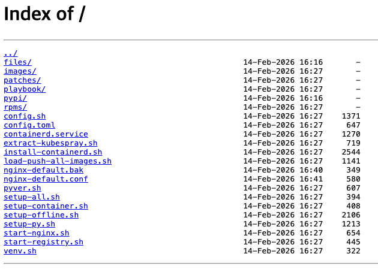

# kubespray-offline으로 k8s 설치

## 초기 세팅 및 download-all 수행
```bash
[root@k8s-ctr1 ~]# git clone https://github.com/kubespray-offline/kubespray-offline.git

[root@k8s-ctr1 ~]# cd kubespray-offline/

[root@k8s-ctr1 kubespray-offline]# tree
.
├── ansible-container
│   ├── ansible-container.sh
│   ├── Dockerfile
│   └── Makefile
├── build-ansible-container.sh
├── ChangeLog.md
├── ci
│   └── ci.sh
├── ci-test
│   ├── ci-test.sh
│   └── download-for-ci.sh
├── cleanup.sh
├── config.sh
├── copy-target-scripts.sh
├── create-repo.sh
├── deprecated
│   ├── kubespray-download.sh
│   └── mirror-docker-ce.sh
├── docker
│   ├── build-image.sh
│   ├── ci-test-in-docker.sh
│   ├── common.sh
│   ├── create-repo-in-docker.sh
│   ├── Dockerfile.alma8
│   ├── Dockerfile.alma9
│   ├── Dockerfile.rocky10
│   ├── Dockerfile.rocky9
│   ├── Dockerfile.ubuntu22
│   ├── Dockerfile.ubuntu24
│   ├── download-all.sh
│   ├── download-files.sh
│   └── download-for-ci-in-docker.sh
├── download-additional-containers.sh
├── download-all.sh
├── download-images.sh
├── download-kubespray-files.sh
├── get-kubespray.sh
├── imagelists
│   └── images.txt
├── install-containerd.sh
├── install-docker.sh
├── install-nerdctl.sh
├── LICENSE
├── offline.yml
├── pkglist
│   ├── rhel
│   │   ├── 10
│   │   │   └── pkgs.txt
│   │   ├── 8
│   │   │   └── pkgs.txt
│   │   ├── 9
│   │   │   └── pkgs.txt
│   │   └── pkgs.txt
│   └── ubuntu
│       ├── 20.04
│       │   └── pkgs.txt
│       ├── 22.04
│       │   └── pkgs.txt
│       ├── 24.04
│       │   └── pkgs.txt
│       └── pkgs.txt
├── precheck.sh
├── prepare-pkgs.sh
├── prepare-py.sh
├── pypi-mirror.sh
├── README.md
├── requirements.txt
├── scripts
│   ├── common.sh
│   ├── create-repo-rhel.sh
│   ├── create-repo-ubuntu.sh
│   ├── images.sh
│   └── set-locale.sh
├── target-scripts
│   ├── config.sh
│   ├── config.toml
│   ├── containerd.service
│   ├── extract-kubespray.sh
│   ├── install-containerd.sh
│   ├── load-push-all-images.sh
│   ├── nginx-default.conf
│   ├── patches
│   │   └── 2.18.0
│   │       ├── 0001-nerdctl-insecure-registry-config-8339.patch
│   │       ├── 0002-Update-config.toml.j2-8340.patch
│   │       └── 0003-generate-list-8537.patch
│   ├── playbook
│   │   ├── offline-repo.yml
│   │   └── roles
│   │       └── offline-repo
│   │           ├── defaults
│   │           │   └── main.yml
│   │           ├── files
│   │           │   └── 99offline
│   │           └── tasks
│   │               ├── Debian.yml
│   │               ├── main.yml
│   │               └── RedHat.yml
│   ├── pyver.sh
│   ├── setup-all.sh
│   ├── setup-container.sh
│   ├── setup-offline.sh
│   ├── setup-py.sh
│   ├── start-nginx.sh
│   ├── start-registry.sh
│   └── venv.sh
├── test
│   ├── common.sh
│   ├── do-kubespray.sh
│   ├── go-offline.sh
│   ├── hosts-cluster.yaml
│   ├── HowToTest.md
│   ├── inventory_builder
│   │   ├── inventory.py
│   │   └── requirements.txt
│   ├── offline-setup.sh
│   ├── old
│   │   └── FULL-TEST-SINGLE.sh
│   ├── prepare-kubespray.sh
│   ├── restore-offline.sh
│   ├── setup-ssh-keys.sh
│   ├── test-install-offline.sh
│   ├── transfer-files.sh
│   └── vagrant
│       ├── cluster
│       │   └── Vagrantfile
│       └── singles
│           └── Vagrantfile
├── Vagrantfile
└── vagrant-test.sh

32 directories, 99 files


# 변수 정보 확인
[root@k8s-ctr1 kubespray-offline]# source ./config.sh
[root@k8s-ctr1 kubespray-offline]# echo -e "kubespary $KUBESPRAY_VERSION"
kubespary 2.30.0
[root@k8s-ctr1 kubespray-offline]# echo -e "runc $RUNC_VERSION"
runc 1.3.4
[root@k8s-ctr1 kubespray-offline]# echo -e "containerd $CONTAINERD_VERSION"
containerd 2.2.1
[root@k8s-ctr1 kubespray-offline]# echo -e "nercdtl $NERDCTL_VERSION"
nercdtl 2.2.1
[root@k8s-ctr1 kubespray-offline]# echo -e "cni $CNI_VERSION"
cni 1.8.0
[root@k8s-ctr1 kubespray-offline]# echo -e "nginx $NGINX_VERSION"
nginx 1.29.4
[root@k8s-ctr1 kubespray-offline]# echo -e "registry $REGISTRY_VERSION"
registry 3.0.0
[root@k8s-ctr1 kubespray-offline]# echo -e "registry_port: $REGISTRY_PORT"
registry_port: 35000
[root@k8s-ctr1 kubespray-offline]# echo -e "Additional container registry hosts: $ADDITIONAL_CONTAINER_REGISTRY_LIST"
Additional container registry hosts: myregistry.io
[root@k8s-ctr1 kubespray-offline]# echo -e "cpu arch: $IMAGE_ARCH"
cpu arch: amd64

# 전체 다운로드 스크립트 실행 (약 17분정도 소요됨.)
[root@k8s-ctr1 kubespray-offline]# ./download-all.sh
=> Running: ./precheck.sh
=> Running: ./prepare-pkgs.sh
==> prepare-pkgs.sh
==> Install required packages
Last metadata expiration check: 0:14:31 ago on Sat 14 Feb 2026 03:48:52 PM UTC.

NetworkManager.x86_64                       1:1.54.0-2.el10_1                        baseos   
NetworkManager-libnm.x86_64                 1:1.54.0-2.el10_1                        baseos   
NetworkManager-tui.x86_64                   1:1.54.0-2.el10_1                        baseos   
binutils.x86_64                             2.41-58.el10_1.2                         baseos   
binutils-gold.x86_64                        2.41-58.el10_1.2                         baseos   
cloud-init.noarch                           24.4-6.el10_1.1.rocky.0.1                appstream
cockpit-bridge.noarch                       344-1.el10.rocky.0.1                     baseos   
cockpit-system.noarch                       344-1.el10.rocky.0.1                     baseos   
cockpit-ws.x86_64                           344-1.el10.rocky.0.1                     baseos   
cockpit-ws-selinux.x86_64                   344-1.el10.rocky.0.1                     baseos   
crypto-policies.noarch                      20250905-2.gitc7eb7b2.el10_1.1           baseos   
crypto-policies-scripts.noarch              20250905-2.gitc7eb7b2.el10_1.1           baseos   
elfutils-debuginfod-client.x86_64           0.193-1.el10.rocky.0.1                   baseos   
elfutils-default-yama-scope.noarch          0.193-1.el10.rocky.0.1                   baseos   
elfutils-libelf.x86_64                      0.193-1.el10.rocky.0.1                   baseos   
elfutils-libs.x86_64                        0.193-1.el10.rocky.0.1                   baseos   
glib2.x86_64                                2.80.4-10.el10_1.12                      baseos   
glibc.x86_64                                2.39-58.el10_1.7                         baseos   
glibc-common.x86_64                         2.39-58.el10_1.7                         baseos   
glibc-gconv-extra.x86_64                    2.39-58.el10_1.7                         baseos   
glibc-langpack-en.x86_64                    2.39-58.el10_1.7                         baseos   
glibc-minimal-langpack.x86_64               2.39-58.el10_1.7                         baseos   
gnupg2.x86_64                               2.4.5-3.el10_1                           baseos   
gnupg2-smime.x86_64                         2.4.5-3.el10_1                           appstream
kernel-tools.x86_64                         6.12.0-124.31.1.el10_1                   baseos   
kernel-tools-libs.x86_64                    6.12.0-124.31.1.el10_1                   baseos   
kpartx.x86_64                               0.9.9-12.el10_1.1                        baseos   
libblkid.x86_64                             2.40.2-15.el10_1                         baseos   
libbrotli.x86_64                            1.1.0-7.el10_1                           baseos   
libfdisk.x86_64                             2.40.2-15.el10_1                         baseos   
libmount.x86_64                             2.40.2-15.el10_1                         baseos   
libsmartcols.x86_64                         2.40.2-15.el10_1                         baseos   
libssh.x86_64                               0.11.1-5.el10_1                          baseos   
libssh-config.noarch                        0.11.1-5.el10_1                          baseos   
libuuid.x86_64                              2.40.2-15.el10_1                         baseos   
microcode_ctl.noarch                        4:20250812-1.20251111.1.el10_1           baseos   
openssl.x86_64                              1:3.5.1-7.el10_1                         baseos   
openssl-fips-provider.x86_64                1:3.5.1-7.el10_1                         baseos   
openssl-libs.x86_64                         1:3.5.1-7.el10_1                         baseos   
python-unversioned-command.noarch           3.12.12-3.el10_1                         appstream
python3.x86_64                              3.12.12-3.el10_1                         baseos   
python3-libs.x86_64                         3.12.12-3.el10_1                         baseos   
python3-urllib3.noarch                      1.26.19-2.el10_1.1                       baseos   
qemu-guest-agent.x86_64                     18:10.0.0-14.el10_1.5                    appstream
rocky-gpg-keys.noarch                       10.1-1.4.el10                            baseos   
rocky-release.noarch                        10.1-1.4.el10                            baseos   
rocky-repos.noarch                          10.1-1.4.el10                            baseos   
sos.noarch                                  4.10.1-2.el10                            baseos   
tar.x86_64                                  2:1.35-9.el10_1                          baseos   
tzdata.noarch                               2025c-1.el10                             baseos   
util-linux.x86_64                           2.40.2-15.el10_1                         baseos   
util-linux-core.x86_64                      2.40.2-15.el10_1                         baseos   
zlib-ng-compat.x86_64                       2.2.3-3.el10_1                           baseos   
Last metadata expiration check: 0:14:32 ago on Sat 14 Feb 2026 03:48:52 PM UTC.
Package rsync-3.4.1-2.el10.x86_64 is already installed.
Package git-2.47.3-1.el10.x86_64 is already installed.
Dependencies resolved.
==============================================================================================
 Package                     Arch       Version                           Repository     Size
==============================================================================================
Installing:
 createrepo_c                x86_64     1.1.2-4.el10                      appstream      78 k
 gcc                         x86_64     14.3.1-2.1.el10                   appstream      38 M
 libffi-devel                x86_64     3.4.4-10.el10                     appstream      28 k
 podman                      x86_64     7:5.6.0-11.el10_1                 appstream      15 M
Installing dependencies:
 aardvark-dns                x86_64     2:1.16.0-2.el10                   appstream     903 k
 catatonit                   x86_64     5:0.2.1-1.el10                    appstream     290 k
 conmon                      x86_64     3:2.1.13-1.el10                   appstream      48 k
 container-selinux           noarch     4:2.240.0-1.el10                  appstream      56 k
 containers-common           noarch     5:0.64.0-5.el10_1                 appstream     103 k
 containers-common-extra     noarch     5:0.64.0-5.el10_1                 appstream     9.3 k
 cpp                         x86_64     14.3.1-2.1.el10                   appstream      13 M
 createrepo_c-libs           x86_64     1.1.2-4.el10                      appstream     106 k
 criu                        x86_64     4.1-1.el10                        appstream     578 k
 crun                        x86_64     1.23.1-1.el10_0                   appstream     260 k
 glibc-devel                 x86_64     2.39-58.el10_1.2                  appstream     600 k
 kernel-headers              x86_64     6.12.0-124.31.1.el10_1            appstream     3.2 M
 libmpc                      x86_64     1.3.1-7.el10                      appstream      70 k
 libnet                      x86_64     1.3-7.el10                        appstream      62 k
 libnftnl                    x86_64     1.2.8-4.el10                      baseos         84 k
 libxcrypt-devel             x86_64     4.4.36-10.el10                    appstream      29 k
 make                        x86_64     1:4.4.1-9.el10                    baseos        590 k
 netavark                    x86_64     2:1.16.0-1.el10                   appstream     3.6 M
 nftables                    x86_64     1:1.1.1-6.el10                    baseos        435 k
 passt                       x86_64     0^20250512.g8ec1341-4.el10_1      appstream     263 k
 passt-selinux               noarch     0^20250512.g8ec1341-4.el10_1      appstream      28 k
 protobuf-c                  x86_64     1.5.0-6.el10                      baseos         32 k
 shadow-utils-subid          x86_64     2:4.15.0-8.el10                   baseos         27 k
Installing weak dependencies:
 criu-libs                   x86_64     4.1-1.el10                        appstream      31 k

Transaction Summary
==============================================================================================
Install  28 Packages

Total download size: 77 M
Installed size: 227 M
Downloading Packages:
(1/28): libnftnl-1.2.8-4.el10.x86_64.rpm                      1.8 MB/s |  84 kB     00:00    
(2/28): protobuf-c-1.5.0-6.el10.x86_64.rpm                    3.8 MB/s |  32 kB     00:00    
(3/28): nftables-1.1.1-6.el10.x86_64.rpm                      6.1 MB/s | 435 kB     00:00    
(4/28): make-4.4.1-9.el10.x86_64.rpm                          7.3 MB/s | 590 kB     00:00    
(5/28): shadow-utils-subid-4.15.0-8.el10.x86_64.rpm           985 kB/s |  27 kB     00:00    
(6/28): conmon-2.1.13-1.el10.x86_64.rpm                       1.8 MB/s |  48 kB     00:00    
(7/28): container-selinux-2.240.0-1.el10.noarch.rpm           6.4 MB/s |  56 kB     00:00    
(8/28): catatonit-0.2.1-1.el10.x86_64.rpm                     6.6 MB/s | 290 kB     00:00    
(9/28): containers-common-extra-0.64.0-5.el10_1.noarch.rpm    1.1 MB/s | 9.3 kB     00:00    
(10/28): containers-common-0.64.0-5.el10_1.noarch.rpm         5.5 MB/s | 103 kB     00:00    
(11/28): aardvark-dns-1.16.0-2.el10.x86_64.rpm                 11 MB/s | 903 kB     00:00    
(12/28): createrepo_c-1.1.2-4.el10.x86_64.rpm                 4.7 MB/s |  78 kB     00:00    
(13/28): createrepo_c-libs-1.1.2-4.el10.x86_64.rpm            6.1 MB/s | 106 kB     00:00    
(14/28): criu-libs-4.1-1.el10.x86_64.rpm                      2.6 MB/s |  31 kB     00:00    
(15/28): criu-4.1-1.el10.x86_64.rpm                            10 MB/s | 578 kB     00:00    
(16/28): crun-1.23.1-1.el10_0.x86_64.rpm                      7.8 MB/s | 260 kB     00:00    
(17/28): glibc-devel-2.39-58.el10_1.2.x86_64.rpm               11 MB/s | 600 kB     00:00    
(18/28): kernel-headers-6.12.0-124.31.1.el10_1.x86_64.rpm      66 MB/s | 3.2 MB     00:00    
(19/28): libffi-devel-3.4.4-10.el10.x86_64.rpm                2.1 MB/s |  28 kB     00:00    
(20/28): libmpc-1.3.1-7.el10.x86_64.rpm                       6.7 MB/s |  70 kB     00:00    
(21/28): libnet-1.3-7.el10.x86_64.rpm                         4.4 MB/s |  62 kB     00:00    
(22/28): libxcrypt-devel-4.4.36-10.el10.x86_64.rpm            3.1 MB/s |  29 kB     00:00    
(23/28): gcc-14.3.1-2.1.el10.x86_64.rpm                        86 MB/s |  38 MB     00:00    
(24/28): netavark-1.16.0-1.el10.x86_64.rpm                     12 MB/s | 3.6 MB     00:00    
(25/28): passt-0^20250512.g8ec1341-4.el10_1.x86_64.rpm        8.0 MB/s | 263 kB     00:00    
(26/28): passt-selinux-0^20250512.g8ec1341-4.el10_1.noarch.rp 2.7 MB/s |  28 kB     00:00    
(27/28): cpp-14.3.1-2.1.el10.x86_64.rpm                        12 MB/s |  13 MB     00:01    
(28/28): podman-5.6.0-11.el10_1.x86_64.rpm                     13 MB/s |  15 MB     00:01    
----------------------------------------------------------------------------------------------
Total                                                          26 MB/s |  77 MB     00:02     
Running transaction check
Transaction check succeeded.
Running transaction test
Transaction test succeeded.
Running transaction
  Preparing        :                                                                      1/1 
  Installing       : passt-0^20250512.g8ec1341-4.el10_1.x86_64                           1/28 
  Running scriptlet: passt-selinux-0^20250512.g8ec1341-4.el10_1.noarch                   2/28 
...


# 설치 초반의 디스크 상태
[root@k8s-ctr1 ~]# lsblk
NAME        MAJ:MIN RM   SIZE RO TYPE MOUNTPOINTS
nvme0n1     259:0    0   120G  0 disk 
├─nvme0n1p1 259:1    0     2M  0 part 
├─nvme0n1p2 259:2    0   200M  0 part /boot/efi
├─nvme0n1p3 259:3    0  1000M  0 part /boot
└─nvme0n1p4 259:4    0 118.8G  0 part /

[root@k8s-ctr1 ~]# df -hT /
Filesystem     Type  Size  Used Avail Use% Mounted on
/dev/nvme0n1p4 xfs   119G  5.3G  114G   5% /

# 설치 완료 후 디스크 상태
[root@k8s-ctr1 ~]# lsblk
NAME        MAJ:MIN RM   SIZE RO TYPE MOUNTPOINTS
nvme0n1     259:0    0   120G  0 disk 
├─nvme0n1p1 259:1    0     2M  0 part 
├─nvme0n1p2 259:2    0   200M  0 part /boot/efi
├─nvme0n1p3 259:3    0  1000M  0 part /boot
└─nvme0n1p4 259:4    0 118.8G  0 part /

[root@k8s-ctr1 ~]# df -hT /
Filesystem     Type  Size  Used Avail Use% Mounted on
/dev/nvme0n1p4 xfs   119G   16G  103G  14% /

# venv 디렉터리 확인
[root@k8s-ctr1 kubespray-offline]# du -sh ~/.venv
491M    /root/.venv

[root@k8s-ctr1 kubespray-offline]# tree ~/.venv | more
/root/.venv
└── 3.12
    ├── bin
    │   ├── activate
    │   ├── activate.csh
    │   ├── activate.fish
    │   ├── Activate.ps1
    │   ├── ansible
    │   ├── ansible-community
    │   ├── ansible-config
    │   ├── ansible-connection
...

# 다운로드 될 파일과 이미지 생성 스크립트는 kubespary repo 에 offline 참고 확인
[root@k8s-ctr1 kubespray-offline]# tree /root/kubespray-offline/cache/kubespray-2.30.0/contrib/offline/
/root/kubespray-offline/cache/kubespray-2.30.0/contrib/offline/
├── docker-daemon.json
├── generate_list.sh
├── generate_list.yml
├── manage-offline-container-images.sh
├── manage-offline-files.sh
├── nginx.conf
├── README.md
├── registries.conf
├── temp
│   ├── files.list
│   ├── files.list.template
│   ├── images.list
│   └── images.list.template
└── upload2artifactory.py

2 directories, 13 files


# 용량 확인
[root@k8s-ctr1 kubespray-offline]# du -sh /root/kubespray-offline/outputs/
3.7G    /root/kubespray-offline/outputs/


# 디렉터리/파일 구조 확인
[root@k8s-ctr1 kubespray-offline]# tree /root/kubespray-offline/outputs/
/root/kubespray-offline/outputs/
├── config.sh
├── config.toml
├── containerd.service
├── extract-kubespray.sh
├── files
│   ├── cilium-cli
│   │   └── v0.18.9
│   │       └── cilium-linux-amd64.tar.gz
│   ├── containerd-2.2.1-linux-amd64.tar.gz
│   ├── cri-dockerd-0.3.23.amd64.tgz
│   ├── cri-o.amd64.v1.34.4.tar.gz
│   ├── crun-1.17-linux-amd64
│   ├── files.list
│   ├── gvisor
│   │   └── 20260112.0
│   │       └── x86_64
│   │           ├── containerd-shim-runsc-v1
│   │           └── runsc
│   ├── helm-v3.18.4-linux-amd64.tar.gz
│   ├── kata-static-3.7.0-amd64.tar.xz
│   ├── kubernetes
│   │   ├── calico
│   │   │   ├── v3.30.6
│   │   │   │   └── calicoctl-linux-amd64
│   │   │   └── v3.30.6.tar.gz
│   │   ├── cni
│   │   │   └── cni-plugins-linux-amd64-v1.8.0.tgz
│   │   ├── cri-tools
│   │   │   └── crictl-v1.34.0-linux-amd64.tar.gz
│   │   ├── etcd
│   │   │   └── etcd-v3.5.26-linux-amd64.tar.gz
│   │   └── v1.34.3
│   │       ├── kubeadm
│   │       ├── kubectl
│   │       └── kubelet
│   ├── kubespray-2.30.0.tar.gz
│   ├── nerdctl-2.2.1-linux-amd64.tar.gz
│   ├── runc
│   │   └── v1.3.4
│   │       └── runc.amd64
│   ├── skopeo
│   │   └── v1.16.1
│   │       └── skopeo-linux-amd64
│   ├── standard-install.yaml
│   ├── stripped-down-crds.yaml
│   ├── youki-0.5.7-x86_64-gnu.tar.gz
│   └── yq
│       └── v4.42.1amd64
│           └── yq_linux_amd64
├── images
│   ├── additional-images.list
│   ├── docker.io_amazon_aws-alb-ingress-controller-v1.1.9.tar.gz
│   ├── docker.io_amazon_aws-ebs-csi-driver-v0.5.0.tar.gz
│   ├── docker.io_cloudnativelabs_kube-router-v2.1.1.tar.gz
│   ├── docker.io_flannel_flannel-cni-plugin-v1.7.1-flannel1.tar.gz
│   ├── docker.io_flannel_flannel-v0.27.3.tar.gz
│   ├── docker.io_kubeovn_kube-ovn-v1.12.21.tar.gz
│   ├── docker.io_kubernetesui_dashboard-v2.7.0.tar.gz
│   ├── docker.io_kubernetesui_metrics-scraper-v1.0.8.tar.gz
│   ├── docker.io_library_haproxy-3.2.4-alpine.tar.gz
│   ├── docker.io_library_nginx-1.28.0-alpine.tar.gz
│   ├── docker.io_library_nginx-1.29.4.tar.gz
│   ├── docker.io_library_registry-2.8.1.tar.gz
│   ├── docker.io_library_registry-3.0.0.tar.gz
│   ├── docker.io_mirantis_k8s-netchecker-agent-v1.2.2.tar.gz
│   ├── docker.io_mirantis_k8s-netchecker-server-v1.2.2.tar.gz
│   ├── docker.io_rancher_local-path-provisioner-v0.0.32.tar.gz
│   ├── ghcr.io_k8snetworkplumbingwg_multus-cni-v4.2.2.tar.gz
│   ├── ghcr.io_kube-vip_kube-vip-v1.0.3.tar.gz
│   ├── images.list
│   ├── quay.io_calico_apiserver-v3.30.6.tar.gz
│   ├── quay.io_calico_cni-v3.30.6.tar.gz
│   ├── quay.io_calico_kube-controllers-v3.30.6.tar.gz
│   ├── quay.io_calico_node-v3.30.6.tar.gz
│   ├── quay.io_calico_typha-v3.30.6.tar.gz
│   ├── quay.io_cilium_certgen-v0.2.4.tar.gz
│   ├── quay.io_cilium_cilium-envoy-v1.34.10-1762597008-ff7ae7d623be00078865cff1b0672cc5d9bfc6d5.tar.gz
│   ├── quay.io_cilium_cilium-v1.18.6.tar.gz
│   ├── quay.io_cilium_hubble-relay-v1.18.6.tar.gz
│   ├── quay.io_cilium_hubble-ui-backend-v0.13.3.tar.gz
│   ├── quay.io_cilium_hubble-ui-v0.13.3.tar.gz
│   ├── quay.io_cilium_operator-v1.18.6.tar.gz
│   ├── quay.io_coreos_etcd-v3.5.26.tar.gz
│   ├── quay.io_jetstack_cert-manager-cainjector-v1.15.3.tar.gz
│   ├── quay.io_jetstack_cert-manager-controller-v1.15.3.tar.gz
│   ├── quay.io_jetstack_cert-manager-webhook-v1.15.3.tar.gz
│   ├── quay.io_metallb_controller-v0.13.9.tar.gz
│   ├── quay.io_metallb_speaker-v0.13.9.tar.gz
│   ├── registry.k8s.io_coredns_coredns-v1.12.1.tar.gz
│   ├── registry.k8s.io_cpa_cluster-proportional-autoscaler-v1.8.8.tar.gz
│   ├── registry.k8s.io_dns_k8s-dns-node-cache-1.25.0.tar.gz
│   ├── registry.k8s.io_ingress-nginx_controller-v1.13.3.tar.gz
│   ├── registry.k8s.io_kube-apiserver-v1.34.3.tar.gz
│   ├── registry.k8s.io_kube-controller-manager-v1.34.3.tar.gz
│   ├── registry.k8s.io_kube-proxy-v1.34.3.tar.gz
│   ├── registry.k8s.io_kube-scheduler-v1.34.3.tar.gz
│   ├── registry.k8s.io_metrics-server_metrics-server-v0.8.0.tar.gz
│   ├── registry.k8s.io_pause-3.10.1.tar.gz
│   ├── registry.k8s.io_provider-os_cinder-csi-plugin-v1.30.0.tar.gz
│   ├── registry.k8s.io_sig-storage_csi-attacher-v4.4.2.tar.gz
│   ├── registry.k8s.io_sig-storage_csi-node-driver-registrar-v2.4.0.tar.gz
│   ├── registry.k8s.io_sig-storage_csi-provisioner-v3.6.2.tar.gz
│   ├── registry.k8s.io_sig-storage_csi-resizer-v1.9.2.tar.gz
│   ├── registry.k8s.io_sig-storage_csi-snapshotter-v6.3.2.tar.gz
│   ├── registry.k8s.io_sig-storage_livenessprobe-v2.11.0.tar.gz
│   ├── registry.k8s.io_sig-storage_local-volume-provisioner-v2.5.0.tar.gz
│   └── registry.k8s.io_sig-storage_snapshot-controller-v7.0.2.tar.gz
├── install-containerd.sh
├── load-push-all-images.sh
├── nginx-default.conf
├── patches
│   └── 2.18.0
│       ├── 0001-nerdctl-insecure-registry-config-8339.patch
│       ├── 0002-Update-config.toml.j2-8340.patch
│       └── 0003-generate-list-8537.patch
├── playbook
│   ├── offline-repo.yml
│   └── roles
│       └── offline-repo
│           ├── defaults
│           │   └── main.yml
│           ├── files
│           │   └── 99offline
│           └── tasks
│               ├── Debian.yml
│               ├── main.yml
│               └── RedHat.yml
├── pypi
│   ├── ansible
│   │   ├── ansible-10.7.0-py3-none-any.whl -> ../files/ansible-10.7.0-py3-none-any.whl
│   │   ├── ansible-10.7.0.tar.gz -> ../files/ansible-10.7.0.tar.gz
│   │   └── index.html
│   ├── ansible-core
│   │   ├── ansible_core-2.17.14-py3-none-any.whl -> ../files/ansible_core-2.17.14-py3-none-any.whl
│   │   ├── ansible_core-2.17.14.tar.gz -> ../files/ansible_core-2.17.14.tar.gz
│   │   └── index.html
│   ├── cffi
│   │   ├── cffi-2.0.0-cp311-cp311-manylinux2014_x86_64.manylinux_2_17_x86_64.whl -> ../files/cffi-2.0.0-cp311-cp311-manylinux2014_x86_64.manylinux_2_17_x86_64.whl
│   │   ├── cffi-2.0.0-cp312-cp312-manylinux2014_x86_64.manylinux_2_17_x86_64.whl -> ../files/cffi-2.0.0-cp312-cp312-manylinux2014_x86_64.manylinux_2_17_x86_64.whl
│   │   ├── cffi-2.0.0.tar.gz -> ../files/cffi-2.0.0.tar.gz
│   │   └── index.html
│   ├── cryptography
│   │   ├── cryptography-46.0.3-cp311-abi3-manylinux2014_x86_64.manylinux_2_17_x86_64.whl -> ../files/cryptography-46.0.3-cp311-abi3-manylinux2014_x86_64.manylinux_2_17_x86_64.whl
│   │   ├── cryptography-46.0.3.tar.gz -> ../files/cryptography-46.0.3.tar.gz
│   │   └── index.html
│   ├── cython
│   │   ├── Cython-0.29.37-cp312-cp312-manylinux_2_17_x86_64.manylinux2014_x86_64.manylinux_2_28_x86_64.whl -> ../files/Cython-0.29.37-cp312-cp312-manylinux_2_17_x86_64.manylinux2014_x86_64.manylinux_2_28_x86_64.whl
│   │   └── index.html
│   ├── distro
│   │   ├── distro-1.9.0-py3-none-any.whl -> ../files/distro-1.9.0-py3-none-any.whl
│   │   └── index.html
│   ├── files
│   │   ├── ansible-10.7.0-py3-none-any.whl
│   │   ├── ansible-10.7.0.tar.gz
│   │   ├── ansible_core-2.17.14-py3-none-any.whl
│   │   ├── ansible_core-2.17.14.tar.gz
│   │   ├── cffi-2.0.0-cp311-cp311-manylinux2014_x86_64.manylinux_2_17_x86_64.whl
│   │   ├── cffi-2.0.0-cp312-cp312-manylinux2014_x86_64.manylinux_2_17_x86_64.whl
│   │   ├── cffi-2.0.0.tar.gz
│   │   ├── cryptography-46.0.3-cp311-abi3-manylinux2014_x86_64.manylinux_2_17_x86_64.whl
│   │   ├── cryptography-46.0.3.tar.gz
│   │   ├── Cython-0.29.37-cp312-cp312-manylinux_2_17_x86_64.manylinux2014_x86_64.manylinux_2_28_x86_64.whl
│   │   ├── distro-1.9.0-py3-none-any.whl
│   │   ├── flit_core-3.12.0-py3-none-any.whl
│   │   ├── jinja2-3.1.6-py3-none-any.whl
│   │   ├── jinja2-3.1.6.tar.gz
│   │   ├── jmespath-1.1.0-py3-none-any.whl
│   │   ├── jmespath-1.1.0.tar.gz
│   │   ├── markupsafe-3.0.3-cp311-cp311-manylinux2014_x86_64.manylinux_2_17_x86_64.manylinux_2_28_x86_64.whl
│   │   ├── markupsafe-3.0.3-cp312-cp312-manylinux2014_x86_64.manylinux_2_17_x86_64.manylinux_2_28_x86_64.whl
│   │   ├── markupsafe-3.0.3.tar.gz
│   │   ├── netaddr-1.3.0-py3-none-any.whl
│   │   ├── netaddr-1.3.0.tar.gz
│   │   ├── packaging-26.0-py3-none-any.whl
│   │   ├── packaging-26.0.tar.gz
│   │   ├── pip-26.0.1-py3-none-any.whl
│   │   ├── pycparser-3.0-py3-none-any.whl
│   │   ├── pycparser-3.0.tar.gz
│   │   ├── pyyaml-6.0.3-cp311-cp311-manylinux2014_x86_64.manylinux_2_17_x86_64.manylinux_2_28_x86_64.whl
│   │   ├── pyyaml-6.0.3-cp312-cp312-manylinux2014_x86_64.manylinux_2_17_x86_64.manylinux_2_28_x86_64.whl
│   │   ├── pyyaml-6.0.3.tar.gz
│   │   ├── resolvelib-1.0.1-py2.py3-none-any.whl
│   │   ├── resolvelib-1.0.1.tar.gz
│   │   ├── ruamel_yaml-0.19.1-py3-none-any.whl
│   │   ├── selinux-0.3.0-py2.py3-none-any.whl
│   │   ├── setuptools-40.9.0-py2.py3-none-any.whl
│   │   ├── setuptools-82.0.0-py3-none-any.whl
│   │   └── wheel-0.46.3-py3-none-any.whl
│   ├── flit-core
│   │   ├── flit_core-3.12.0-py3-none-any.whl -> ../files/flit_core-3.12.0-py3-none-any.whl
│   │   └── index.html
│   ├── index.html
│   ├── jinja2
│   │   ├── index.html
│   │   ├── jinja2-3.1.6-py3-none-any.whl -> ../files/jinja2-3.1.6-py3-none-any.whl
│   │   └── jinja2-3.1.6.tar.gz -> ../files/jinja2-3.1.6.tar.gz
│   ├── jmespath
│   │   ├── index.html
│   │   ├── jmespath-1.1.0-py3-none-any.whl -> ../files/jmespath-1.1.0-py3-none-any.whl
│   │   └── jmespath-1.1.0.tar.gz -> ../files/jmespath-1.1.0.tar.gz
│   ├── markupsafe
│   │   ├── index.html
│   │   ├── markupsafe-3.0.3-cp311-cp311-manylinux2014_x86_64.manylinux_2_17_x86_64.manylinux_2_28_x86_64.whl -> ../files/markupsafe-3.0.3-cp311-cp311-manylinux2014_x86_64.manylinux_2_17_x86_64.manylinux_2_28_x86_64.whl
│   │   ├── markupsafe-3.0.3-cp312-cp312-manylinux2014_x86_64.manylinux_2_17_x86_64.manylinux_2_28_x86_64.whl -> ../files/markupsafe-3.0.3-cp312-cp312-manylinux2014_x86_64.manylinux_2_17_x86_64.manylinux_2_28_x86_64.whl
│   │   └── markupsafe-3.0.3.tar.gz -> ../files/markupsafe-3.0.3.tar.gz
│   ├── netaddr
│   │   ├── index.html
│   │   ├── netaddr-1.3.0-py3-none-any.whl -> ../files/netaddr-1.3.0-py3-none-any.whl
│   │   └── netaddr-1.3.0.tar.gz -> ../files/netaddr-1.3.0.tar.gz
│   ├── packaging
│   │   ├── index.html
│   │   ├── packaging-26.0-py3-none-any.whl -> ../files/packaging-26.0-py3-none-any.whl
│   │   └── packaging-26.0.tar.gz -> ../files/packaging-26.0.tar.gz
│   ├── pip
│   │   ├── index.html
│   │   └── pip-26.0.1-py3-none-any.whl -> ../files/pip-26.0.1-py3-none-any.whl
│   ├── pycparser
│   │   ├── index.html
│   │   ├── pycparser-3.0-py3-none-any.whl -> ../files/pycparser-3.0-py3-none-any.whl
│   │   └── pycparser-3.0.tar.gz -> ../files/pycparser-3.0.tar.gz
│   ├── pyyaml
│   │   ├── index.html
│   │   ├── pyyaml-6.0.3-cp311-cp311-manylinux2014_x86_64.manylinux_2_17_x86_64.manylinux_2_28_x86_64.whl -> ../files/pyyaml-6.0.3-cp311-cp311-manylinux2014_x86_64.manylinux_2_17_x86_64.manylinux_2_28_x86_64.whl
│   │   ├── pyyaml-6.0.3-cp312-cp312-manylinux2014_x86_64.manylinux_2_17_x86_64.manylinux_2_28_x86_64.whl -> ../files/pyyaml-6.0.3-cp312-cp312-manylinux2014_x86_64.manylinux_2_17_x86_64.manylinux_2_28_x86_64.whl
│   │   └── pyyaml-6.0.3.tar.gz -> ../files/pyyaml-6.0.3.tar.gz
│   ├── resolvelib
│   │   ├── index.html
│   │   ├── resolvelib-1.0.1-py2.py3-none-any.whl -> ../files/resolvelib-1.0.1-py2.py3-none-any.whl
│   │   └── resolvelib-1.0.1.tar.gz -> ../files/resolvelib-1.0.1.tar.gz
│   ├── ruamel-yaml
│   │   ├── index.html
│   │   └── ruamel_yaml-0.19.1-py3-none-any.whl -> ../files/ruamel_yaml-0.19.1-py3-none-any.whl
│   ├── selinux
│   │   ├── index.html
│   │   └── selinux-0.3.0-py2.py3-none-any.whl -> ../files/selinux-0.3.0-py2.py3-none-any.whl
│   ├── setuptools
│   │   ├── index.html
│   │   ├── setuptools-40.9.0-py2.py3-none-any.whl -> ../files/setuptools-40.9.0-py2.py3-none-any.whl
│   │   └── setuptools-82.0.0-py3-none-any.whl -> ../files/setuptools-82.0.0-py3-none-any.whl
│   └── wheel
│       ├── index.html
│       └── wheel-0.46.3-py3-none-any.whl -> ../files/wheel-0.46.3-py3-none-any.whl
├── pyver.sh
├── rpms
│   └── local
│       ├── alternatives-1.30-2.el10.x86_64.rpm
│       ├── attr-2.5.2-5.el10.x86_64.rpm
│       ├── audit-4.0.3-4.el10.x86_64.rpm
│       ├── audit-libs-4.0.3-4.el10.x86_64.rpm
│       ├── audit-rules-4.0.3-4.el10.x86_64.rpm
│       ├── authselect-1.5.0-8.el10.x86_64.rpm
│       ├── authselect-libs-1.5.0-8.el10.x86_64.rpm
│       ├── basesystem-11-22.el10.noarch.rpm
│       ├── bash-5.2.26-6.el10.x86_64.rpm
│       ├── bash-completion-2.11-16.el10.noarch.rpm
│       ├── bzip2-libs-1.0.8-25.el10.x86_64.rpm
│       ├── ca-certificates-2025.2.80_v9.0.305-102.el10.noarch.rpm
│       ├── conntrack-tools-1.4.8-3.el10.x86_64.rpm
│       ├── container-selinux-2.240.0-1.el10.noarch.rpm
│       ├── coreutils-9.5-6.el10.x86_64.rpm
│       ├── coreutils-common-9.5-6.el10.x86_64.rpm
│       ├── cracklib-2.9.11-8.el10.x86_64.rpm
│       ├── cracklib-dicts-2.9.11-8.el10.x86_64.rpm
│       ├── crypto-policies-20250905-2.gitc7eb7b2.el10_1.1.noarch.rpm
│       ├── cryptsetup-libs-2.7.5-2.el10.x86_64.rpm
│       ├── curl-8.12.1-2.el10_1.2.x86_64.rpm
│       ├── cyrus-sasl-lib-2.1.28-29.el10.x86_64.rpm
│       ├── dbus-1.14.10-5.el10.x86_64.rpm
│       ├── dbus-broker-36-4.el10.x86_64.rpm
│       ├── dbus-common-1.14.10-5.el10.noarch.rpm
│       ├── dbus-libs-1.14.10-5.el10.x86_64.rpm
│       ├── device-mapper-1.02.206-3.el10.x86_64.rpm
│       ├── device-mapper-event-1.02.206-3.el10.x86_64.rpm
│       ├── device-mapper-event-libs-1.02.206-3.el10.x86_64.rpm
│       ├── device-mapper-libs-1.02.206-3.el10.x86_64.rpm
│       ├── device-mapper-persistent-data-1.1.0-2.el10.x86_64.rpm
│       ├── diffutils-3.10-8.el10.x86_64.rpm
│       ├── dnf-data-4.20.0-18.el10.rocky.0.1.noarch.rpm
│       ├── dnf-plugins-core-4.7.0-9.el10.noarch.rpm
│       ├── e2fsprogs-1.47.1-4.el10.x86_64.rpm
│       ├── e2fsprogs-libs-1.47.1-4.el10.x86_64.rpm
│       ├── elfutils-debuginfod-client-0.193-1.el10.rocky.0.1.x86_64.rpm
│       ├── elfutils-default-yama-scope-0.193-1.el10.rocky.0.1.noarch.rpm
│       ├── elfutils-libelf-0.193-1.el10.rocky.0.1.x86_64.rpm
│       ├── elfutils-libs-0.193-1.el10.rocky.0.1.x86_64.rpm
│       ├── expat-2.7.1-1.el10_0.3.x86_64.rpm
│       ├── file-libs-5.45-8.el10.x86_64.rpm
│       ├── filesystem-3.18-17.el10.x86_64.rpm
│       ├── findutils-4.10.0-5.el10.x86_64.rpm
│       ├── firewalld-2.3.1-1.el10_0.noarch.rpm
│       ├── firewalld-filesystem-2.3.1-1.el10_0.noarch.rpm
│       ├── fuse3-libs-3.16.2-5.el10.x86_64.rpm
│       ├── gawk-5.3.0-6.el10.x86_64.rpm
│       ├── gawk-all-langpacks-5.3.0-6.el10.x86_64.rpm
│       ├── gdbm-1.23-13.el10.x86_64.rpm
│       ├── gdbm-libs-1.23-13.el10.x86_64.rpm
│       ├── glib2-2.80.4-10.el10_1.12.x86_64.rpm
│       ├── glibc-2.39-58.el10_1.7.x86_64.rpm
│       ├── glibc-common-2.39-58.el10_1.7.x86_64.rpm
│       ├── glibc-gconv-extra-2.39-58.el10_1.7.x86_64.rpm
│       ├── glibc-minimal-langpack-2.39-58.el10_1.7.x86_64.rpm
│       ├── gmp-6.2.1-12.el10.x86_64.rpm
│       ├── gnupg2-2.4.5-3.el10_1.x86_64.rpm
│       ├── gnutls-3.8.10-2.el10.x86_64.rpm
│       ├── gobject-introspection-1.79.1-6.el10.x86_64.rpm
│       ├── grep-3.11-10.el10.x86_64.rpm
│       ├── gzip-1.13-3.el10.x86_64.rpm
│       ├── ima-evm-utils-1.6.2-3.el10.rocky.0.2.x86_64.rpm
│       ├── inih-58-3.el10.x86_64.rpm
│       ├── initscripts-service-10.26-2.el10.noarch.rpm
│       ├── ipset-7.22-8.el10.x86_64.rpm
│       ├── ipset-libs-7.22-8.el10.x86_64.rpm
│       ├── iptables-libs-1.8.11-11.el10.x86_64.rpm
│       ├── iptables-nft-1.8.11-11.el10.x86_64.rpm
│       ├── ipvsadm-1.31-15.el10.x86_64.rpm
│       ├── jansson-2.14-3.el10.x86_64.rpm
│       ├── json-c-0.18-3.el10.x86_64.rpm
│       ├── kernel-modules-extra-matched-6.12.0-124.31.1.el10_1.x86_64.rpm
│       ├── keyutils-1.6.3-5.el10.x86_64.rpm
│       ├── keyutils-libs-1.6.3-5.el10.x86_64.rpm
│       ├── kmod-31-12.el10.x86_64.rpm
│       ├── kmod-libs-31-12.el10.x86_64.rpm
│       ├── krb5-libs-1.21.3-8.el10_0.x86_64.rpm
│       ├── libacl-2.3.2-4.el10.x86_64.rpm
│       ├── libaio-0.3.111-22.el10.x86_64.rpm
│       ├── libarchive-3.7.7-4.el10_0.x86_64.rpm
│       ├── libassuan-2.5.6-6.el10.x86_64.rpm
│       ├── libattr-2.5.2-5.el10.x86_64.rpm
│       ├── libblkid-2.40.2-15.el10_1.x86_64.rpm
│       ├── libbpf-1.6.0-3.el10.x86_64.rpm
│       ├── libbrotli-1.1.0-7.el10_1.x86_64.rpm
│       ├── libcap-2.69-7.el10.x86_64.rpm
│       ├── libcap-ng-0.8.4-6.el10.x86_64.rpm
│       ├── libcap-ng-python3-0.8.4-6.el10.x86_64.rpm
│       ├── libcom_err-1.47.1-4.el10.x86_64.rpm
│       ├── libcomps-0.1.21-3.el10.x86_64.rpm
│       ├── libcurl-8.12.1-2.el10_1.2.x86_64.rpm
│       ├── libdnf-0.73.1-12.el10.rocky.0.1.x86_64.rpm
│       ├── libeconf-0.6.2-4.el10.x86_64.rpm
│       ├── libedit-3.1-52.20230828cvs.el10.x86_64.rpm
│       ├── libevent-2.1.12-16.el10.x86_64.rpm
│       ├── libfdisk-2.40.2-15.el10_1.x86_64.rpm
│       ├── libffi-3.4.4-10.el10.x86_64.rpm
│       ├── libgcc-14.3.1-2.1.el10.x86_64.rpm
│       ├── libgcrypt-1.11.0-5.el10.x86_64.rpm
│       ├── libgomp-14.3.1-2.1.el10.x86_64.rpm
│       ├── libgpg-error-1.50-2.el10.x86_64.rpm
│       ├── libidn2-2.3.7-3.el10.x86_64.rpm
│       ├── libksba-1.6.7-2.el10.x86_64.rpm
│       ├── libmnl-1.0.5-7.el10.x86_64.rpm
│       ├── libmodulemd-2.15.0-12.el10.x86_64.rpm
│       ├── libmount-2.40.2-15.el10_1.x86_64.rpm
│       ├── libnetfilter_conntrack-1.0.9-12.el10.x86_64.rpm
│       ├── libnetfilter_cthelper-1.0.1-1.el10.x86_64.rpm
│       ├── libnetfilter_cttimeout-1.0.0-27.el10.x86_64.rpm
│       ├── libnetfilter_queue-1.0.5-9.el10.x86_64.rpm
│       ├── libnfnetlink-1.0.2-3.el10.x86_64.rpm
│       ├── libnftnl-1.2.8-4.el10.x86_64.rpm
│       ├── libnghttp2-1.64.0-2.el10.x86_64.rpm
│       ├── libnl3-3.11.0-1.el10.x86_64.rpm
│       ├── libnvme-1.13-1.el10.x86_64.rpm
│       ├── libpkgconf-2.1.0-3.el10.x86_64.rpm
│       ├── libpsl-0.21.5-6.el10.x86_64.rpm
│       ├── libpwquality-1.4.5-12.el10.x86_64.rpm
│       ├── librepo-1.18.0-6.el10_0.x86_64.rpm
│       ├── libseccomp-2.5.6-1.el10.x86_64.rpm
│       ├── libselinux-3.9-1.el10.x86_64.rpm
│       ├── libselinux-utils-3.9-1.el10.x86_64.rpm
│       ├── libsemanage-3.9-1.el10.x86_64.rpm
│       ├── libsepol-3.9-1.el10.x86_64.rpm
│       ├── libsmartcols-2.40.2-15.el10_1.x86_64.rpm
│       ├── libsolv-0.7.29-8.el10.x86_64.rpm
│       ├── libss-1.47.1-4.el10.x86_64.rpm
│       ├── libssh-0.11.1-5.el10_1.x86_64.rpm
│       ├── libssh-config-0.11.1-5.el10_1.noarch.rpm
│       ├── libstdc++-14.3.1-2.1.el10.x86_64.rpm
│       ├── libtasn1-4.20.0-1.el10.x86_64.rpm
│       ├── libunistring-1.1-10.el10.x86_64.rpm
│       ├── libutempter-1.2.1-15.el10.x86_64.rpm
│       ├── libuuid-2.40.2-15.el10_1.x86_64.rpm
│       ├── libverto-0.3.2-10.el10.x86_64.rpm
│       ├── libxcrypt-4.4.36-10.el10.x86_64.rpm
│       ├── libxkbcommon-1.7.0-4.el10.x86_64.rpm
│       ├── libxml2-2.12.5-9.el10_0.x86_64.rpm
│       ├── libyaml-0.2.5-16.el10.x86_64.rpm
│       ├── libzstd-1.5.5-9.el10.x86_64.rpm
│       ├── lua-libs-5.4.6-7.el10.x86_64.rpm
│       ├── lvm2-2.03.32-3.el10.x86_64.rpm
│       ├── lvm2-libs-2.03.32-3.el10.x86_64.rpm
│       ├── lz4-libs-1.9.4-8.el10.x86_64.rpm
│       ├── mpdecimal-2.5.1-12.el10.x86_64.rpm
│       ├── mpfr-4.2.1-5.el10.x86_64.rpm
│       ├── ncurses-base-6.4-14.20240127.el10.noarch.rpm
│       ├── ncurses-libs-6.4-14.20240127.el10.x86_64.rpm
│       ├── nftables-1.1.1-6.el10.x86_64.rpm
│       ├── npth-1.6-21.el10.x86_64.rpm
│       ├── nspr-4.36.0-4.el10_0.x86_64.rpm
│       ├── nss-3.112.0-4.el10_0.x86_64.rpm
│       ├── nss-softokn-3.112.0-4.el10_0.x86_64.rpm
│       ├── nss-softokn-freebl-3.112.0-4.el10_0.x86_64.rpm
│       ├── nss-sysinit-3.112.0-4.el10_0.x86_64.rpm
│       ├── nss-util-3.112.0-4.el10_0.x86_64.rpm
│       ├── openldap-2.6.9-1.el10.x86_64.rpm
│       ├── openssl-3.5.1-7.el10_1.x86_64.rpm
│       ├── openssl-fips-provider-3.5.1-7.el10_1.x86_64.rpm
│       ├── openssl-libs-3.5.1-7.el10_1.x86_64.rpm
│       ├── p11-kit-0.25.5-7.el10.x86_64.rpm
│       ├── p11-kit-trust-0.25.5-7.el10.x86_64.rpm
│       ├── pam-1.6.1-8.el10.x86_64.rpm
│       ├── pam-libs-1.6.1-8.el10.x86_64.rpm
│       ├── pcre2-10.44-1.el10.3.x86_64.rpm
│       ├── pcre2-syntax-10.44-1.el10.3.noarch.rpm
│       ├── pkgconf-2.1.0-3.el10.x86_64.rpm
│       ├── pkgconf-m4-2.1.0-3.el10.noarch.rpm
│       ├── pkgconf-pkg-config-2.1.0-3.el10.x86_64.rpm
│       ├── policycoreutils-3.9-1.el10.x86_64.rpm
│       ├── popt-1.19-8.el10.x86_64.rpm
│       ├── publicsuffix-list-dafsa-20240107-5.el10.noarch.rpm
│       ├── python3-3.12.12-3.el10_1.x86_64.rpm
│       ├── python3-dateutil-2.9.0.post0-1.el10_0.noarch.rpm
│       ├── python3-dbus-1.3.2-8.el10.x86_64.rpm
│       ├── python3-devel-3.12.12-3.el10_1.x86_64.rpm
│       ├── python3-dnf-4.20.0-18.el10.rocky.0.1.noarch.rpm
│       ├── python3-dnf-plugins-core-4.7.0-9.el10.noarch.rpm
│       ├── python3-dnf-plugin-versionlock-4.7.0-9.el10.noarch.rpm
│       ├── python3-firewall-2.3.1-1.el10_0.noarch.rpm
│       ├── python3-gobject-base-3.46.0-7.el10.x86_64.rpm
│       ├── python3-gobject-base-noarch-3.46.0-7.el10.noarch.rpm
│       ├── python3-hawkey-0.73.1-12.el10.rocky.0.1.x86_64.rpm
│       ├── python3-libcomps-0.1.21-3.el10.x86_64.rpm
│       ├── python3-libdnf-0.73.1-12.el10.rocky.0.1.x86_64.rpm
│       ├── python3-libs-3.12.12-3.el10_1.x86_64.rpm
│       ├── python3-libselinux-3.9-1.el10.x86_64.rpm
│       ├── python3-nftables-1.1.1-6.el10.x86_64.rpm
│       ├── python3-pip-23.3.2-7.el10.noarch.rpm
│       ├── python3-pip-wheel-23.3.2-7.el10.noarch.rpm
│       ├── python3-rpm-4.19.1.1-20.el10.x86_64.rpm
│       ├── python3-six-1.16.0-16.el10.noarch.rpm
│       ├── python3-systemd-235-11.el10.x86_64.rpm
│       ├── python-unversioned-command-3.12.12-3.el10_1.noarch.rpm
│       ├── readline-8.2-11.el10.x86_64.rpm
│       ├── repodata
│       │   ├── 22abf6646da9cb55ee66e8372cb11156007aa604e34a6a1648f46037ea4be476-filelists.xml.zst
│       │   ├── 74707848c1d56fe2ce374576c14b2dd7f23cc7c554e964d8dca7be4fb2b4b866-other.xml.zst
│       │   ├── a9508b305ee78d0846a9ca2f616d8b5152530a4f20c2c24fcf9f412473b07cfe-primary.xml.zst
│       │   └── repomd.xml
│       ├── rocky-gpg-keys-10.1-1.4.el10.noarch.rpm
│       ├── rocky-release-10.1-1.4.el10.noarch.rpm
│       ├── rocky-repos-10.1-1.4.el10.noarch.rpm
│       ├── rpm-4.19.1.1-20.el10.x86_64.rpm
│       ├── rpm-build-libs-4.19.1.1-20.el10.x86_64.rpm
│       ├── rpm-libs-4.19.1.1-20.el10.x86_64.rpm
│       ├── rpm-plugin-audit-4.19.1.1-20.el10.x86_64.rpm
│       ├── rpm-plugin-selinux-4.19.1.1-20.el10.x86_64.rpm
│       ├── rpm-plugin-systemd-inhibit-4.19.1.1-20.el10.x86_64.rpm
│       ├── rpm-sequoia-1.9.0.3-1.el10_1.x86_64.rpm
│       ├── rpm-sign-libs-4.19.1.1-20.el10.x86_64.rpm
│       ├── rsync-3.4.1-2.el10.x86_64.rpm
│       ├── sed-4.9-3.el10.x86_64.rpm
│       ├── selinux-policy-42.1.7-1.el10.noarch.rpm
│       ├── selinux-policy-targeted-42.1.7-1.el10.noarch.rpm
│       ├── setup-2.14.5-7.el10.noarch.rpm
│       ├── shadow-utils-4.15.0-8.el10.x86_64.rpm
│       ├── socat-1.7.4.4-8.el10.x86_64.rpm
│       ├── sqlite-libs-3.46.1-5.el10_1.x86_64.rpm
│       ├── systemd-257-13.el10.rocky.0.1.x86_64.rpm
│       ├── systemd-libs-257-13.el10.rocky.0.1.x86_64.rpm
│       ├── systemd-pam-257-13.el10.rocky.0.1.x86_64.rpm
│       ├── tar-1.35-9.el10_1.x86_64.rpm
│       ├── tpm2-tss-4.1.3-5.el10.x86_64.rpm
│       ├── tzdata-2025c-1.el10.noarch.rpm
│       ├── unzip-6.0-69.el10.x86_64.rpm
│       ├── userspace-rcu-0.14.0-7.el10.x86_64.rpm
│       ├── util-linux-2.40.2-15.el10_1.x86_64.rpm
│       ├── util-linux-core-2.40.2-15.el10_1.x86_64.rpm
│       ├── xfsprogs-6.11.0-2.el10.x86_64.rpm
│       ├── xkeyboard-config-2.41-3.el10.noarch.rpm
│       ├── xz-libs-5.6.2-4.el10_0.x86_64.rpm
│       ├── yum-utils-4.7.0-9.el10.noarch.rpm
│       └── zlib-ng-compat-2.2.3-3.el10_1.x86_64.rpm
├── setup-all.sh
├── setup-container.sh
├── setup-offline.sh
├── setup-py.sh
├── start-nginx.sh
├── start-registry.sh
└── venv.sh

54 directories, 434 files

[root@k8s-ctr1 kubespray-offline]# tree /root/kubespray-offline/outputs/ -L 1
/root/kubespray-offline/outputs/
├── config.sh
├── config.toml
├── containerd.service
├── extract-kubespray.sh
├── files
├── images
├── install-containerd.sh
├── load-push-all-images.sh
├── nginx-default.conf
├── patches
├── playbook
├── pypi
├── pyver.sh
├── rpms
├── setup-all.sh
├── setup-container.sh
├── setup-offline.sh
├── setup-py.sh
├── start-nginx.sh
├── start-registry.sh
└── venv.sh

7 directories, 15 files
```

## outputs 디렉터리 이동 후 setup-container.sh 실행
- `install-containerd.sh`가 같이 실행된다.

```bash
# outputs 확인
[root@k8s-ctr1 kubespray-offline]# cd /root/kubespray-offline/outputs
[root@k8s-ctr1 outputs]# 

[root@k8s-ctr1 outputs]# ls -l *.sh
-rw-r--r--. 1 root root 1371 Feb 14 16:27 config.sh
-rwxr-xr-x. 1 root root  719 Feb 14 16:27 extract-kubespray.sh
-rwxr-xr-x. 1 root root 2544 Feb 14 16:27 install-containerd.sh
-rwxr-xr-x. 1 root root 1141 Feb 14 16:27 load-push-all-images.sh
-rw-r--r--. 1 root root  607 Feb 14 16:27 pyver.sh
-rwxr-xr-x. 1 root root  394 Feb 14 16:27 setup-all.sh
-rwxr-xr-x. 1 root root  408 Feb 14 16:27 setup-container.sh
-rwxr-xr-x. 1 root root 2106 Feb 14 16:27 setup-offline.sh
-rwxr-xr-x. 1 root root 1213 Feb 14 16:27 setup-py.sh
-rwxr-xr-x. 1 root root  654 Feb 14 16:27 start-nginx.sh
-rwxr-xr-x. 1 root root  445 Feb 14 16:27 start-registry.sh
-rw-r--r--. 1 root root  322 Feb 14 16:27 venv.sh

# Install containerd from local files. Load nginx and registry images to containerd.
[root@k8s-ctr1 outputs]# ./setup-container.sh
==> Install runc
==> Install nerdctl
nerdctl
containerd-rootless-setuptool.sh
containerd-rootless.sh
==> Install containerd
bin/containerd-stress
bin/containerd
bin/ctr
bin/containerd-shim-runc-v2
==> Start containerd
Created symlink '/etc/systemd/system/multi-user.target.wants/containerd.service' → '/etc/systemd/system/containerd.service'.
==> Install CNI plugins
./
./README.md
./static
./host-device
./ipvlan
./dhcp
./LICENSE
./portmap
./tap
./host-local
./vlan
./loopback
./sbr
./firewall
./bandwidth
./bridge
./vrf
./macvlan
./tuning
./dummy
./ptp
==> Load registry, nginx images
unpacking docker.io/library/registry:2.8.1 (sha256:1e6c7d1be0dd576c7e50f786e3333382e209907eba72f5414a91025af241e16d)...
Loaded image: registry:2.8.1
unpacking docker.io/library/registry:3.0.0 (sha256:09d6d68c85b98bac6699850ad2c071714e01a3bb7f67f68e636b98e4123275d2)...
Loaded image: registry:3.0.0
unpacking docker.io/library/nginx:1.28.0-alpine (sha256:dc8e6d3967a06c0c9bb10d16cfc5770686de05da4c34d4224ef2aec61142e8f1)...
Loaded image: nginx:1.28.0-alpine
unpacking docker.io/library/nginx:1.29.4 (sha256:93c49ce72e039396ca3c51a43e2703bfc165500d1fe0faa697fb60c9e60fe99f)...
Loaded image: nginx:1.29.4

# 설치된 바이너리 파일 및 버전 확인
[root@k8s-ctr1 outputs]# which runc && runc --version
/usr/local/bin/runc
runc version 1.3.4
commit: v1.3.4-0-gd6d73eb8
spec: 1.2.1
go: go1.24.10
libseccomp: 2.5.6

[root@k8s-ctr1 outputs]# which containerd && containerd --version
/usr/local/bin/containerd
containerd github.com/containerd/containerd/v2 v2.2.1 dea7da592f5d1d2b7755e3a161be07f43fad8f75

[root@k8s-ctr1 outputs]# which nerdctl && nerdctl --version
/usr/local/bin/nerdctl
nerdctl version 2.2.1

[root@k8s-ctr1 outputs]# tree -ug /opt/cni/bin/
[root     root    ]  /opt/cni/bin/
├── [root     root    ]  bandwidth
├── [root     root    ]  bridge
├── [root     root    ]  dhcp
├── [root     root    ]  dummy
├── [root     root    ]  firewall
├── [root     root    ]  host-device
├── [root     root    ]  host-local
├── [root     root    ]  ipvlan
├── [root     root    ]  LICENSE
├── [root     root    ]  loopback
├── [root     root    ]  macvlan
├── [root     root    ]  portmap
├── [root     root    ]  ptp
├── [root     root    ]  README.md
├── [root     root    ]  sbr
├── [root     root    ]  static
├── [root     root    ]  tap
├── [root     root    ]  tuning
├── [root     root    ]  vlan
└── [root     root    ]  vrf

1 directory, 20 files


# containerd systemd unit 확인
[root@k8s-ctr1 outputs]# cat /etc/containerd/config.toml
version = 2
root = "/var/lib/containerd"
state = "/run/containerd"
oom_score = 0

[grpc]
  address = "/run/containerd/containerd.sock"
  uid = 0
  gid = 0

[debug]
  address = "/run/containerd/debug.sock"
  uid = 0
  gid = 0
  level = "info"

[metrics]
  address = ""
  grpc_histogram = false

[cgroup]
  path = ""

[plugins]
  [plugins."io.containerd.grpc.v1.cri".containerd]
    default_runtime_name = "runc"
    snapshotter = "overlayfs"
  [plugins."io.containerd.grpc.v1.cri".containerd.runtimes.runc]
    runtime_type = "io.containerd.runc.v2"
  [plugins."io.containerd.grpc.v1.cri".containerd.runtimes.runc.options]
    systemdCgroup = true

[root@k8s-ctr1 outputs]# cat /etc/systemd/system/containerd.service
# Copyright The containerd Authors.
#
# Licensed under the Apache License, Version 2.0 (the "License");
# you may not use this file except in compliance with the License.
# You may obtain a copy of the License at
#
#     http://www.apache.org/licenses/LICENSE-2.0
#
# Unless required by applicable law or agreed to in writing, software
# distributed under the License is distributed on an "AS IS" BASIS,
# WITHOUT WARRANTIES OR CONDITIONS OF ANY KIND, either express or implied.
# See the License for the specific language governing permissions and
# limitations under the License.

[Unit]
Description=containerd container runtime
Documentation=https://containerd.io
After=network.target local-fs.target

[Service]
ExecStartPre=-/sbin/modprobe overlay
ExecStart=/usr/local/bin/containerd

Type=notify
Delegate=yes
KillMode=process
Restart=always
RestartSec=5
# Having non-zero Limit*s causes performance problems due to accounting overhead
# in the kernel. We recommend using cgroups to do container-local accounting.
LimitNPROC=infinity
LimitCORE=infinity
LimitNOFILE=infinity
# Comment TasksMax if your systemd version does not supports it.
# Only systemd 226 and above support this version.
TasksMax=infinity
OOMScoreAdjust=-999

[Install]
WantedBy=multi-user.target

[root@k8s-ctr1 outputs]# systemctl status containerd.service --no-pager
● containerd.service - containerd container runtime
     Loaded: loaded (/etc/systemd/system/containerd.service; enabled; preset: disabled)
     Active: active (running) since Sat 2026-02-14 16:37:45 UTC; 1min 39s ago
 Invocation: 9fcbef8a2fa042a99bb2b03a91dfd285
       Docs: https://containerd.io
    Process: 18570 ExecStartPre=/sbin/modprobe overlay (code=exited, status=0/SUCCESS)
   Main PID: 18571 (containerd)
      Tasks: 8
     Memory: 641.6M (peak: 643.6M)
        CPU: 4.340s
     CGroup: /system.slice/containerd.service
             └─18571 /usr/local/bin/containerd

Feb 14 16:37:45 k8s-ctr1 containerd[18571]: time="2026-02-14T16:37:45.210635192Z" level=…rver"
Feb 14 16:37:45 k8s-ctr1 containerd[18571]: time="2026-02-14T16:37:45.210771696Z" level=… NRI"
Feb 14 16:37:45 k8s-ctr1 containerd[18571]: time="2026-02-14T16:37:45.210827685Z" level=…p..."
Feb 14 16:37:45 k8s-ctr1 containerd[18571]: time="2026-02-14T16:37:45.210836159Z" level=…s..."
Feb 14 16:37:45 k8s-ctr1 containerd[18571]: time="2026-02-14T16:37:45.210849349Z" level=…tate"
Feb 14 16:37:45 k8s-ctr1 containerd[18571]: time="2026-02-14T16:37:45.210743733Z" level=….sock
Feb 14 16:37:45 k8s-ctr1 containerd[18571]: time="2026-02-14T16:37:45.210939927Z" level=…ttrpc
Feb 14 16:37:45 k8s-ctr1 containerd[18571]: time="2026-02-14T16:37:45.210978094Z" level=….sock
Feb 14 16:37:45 k8s-ctr1 containerd[18571]: time="2026-02-14T16:37:45.211444786Z" level=…987s"
Feb 14 16:37:45 k8s-ctr1 systemd[1]: Started containerd.service - containerd container …ntime.
Hint: Some lines were ellipsized, use -l to show in full.

# 다운받은 이미지를 압축해제 후 로컬에 load 확인 : CPU Arch = PLATFORM 확인하자.
[root@k8s-ctr1 outputs]# nerdctl images
REPOSITORY    TAG              IMAGE ID        CREATED               PLATFORM       SIZE       BLOB SIZE
nginx         1.29.4           93c49ce72e03    About a minute ago    linux/amd64    171MB      164.3MB
nginx         1.28.0-alpine    dc8e6d3967a0    About a minute ago    linux/amd64    51.18MB    49.69MB
registry      3.0.0            09d6d68c85b9    About a minute ago    linux/amd64    58.44MB    58.26MB
registry      2.8.1            1e6c7d1be0dd    About a minute ago    linux/amd64    26.65MB    26.49MB
```

## start-nginx.sh 실행 (웹 서버로 files, images, pypi, rpms 제공)

```bash
# (옵션) nginx conf 파일 수정 : 디렉터리 목록 표시되게
[root@k8s-ctr1 outputs]# cp nginx-default.conf nginx-default.bak

cat << EOF > nginx-default.conf 
server {
    listen       80;
    listen  [::]:80;
    server_name  localhost;

    location / {
        root   /usr/share/nginx/html;
        # index  index.html index.htm;

        autoindex on;                 # 디렉터리 목록 표시
        autoindex_exact_size off;     # 파일 크기 KB/MB/GB 단위로 보기 좋게
        autoindex_localtime on;       # 서버 로컬 타임으로 표시
    }

    error_page   500 502 503 504  /50x.html;
    location = /50x.html {
        root   /usr/share/nginx/html;
    }

    # Force sendfile to off
    sendfile off;     
}
EOF

# Start nginx container.
[root@k8s-ctr1 outputs]# ./start-nginx.sh
===> Stop nginx
===> Start nginx
3af7c42dfb09362eb1827ab10cfd70a0cb4d0b7084499a95f81776db3d6ae48d

[root@k8s-ctr1 outputs]# nerdctl ps
CONTAINER ID    IMAGE                             COMMAND                   CREATED           STATUS    PORTS    NAMES
3af7c42dfb09    docker.io/library/nginx:1.29.4    "/docker-entrypoint.…"    14 seconds ago    Up                 nginx

[root@k8s-ctr1 outputs]# ss -tnlp | grep nginx
LISTEN 0      511          0.0.0.0:80         0.0.0.0:*    users:(("nginx",pid=18860,fd=6),("nginx",pid=18859,fd=6),("nginx",pid=18825,fd=6))
LISTEN 0      511             [::]:80            [::]:*    users:(("nginx",pid=18860,fd=7),("nginx",pid=18859,fd=7),("nginx",pid=18825,fd=7))
```

nginx를 확인하면 아래처럼 나온다.


## setup-offline.sh 실행 (offline repo 설정, pypi mirror 전역 설정)

```bash
# 스크립트 실행 전 기본 정보 확인
[root@k8s-ctr1 outputs]# dnf repolist
repo id                                repo name
appstream                              Rocky Linux 10 - AppStream
baseos                                 Rocky Linux 10 - BaseOS
extras                                 Rocky Linux 10 - Extras

[root@k8s-ctr1 outputs]# cat /etc/redhat-release
Rocky Linux release 10.1 (Red Quartz)

# 스크립트 실행 : Setup yum/deb repo config and PyPI mirror config to use local nginx server.
[root@k8s-ctr1 outputs]# ./setup-offline.sh
/bin/rm: cannot remove '/etc/yum.repos.d/offline.repo': No such file or directory
===> Disable all yumrepositories
===> Setup local yum repository
[offline-repo]
name=Offline repo
baseurl=http://localhost/rpms/local/
enabled=1
gpgcheck=0
===> Setup PyPI mirror

# 기존 repo 이름이 .original로 변경되고, offline.repo 추가 확인
[root@k8s-ctr1 outputs]# tree /etc/yum.repos.d/
/etc/yum.repos.d/
├── offline.repo
├── rocky-addons.repo.original
├── rocky-devel.repo.original
├── rocky-extras.repo.original
└── rocky.repo.original

1 directory, 5 files

# offline.repo 파일 확인
[root@k8s-ctr1 outputs]# tree /etc/yum.repos.d/
/etc/yum.repos.d/
├── offline.repo
├── rocky-addons.repo.original
├── rocky-devel.repo.original
├── rocky-extras.repo.original
└── rocky.repo.original

1 directory, 5 files
[root@k8s-ctr1 outputs]# 
[root@k8s-ctr1 outputs]# 
[root@k8s-ctr1 outputs]# cat /etc/yum.repos.d/offline.repo
[offline-repo]
name=Offline repo
baseurl=http://localhost/rpms/local/
enabled=1
gpgcheck=0

# offline repo 확인
[root@k8s-ctr1 outputs]# dnf clean all
18 files removed

[root@k8s-ctr1 outputs]# dnf repolist
repo id                                        repo name
offline-repo                                   Offline repo

# pip 전역 설정 : pypi mirror 설정 확인
[root@k8s-ctr1 outputs]# cat ~/.config/pip/pip.conf
[global]
index = http://localhost/pypi/
index-url = http://localhost/pypi/
trusted-host = localhost
```

## setup-py.sh 실행 (offline repo 로 부터 python${PY} 설치)

```bash
# Install python3 and venv from local repo.
## sudo dnf install -y --disablerepo=* --enablerepo=offline-repo python${PY}
[root@k8s-ctr1 outputs]# ./setup-py.sh
===> Install python, venv, etc
Offline repo                                                   14 MB/s |  85 kB     00:00    
Package python3-3.12.12-3.el10_1.x86_64 is already installed.
Dependencies resolved.
Nothing to do.
Complete!

# 변수 확인
[root@k8s-ctr1 outputs]# source pyver.sh
[root@k8s-ctr1 outputs]# echo -e "python_version $python${PY}"
python_version 3.12

# offline-repo 에 패키지 파일 확인
[root@k8s-ctr1 outputs]# dnf info python3
Last metadata expiration check: 0:00:38 ago on Sat 14 Feb 2026 04:46:02 PM UTC.
Installed Packages
Name         : python3
Version      : 3.12.12
Release      : 3.el10_1
Architecture : x86_64
Size         : 31 k
Source       : python3.12-3.12.12-3.el10_1.src.rpm
Repository   : @System
From repo    : baseos
Summary      : Python 3.12 interpreter
URL          : https://www.python.org/
License      : Python-2.0.1
Description  : Python 3.12 is an accessible, high-level, dynamically typed, interpreted
             : programming language, designed with an emphasis on code readability.
             : It includes an extensive standard library, and has a vast ecosystem of
             : third-party libraries.
             : 
             : The python3 package provides the "python3" executable: the reference
             : interpreter for the Python language, version 3.
             : The majority of its standard library is provided in the python3-libs package,
             : which should be installed automatically along with python3.
             : The remaining parts of the Python standard library are broken out into the
             : python3-tkinter and python3-test packages, which may need to be installed
             : separately.
             : 
             : Documentation for Python is provided in the python3-docs package.
             : 
             : Packages containing additional libraries for Python are generally named with
             : the "python3-" prefix.

[root@k8s-ctr1 outputs]# tree rpms/local/ | grep -i python
├── libcap-ng-python3-0.8.4-6.el10.x86_64.rpm
├── python3-3.12.12-3.el10_1.x86_64.rpm
├── python3-dateutil-2.9.0.post0-1.el10_0.noarch.rpm
├── python3-dbus-1.3.2-8.el10.x86_64.rpm
├── python3-devel-3.12.12-3.el10_1.x86_64.rpm
├── python3-dnf-4.20.0-18.el10.rocky.0.1.noarch.rpm
├── python3-dnf-plugins-core-4.7.0-9.el10.noarch.rpm
├── python3-dnf-plugin-versionlock-4.7.0-9.el10.noarch.rpm
├── python3-firewall-2.3.1-1.el10_0.noarch.rpm
├── python3-gobject-base-3.46.0-7.el10.x86_64.rpm
├── python3-gobject-base-noarch-3.46.0-7.el10.noarch.rpm
├── python3-hawkey-0.73.1-12.el10.rocky.0.1.x86_64.rpm
├── python3-libcomps-0.1.21-3.el10.x86_64.rpm
├── python3-libdnf-0.73.1-12.el10.rocky.0.1.x86_64.rpm
├── python3-libs-3.12.12-3.el10_1.x86_64.rpm
├── python3-libselinux-3.9-1.el10.x86_64.rpm
├── python3-nftables-1.1.1-6.el10.x86_64.rpm
├── python3-pip-23.3.2-7.el10.noarch.rpm
├── python3-pip-wheel-23.3.2-7.el10.noarch.rpm
├── python3-rpm-4.19.1.1-20.el10.x86_64.rpm
├── python3-six-1.16.0-16.el10.noarch.rpm
├── python3-systemd-235-11.el10.x86_64.rpm
├── python-unversioned-command-3.12.12-3.el10_1.noarch.rpm
```

## start-registry.sh 실행 (컨테이너 이미지 저장소를 컨테이너로 기동)

```bash
# Start docker private registry container.
[root@k8s-ctr1 outputs]# ./start-registry.sh
===> Start registry
9ff78a549ea6fb35479bfa203d345cb8716d0f5ecc6eb5cd08fb8a035a9de783

# 관련 변수 확인
[root@k8s-ctr1 outputs]# source config.sh
[root@k8s-ctr1 outputs]# echo -e "registry_port: $REGISTRY_PORT"
registry_port: 35000

# 확인
[root@k8s-ctr1 outputs]# nerdctl ps
CONTAINER ID    IMAGE                               COMMAND                   CREATED           STATUS    PORTS    NAMES
9ff78a549ea6    docker.io/library/registry:3.0.0    "/entrypoint.sh /etc…"    26 seconds ago    Up                 registry
3af7c42dfb09    docker.io/library/nginx:1.29.4      "/docker-entrypoint.…"    6 minutes ago     Up                 nginx

[root@k8s-ctr1 outputs]# ss -tnlp | grep registry
LISTEN 0      4096               *:5001             *:*    users:(("registry",pid=18992,fd=7))                                               
LISTEN 0      4096               *:35000            *:*    users:(("registry",pid=18992,fd=3))                         

# 현재는 registry 서버 내부에 저장된 (컨테이너) 이미지 없는 상태 : (참고) REGISTRY_DIR=${REGISTRY_DIR:-/var/lib/registry}
[root@k8s-ctr1 outputs]# tree /var/lib/registry/
/var/lib/registry/

0 directories, 0 files


# tcp 5001 port : debug, metrics 
curl k8s-ctr1:5001/metrics
curl k8s-ctr1:5001/debug/pprof/
```

## load-push-images.sh 실행 (컨테이너 이미지 저장소에 이미지 push)

```bash
# 스크립트 실행 전 관련 변수 확인
[root@k8s-ctr1 outputs]# echo -e "cpu arch: $IMAGE_ARCH"
cpu arch: amd64

## (옵션) 'registry.k8s.io k8s.gcr.io gcr.io ghcr.io docker.io quay.io' 이외에 추가로 필요한 저장소가 있다면 설정
echo -e "Additional container registry hosts: $ADDITIONAL_CONTAINER_REGISTRY_LIST"

# nerdctl load 할 .tar.gz 파일들
[root@k8s-ctr1 outputs]# ls -l images/*.tar.gz
-rw-r--r--. 1 root root  11194751 Feb 14 16:24 images/docker.io_amazon_aws-alb-ingress-controller-v1.1.9.tar.gz
-rw-r--r--. 1 root root 175407403 Feb 14 16:25 images/docker.io_amazon_aws-ebs-csi-driver-v0.5.0.tar.gz
-rw-r--r--. 1 root root 101536170 Feb 14 16:22 images/docker.io_cloudnativelabs_kube-router-v2.1.1.tar.gz
-rw-r--r--. 1 root root   4735281 Feb 14 16:20 images/docker.io_flannel_flannel-cni-plugin-v1.7.1-flannel1.tar.gz
-rw-r--r--. 1 root root  33229429 Feb 14 16:19 images/docker.io_flannel_flannel-v0.27.3.tar.gz
-rw-r--r--. 1 root root 170460809 Feb 14 16:21 images/docker.io_kubeovn_kube-ovn-v1.12.21.tar.gz
-rw-r--r--. 1 root root  75553270 Feb 14 16:25 images/docker.io_kubernetesui_dashboard-v2.7.0.tar.gz
-rw-r--r--. 1 root root  19511602 Feb 14 16:26 images/docker.io_kubernetesui_metrics-scraper-v1.0.8.tar.gz
-rw-r--r--. 1 root root  14741073 Feb 14 16:22 images/docker.io_library_haproxy-3.2.4-alpine.tar.gz
-rw-r--r--. 1 root root  20364156 Feb 14 16:22 images/docker.io_library_nginx-1.28.0-alpine.tar.gz
-rw-r--r--. 1 root root  62189875 Feb 14 16:27 images/docker.io_library_nginx-1.29.4.tar.gz
-rw-r--r--. 1 root root   9650047 Feb 14 16:23 images/docker.io_library_registry-2.8.1.tar.gz
-rw-r--r--. 1 root root  18152797 Feb 14 16:27 images/docker.io_library_registry-3.0.0.tar.gz
-rw-r--r--. 1 root root   2382760 Feb 14 16:16 images/docker.io_mirantis_k8s-netchecker-agent-v1.2.2.tar.gz
-rw-r--r--. 1 root root  31516638 Feb 14 16:16 images/docker.io_mirantis_k8s-netchecker-server-v1.2.2.tar.gz
-rw-r--r--. 1 root root  20727011 Feb 14 16:23 images/docker.io_rancher_local-path-provisioner-v0.0.32.tar.gz
-rw-r--r--. 1 root root 205587573 Feb 14 16:19 images/ghcr.io_k8snetworkplumbingwg_multus-cni-v4.2.2.tar.gz
-rw-r--r--. 1 root root  18342719 Feb 14 16:22 images/ghcr.io_kube-vip_kube-vip-v1.0.3.tar.gz
-rw-r--r--. 1 root root  48304219 Feb 14 16:21 images/quay.io_calico_apiserver-v3.30.6.tar.gz
-rw-r--r--. 1 root root  71244181 Feb 14 16:20 images/quay.io_calico_cni-v3.30.6.tar.gz
-rw-r--r--. 1 root root  52243468 Feb 14 16:20 images/quay.io_calico_kube-controllers-v3.30.6.tar.gz
-rw-r--r--. 1 root root 155563801 Feb 14 16:20 images/quay.io_calico_node-v3.30.6.tar.gz
-rw-r--r--. 1 root root  34872207 Feb 14 16:21 images/quay.io_calico_typha-v3.30.6.tar.gz
-rw-r--r--. 1 root root  26584709 Feb 14 16:18 images/quay.io_cilium_certgen-v0.2.4.tar.gz
-rw-r--r--. 1 root root  66988003 Feb 14 16:19 images/quay.io_cilium_cilium-envoy-v1.34.10-1762597008-ff7ae7d623be00078865cff1b0672cc5d9bfc6d5.tar.gz
-rw-r--r--. 1 root root 244770124 Feb 14 16:17 images/quay.io_cilium_cilium-v1.18.6.tar.gz
-rw-r--r--. 1 root root  26726480 Feb 14 16:18 images/quay.io_cilium_hubble-relay-v1.18.6.tar.gz
-rw-r--r--. 1 root root  20127587 Feb 14 16:18 images/quay.io_cilium_hubble-ui-backend-v0.13.3.tar.gz
-rw-r--r--. 1 root root  11143058 Feb 14 16:18 images/quay.io_cilium_hubble-ui-v0.13.3.tar.gz
-rw-r--r--. 1 root root  43508234 Feb 14 16:18 images/quay.io_cilium_operator-v1.18.6.tar.gz
-rw-r--r--. 1 root root  23160282 Feb 14 16:16 images/quay.io_coreos_etcd-v3.5.26.tar.gz
-rw-r--r--. 1 root root  13454461 Feb 14 16:24 images/quay.io_jetstack_cert-manager-cainjector-v1.15.3.tar.gz
-rw-r--r--. 1 root root  19729447 Feb 14 16:24 images/quay.io_jetstack_cert-manager-controller-v1.15.3.tar.gz
-rw-r--r--. 1 root root  17022001 Feb 14 16:24 images/quay.io_jetstack_cert-manager-webhook-v1.15.3.tar.gz
-rw-r--r--. 1 root root  27464823 Feb 14 16:26 images/quay.io_metallb_controller-v0.13.9.tar.gz
-rw-r--r--. 1 root root  49517280 Feb 14 16:26 images/quay.io_metallb_speaker-v0.13.9.tar.gz
-rw-r--r--. 1 root root  21974439 Feb 14 16:22 images/registry.k8s.io_coredns_coredns-v1.12.1.tar.gz
-rw-r--r--. 1 root root  11376162 Feb 14 16:23 images/registry.k8s.io_cpa_cluster-proportional-autoscaler-v1.8.8.tar.gz
-rw-r--r--. 1 root root  37237848 Feb 14 16:23 images/registry.k8s.io_dns_k8s-dns-node-cache-1.25.0.tar.gz
-rw-r--r--. 1 root root 116310561 Feb 14 16:23 images/registry.k8s.io_ingress-nginx_controller-v1.13.3.tar.gz
-rw-r--r--. 1 root root  26496824 Feb 14 16:26 images/registry.k8s.io_kube-apiserver-v1.34.3.tar.gz
-rw-r--r--. 1 root root  22331363 Feb 14 16:26 images/registry.k8s.io_kube-controller-manager-v1.34.3.tar.gz
-rw-r--r--. 1 root root  25457388 Feb 14 16:27 images/registry.k8s.io_kube-proxy-v1.34.3.tar.gz
-rw-r--r--. 1 root root  16975183 Feb 14 16:27 images/registry.k8s.io_kube-scheduler-v1.34.3.tar.gz
-rw-r--r--. 1 root root  21965356 Feb 14 16:23 images/registry.k8s.io_metrics-server_metrics-server-v0.8.0.tar.gz
-rw-r--r--. 1 root root    305930 Feb 14 16:22 images/registry.k8s.io_pause-3.10.1.tar.gz
-rw-r--r--. 1 root root  23652663 Feb 14 16:25 images/registry.k8s.io_provider-os_cinder-csi-plugin-v1.30.0.tar.gz
-rw-r--r--. 1 root root  26238164 Feb 14 16:24 images/registry.k8s.io_sig-storage_csi-attacher-v4.4.2.tar.gz
-rw-r--r--. 1 root root   8945395 Feb 14 16:25 images/registry.k8s.io_sig-storage_csi-node-driver-registrar-v2.4.0.tar.gz
-rw-r--r--. 1 root root  28214492 Feb 14 16:24 images/registry.k8s.io_sig-storage_csi-provisioner-v3.6.2.tar.gz
-rw-r--r--. 1 root root  26562208 Feb 14 16:24 images/registry.k8s.io_sig-storage_csi-resizer-v1.9.2.tar.gz
-rw-r--r--. 1 root root  26350606 Feb 14 16:24 images/registry.k8s.io_sig-storage_csi-snapshotter-v6.3.2.tar.gz
-rw-r--r--. 1 root root   9431088 Feb 14 16:25 images/registry.k8s.io_sig-storage_livenessprobe-v2.11.0.tar.gz
-rw-r--r--. 1 root root  52495951 Feb 14 16:23 images/registry.k8s.io_sig-storage_local-volume-provisioner-v2.5.0.tar.gz
-rw-r--r--. 1 root root  25375631 Feb 14 16:24 images/registry.k8s.io_sig-storage_snapshot-controller-v7.0.2.tar.gz

# Load all container images to containerd. Tag and push them to the private registry.
# 2분 정도 소요.
[root@k8s-ctr1 outputs]# ./load-push-all-images.sh
===> Loading ./images/docker.io_amazon_aws-alb-ingress-controller-v1.1.9.tar.gz
unpacking docker.io/amazon/aws-alb-ingress-controller:v1.1.9 (sha256:587b3a4fa412965abd0c12db51524c9f3de6431094f4303378bfb88e6c64758a)...
Loaded image: amazon/aws-alb-ingress-controller:v1.1.9
===> Loading ./images/docker.io_amazon_aws-ebs-csi-driver-v0.5.0.tar.gz
unpacking docker.io/amazon/aws-ebs-csi-driver:v0.5.0 (sha256:ff65db28333e75eab046b4b8bea32ed4e84850b5a4d95c0c7d4a4df161bac511)...
Loaded image: amazon/aws-ebs-csi-driver:v0.5.0
===> Loading ./images/docker.io_cloudnativelabs_kube-router-v2.1.1.tar.gz
unpacking docker.io/cloudnativelabs/kube-router:v2.1.1 (sha256:8d860ed67e7f073c3032ffca06ba898b9492d40b32ec1c564310f8a3dea88031)...
Loaded image: cloudnativelabs/kube-router:v2.1.1
===> Loading ./images/docker.io_flannel_flannel-cni-plugin-v1.7.1-flannel1.tar.gz
unpacking docker.io/flannel/flannel-cni-plugin:v1.7.1-flannel1 (sha256:d7221bd25b8f2306a529955917137a4d6ffc711de5ed6ca9b28f8e9888312727)...
Loaded image: flannel/flannel-cni-plugin:v1.7.1-flannel1
...

# 로컬 이미지 load 확인
[root@k8s-ctr1 outputs]# nerdctl images
REPOSITORY                                               TAG                                                             IMAGE ID        CREATED               PLATFORM       SIZE       BLOB SIZE
localhost:35000/kube-proxy                               v1.34.3                                                         fbe99026b627    40 seconds ago        linux/amd64    75.24MB    73.14MB
localhost:35000/kube-scheduler                           v1.34.3                                                         f9e384f4d1e8    41 seconds ago        linux/amd64    55.6MB     53.85MB
localhost:35000/kube-controller-manager                  v1.34.3                                                         685d1c802d6c    42 seconds ago        linux/amd64    77.75MB    76MB
localhost:35000/kube-apiserver                           v1.34.3                                                         7dd47dd94b4d    43 seconds ago        linux/amd64    90.79MB    89.04MB
localhost:35000/metallb/controller                       v0.13.9                                                         b9859bda36a2    44 seconds ago        linux/amd64    64.36MB    64.35MB
localhost:35000/metallb/speaker                          v0.13.9                                                         36f24e20f6aa    46 seconds ago        linux/amd64    114MB      114MB
localhost:35000/kubernetesui/metrics-scraper             v1.0.8                                                          04131c31ea1c    46 seconds ago        linux/amd64    43.82MB    43.82MB
localhost:35000/kubernetesui/dashboard                   v2.7.0                                                          6e567ca11303    50 seconds ago        linux/amd64    257.7MB    249.2MB
localhost:35000/amazon/aws-ebs-csi-driver                v0.5.0                                                          ff65db28333e    57 seconds ago        linux/amd64    456.9MB    444.1MB
localhost:35000/provider-os/cinder-csi-plugin            v1.30.0                                                         5edd47d6ece6    58 seconds ago        linux/amd64    65.97MB    64.14MB
localhost:35000/sig-storage/csi-node-driver-registrar    v2.4.0                                                          77e3d9aebfde    58 seconds ago        linux/amd64    23.33MB    21.17MB
localhost:35000/sig-storage/livenessprobe                v2.11.0                                                         76e294daa30c    59 seconds ago        linux/amd64    22.99MB    20.88MB
localhost:35000/sig-storage/csi-resizer                  v1.9.2                                                          37c5f71af6ea    About a minute ago    linux/amd64    66.43MB    64.32MB
localhost:35000/sig-storage/snapshot-controller          v7.0.2                                                          676ce2b94e65    About a minute ago    linux/amd64    63.98MB    61.26MB
localhost:35000/sig-storage/csi-snapshotter              v6.3.2                                                          5b6b5705702c    About a minute ago    linux/amd64    66.21MB    64.1MB
localhost:35000/sig-storage/csi-provisioner              v3.6.2                                                          69b44f27fefa    About a minute ago    linux/amd64    70.19MB    68.08MB
localhost:35000/sig-storage/csi-attacher                 v4.4.2                                                          a543d2722b2d    About a minute ago    linux/amd64    65.8MB     63.7MB
localhost:35000/jetstack/cert-manager-webhook            v1.15.3                                                         9310e40895f4    About a minute ago    linux/amd64    59.62MB    57.86MB
localhost:35000/jetstack/cert-manager-cainjector         v1.15.3                                                         07c8cbf3cd55    About a minute ago    linux/amd64    45.93MB    44.17MB
localhost:35000/jetstack/cert-manager-controller         v1.15.3                                                         d8f2900ee445    About a minute ago    linux/amd64    69.26MB    67.5MB
localhost:35000/amazon/aws-alb-ingress-controller        v1.1.9                                                          587b3a4fa412    About a minute ago    linux/amd64    40.55MB    40.56MB
localhost:35000/ingress-nginx/controller                 v1.13.3                                                         790dc934a5a1    About a minute ago    linux/amd64    336.3MB    334.2MB
localhost:35000/rancher/local-path-provisioner           v0.0.32                                                         c1f13d95b419    About a minute ago    linux/amd64    63.3MB     63.28MB
localhost:35000/sig-storage/local-volume-provisioner     v2.5.0                                                          8ca10dc43173    About a minute ago    linux/amd64    137.8MB    133.6MB
localhost:35000/metrics-server/metrics-server            v0.8.0                                                          f75c62ab20a6    About a minute ago    linux/amd64    85.48MB    83.73MB
localhost:35000/library/registry                         2.8.1                                                           1e6c7d1be0dd    About a minute ago    linux/amd64    26.65MB    26.49MB
localhost:35000/cpa/cluster-proportional-autoscaler      v1.8.8                                                          aee394ffcb21    About a minute ago    linux/amd64    41.53MB    39.41MB
localhost:35000/dns/k8s-dns-node-cache                   1.25.0                                                          197bbbb6964a    About a minute ago    linux/amd64    87.74MB    85.63MB
localhost:35000/coredns/coredns                          v1.12.1                                                         da9974ad8637    About a minute ago    linux/amd64    77.85MB    76.1MB
localhost:35000/library/haproxy                          3.2.4-alpine                                                    08d1daf7ab00    About a minute ago    linux/amd64    33.11MB    32.9MB
localhost:35000/library/nginx                            1.28.0-alpine                                                   dc8e6d3967a0    About a minute ago    linux/amd64    51.18MB    49.69MB
localhost:35000/kube-vip/kube-vip                        v1.0.3                                                          8aded5a0e648    About a minute ago    linux/amd64    62.13MB    62.13MB
localhost:35000/pause                                    3.10.1                                                          167a89d7304f    About a minute ago    linux/amd64    737.3kB    739.1kB
localhost:35000/cloudnativelabs/kube-router              v2.1.1                                                          8d860ed67e7f    About a minute ago    linux/amd64    209.3MB    208.8MB
localhost:35000/kubeovn/kube-ovn                         v1.12.21                                                        ffd9154841ef    About a minute ago    linux/amd64    526.2MB    514MB
localhost:35000/calico/apiserver                         v3.30.6                                                         d1d0cd90cce5    About a minute ago    linux/amd64    118.1MB    118.1MB
localhost:35000/calico/typha                             v3.30.6                                                         70b1f9d9d52b    About a minute ago    linux/amd64    85.32MB    85.29MB
localhost:35000/calico/kube-controllers                  v3.30.6                                                         722a69c0fea9    About a minute ago    linux/amd64    121.7MB    121.7MB
localhost:35000/calico/cni                               v3.30.6                                                         fe3be7677089    About a minute ago    linux/amd64    162.7MB    162.6MB
localhost:35000/calico/node                              v3.30.6                                                         31c901094371    About a minute ago    linux/amd64    411.4MB    409.3MB
localhost:35000/flannel/flannel-cni-plugin               v1.7.1-flannel1                                                 d7221bd25b8f    About a minute ago    linux/amd64    11.05MB    11.03MB
localhost:35000/flannel/flannel                          v0.27.3                                                         1d2a37fa2057    About a minute ago    linux/amd64    93.23MB    92.16MB
localhost:35000/k8snetworkplumbingwg/multus-cni          v4.2.2                                                          196e3cf6e179    About a minute ago    linux/amd64    496.9MB    494.9MB
localhost:35000/cilium/cilium-envoy                      v1.34.10-1762597008-ff7ae7d623be00078865cff1b0672cc5d9bfc6d5    2a582bde8e59    About a minute ago    linux/amd64    186MB      181.3MB
localhost:35000/cilium/hubble-ui-backend                 v0.13.3                                                         4b3d96d7a0ec    2 minutes ago         linux/amd64    71.52MB    69.78MB
localhost:35000/cilium/hubble-ui                         v0.13.3                                                         eb020f4e6761    2 minutes ago         linux/amd64    35.26MB    31.61MB
localhost:35000/cilium/certgen                           v0.2.4                                                          905fa797e361    2 minutes ago         linux/amd64    61.03MB    61.03MB
localhost:35000/cilium/hubble-relay                      v1.18.6                                                         36c375cfda41    2 minutes ago         linux/amd64    96.02MB    94.28MB
localhost:35000/cilium/operator                          v1.18.6                                                         a3ff9ef0c0c5    2 minutes ago         linux/amd64    187.7MB    187.7MB
localhost:35000/cilium/cilium                            v1.18.6                                                         0f82546a7a74    2 minutes ago         linux/amd64    729.8MB    722.9MB
localhost:35000/coreos/etcd                              v3.5.26                                                         6d31fdd1fca7    2 minutes ago         linux/amd64    68.9MB     66.18MB
localhost:35000/mirantis/k8s-netchecker-agent            v1.2.2                                                          e07c83f8f083    2 minutes ago         linux/amd64    5.681MB    5.856MB
localhost:35000/mirantis/k8s-netchecker-server           v1.2.2                                                          8e0ef348cf54    2 minutes ago         linux/amd64    125.8MB    123.7MB
localhost:35000/library/registry                         3.0.0                                                           09d6d68c85b9    2 minutes ago         linux/amd64    58.44MB    58.26MB
localhost:35000/library/nginx                            1.29.4                                                          93c49ce72e03    2 minutes ago         linux/amd64    171MB      164.3MB
registry.k8s.io/sig-storage/snapshot-controller          v7.0.2                                                          676ce2b94e65    2 minutes ago         linux/amd64    63.98MB    61.26MB
registry.k8s.io/sig-storage/local-volume-provisioner     v2.5.0                                                          8ca10dc43173    2 minutes ago         linux/amd64    137.8MB    133.6MB
registry.k8s.io/sig-storage/livenessprobe                v2.11.0                                                         76e294daa30c    2 minutes ago         linux/amd64    22.99MB    20.88MB
registry.k8s.io/sig-storage/csi-snapshotter              v6.3.2                                                          5b6b5705702c    2 minutes ago         linux/amd64    66.21MB    64.1MB
registry.k8s.io/sig-storage/csi-resizer                  v1.9.2                                                          37c5f71af6ea    2 minutes ago         linux/amd64    66.43MB    64.32MB
registry.k8s.io/sig-storage/csi-provisioner              v3.6.2                                                          69b44f27fefa    2 minutes ago         linux/amd64    70.19MB    68.08MB
registry.k8s.io/sig-storage/csi-node-driver-registrar    v2.4.0                                                          77e3d9aebfde    2 minutes ago         linux/amd64    23.33MB    21.17MB
registry.k8s.io/sig-storage/csi-attacher                 v4.4.2                                                          a543d2722b2d    2 minutes ago         linux/amd64    65.8MB     63.7MB
registry.k8s.io/provider-os/cinder-csi-plugin            v1.30.0                                                         5edd47d6ece6    2 minutes ago         linux/amd64    65.97MB    64.14MB
registry.k8s.io/pause                                    3.10.1                                                          167a89d7304f    2 minutes ago         linux/amd64    737.3kB    739.1kB
registry.k8s.io/metrics-server/metrics-server            v0.8.0                                                          f75c62ab20a6    2 minutes ago         linux/amd64    85.48MB    83.73MB
registry.k8s.io/kube-scheduler                           v1.34.3                                                         f9e384f4d1e8    2 minutes ago         linux/amd64    55.6MB     53.85MB
registry.k8s.io/kube-proxy                               v1.34.3                                                         fbe99026b627    2 minutes ago         linux/amd64    75.24MB    73.14MB
registry.k8s.io/kube-controller-manager                  v1.34.3                                                         685d1c802d6c    2 minutes ago         linux/amd64    77.75MB    76MB
registry.k8s.io/kube-apiserver                           v1.34.3                                                         7dd47dd94b4d    2 minutes ago         linux/amd64    90.79MB    89.04MB
registry.k8s.io/ingress-nginx/controller                 v1.13.3                                                         790dc934a5a1    2 minutes ago         linux/amd64    336.3MB    334.2MB
registry.k8s.io/dns/k8s-dns-node-cache                   1.25.0                                                          197bbbb6964a    2 minutes ago         linux/amd64    87.74MB    85.63MB
registry.k8s.io/cpa/cluster-proportional-autoscaler      v1.8.8                                                          aee394ffcb21    2 minutes ago         linux/amd64    41.53MB    39.41MB
registry.k8s.io/coredns/coredns                          v1.12.1                                                         da9974ad8637    3 minutes ago         linux/amd64    77.85MB    76.1MB
quay.io/metallb/speaker                                  v0.13.9                                                         36f24e20f6aa    3 minutes ago         linux/amd64    114MB      114MB
quay.io/metallb/controller                               v0.13.9                                                         b9859bda36a2    3 minutes ago         linux/amd64    64.36MB    64.35MB
quay.io/jetstack/cert-manager-webhook                    v1.15.3                                                         9310e40895f4    3 minutes ago         linux/amd64    59.62MB    57.86MB
quay.io/jetstack/cert-manager-controller                 v1.15.3                                                         d8f2900ee445    3 minutes ago         linux/amd64    69.26MB    67.5MB
quay.io/jetstack/cert-manager-cainjector                 v1.15.3                                                         07c8cbf3cd55    3 minutes ago         linux/amd64    45.93MB    44.17MB
quay.io/coreos/etcd                                      v3.5.26                                                         6d31fdd1fca7    3 minutes ago         linux/amd64    68.9MB     66.18MB
quay.io/cilium/operator                                  v1.18.6                                                         a3ff9ef0c0c5    3 minutes ago         linux/amd64    187.7MB    187.7MB
quay.io/cilium/hubble-ui                                 v0.13.3                                                         eb020f4e6761    3 minutes ago         linux/amd64    35.26MB    31.61MB
quay.io/cilium/hubble-ui-backend                         v0.13.3                                                         4b3d96d7a0ec    3 minutes ago         linux/amd64    71.52MB    69.78MB
quay.io/cilium/hubble-relay                              v1.18.6                                                         36c375cfda41    3 minutes ago         linux/amd64    96.02MB    94.28MB
quay.io/cilium/cilium                                    v1.18.6                                                         0f82546a7a74    3 minutes ago         linux/amd64    729.8MB    722.9MB
quay.io/cilium/cilium-envoy                              v1.34.10-1762597008-ff7ae7d623be00078865cff1b0672cc5d9bfc6d5    2a582bde8e59    3 minutes ago         linux/amd64    186MB      181.3MB
quay.io/cilium/certgen                                   v0.2.4                                                          905fa797e361    3 minutes ago         linux/amd64    61.03MB    61.03MB
quay.io/calico/typha                                     v3.30.6                                                         70b1f9d9d52b    3 minutes ago         linux/amd64    85.32MB    85.29MB
quay.io/calico/node                                      v3.30.6                                                         31c901094371    3 minutes ago         linux/amd64    411.4MB    409.3MB
quay.io/calico/kube-controllers                          v3.30.6                                                         722a69c0fea9    3 minutes ago         linux/amd64    121.7MB    121.7MB
quay.io/calico/cni                                       v3.30.6                                                         fe3be7677089    3 minutes ago         linux/amd64    162.7MB    162.6MB
quay.io/calico/apiserver                                 v3.30.6                                                         d1d0cd90cce5    4 minutes ago         linux/amd64    118.1MB    118.1MB
ghcr.io/kube-vip/kube-vip                                v1.0.3                                                          8aded5a0e648    4 minutes ago         linux/amd64    62.13MB    62.13MB
ghcr.io/k8snetworkplumbingwg/multus-cni                  v4.2.2                                                          196e3cf6e179    4 minutes ago         linux/amd64    496.9MB    494.9MB
rancher/local-path-provisioner                           v0.0.32                                                         c1f13d95b419    4 minutes ago         linux/amd64    63.3MB     63.28MB
mirantis/k8s-netchecker-server                           v1.2.2                                                          8e0ef348cf54    4 minutes ago         linux/amd64    125.8MB    123.7MB
mirantis/k8s-netchecker-agent                            v1.2.2                                                          e07c83f8f083    4 minutes ago         linux/amd64    5.681MB    5.856MB
haproxy                                                  3.2.4-alpine                                                    08d1daf7ab00    4 minutes ago         linux/amd64    33.11MB    32.9MB
kubernetesui/metrics-scraper                             v1.0.8                                                          04131c31ea1c    4 minutes ago         linux/amd64    43.82MB    43.82MB
kubernetesui/dashboard                                   v2.7.0                                                          6e567ca11303    4 minutes ago         linux/amd64    257.7MB    249.2MB
kubeovn/kube-ovn                                         v1.12.21                                                        ffd9154841ef    4 minutes ago         linux/amd64    526.2MB    514MB
flannel/flannel                                          v0.27.3                                                         1d2a37fa2057    4 minutes ago         linux/amd64    93.23MB    92.16MB
flannel/flannel-cni-plugin                               v1.7.1-flannel1                                                 d7221bd25b8f    4 minutes ago         linux/amd64    11.05MB    11.03MB
cloudnativelabs/kube-router                              v2.1.1                                                          8d860ed67e7f    4 minutes ago         linux/amd64    209.3MB    208.8MB
amazon/aws-ebs-csi-driver                                v0.5.0                                                          ff65db28333e    4 minutes ago         linux/amd64    456.9MB    444.1MB
amazon/aws-alb-ingress-controller                        v1.1.9                                                          587b3a4fa412    5 minutes ago         linux/amd64    40.55MB    40.56MB
nginx                                                    1.29.4                                                          93c49ce72e03    17 minutes ago        linux/amd64    171MB      164.3MB
nginx                                                    1.28.0-alpine                                                   dc8e6d3967a0    17 minutes ago        linux/amd64    51.18MB    49.69MB
registry                                                 3.0.0                                                           09d6d68c85b9    17 minutes ago        linux/amd64    58.44MB    58.26MB
registry                                                 2.8.1                                                           1e6c7d1be0dd    17 minutes ago        linux/amd64    26.65MB    26.49MB


# (참고) kube-proxy 컨테이너가 localhost:35000 과 registry.k8s.io 로 push 된 상태 확인 (다른 것도 마찬가지)
[root@k8s-ctr1 outputs]# nerdctl images | grep -i kube-proxy
localhost:35000/kube-proxy                               v1.34.3                                                         fbe99026b627    58 seconds ago        linux/amd64    75.24MB    73.14MB
registry.k8s.io/kube-proxy                               v1.34.3                                                         fbe99026b627    3 minutes ago         linux/amd64    75.24MB    73.14MB

# 이미지 저장소 카탈로그 확인
[root@k8s-ctr1 outputs]# curl -s http://localhost:35000/v2/_catalog | jq
{
  "repositories": [
    "amazon/aws-alb-ingress-controller",
    "amazon/aws-ebs-csi-driver",
    "calico/apiserver",
    "calico/cni",
    "calico/kube-controllers",
    "calico/node",
    "calico/typha",
    "cilium/certgen",
    "cilium/cilium",
    "cilium/cilium-envoy",
    "cilium/hubble-relay",
    "cilium/hubble-ui",
    "cilium/hubble-ui-backend",
    "cilium/operator",
    "cloudnativelabs/kube-router",
    "coredns/coredns",
    "coreos/etcd",
    "cpa/cluster-proportional-autoscaler",
    "dns/k8s-dns-node-cache",
    "flannel/flannel",
    "flannel/flannel-cni-plugin",
    "ingress-nginx/controller",
    "jetstack/cert-manager-cainjector",
    "jetstack/cert-manager-controller",
    "jetstack/cert-manager-webhook",
    "k8snetworkplumbingwg/multus-cni",
    "kube-apiserver",
    "kube-controller-manager",
    "kube-proxy",
    "kube-scheduler",
    "kube-vip/kube-vip",
    "kubeovn/kube-ovn",
    "kubernetesui/dashboard",
    "kubernetesui/metrics-scraper",
    "library/haproxy",
    "library/nginx",
    "library/registry",
    "metallb/controller",
    "metallb/speaker",
    "metrics-server/metrics-server",
    "mirantis/k8s-netchecker-agent",
    "mirantis/k8s-netchecker-server",
    "pause",
    "provider-os/cinder-csi-plugin",
    "rancher/local-path-provisioner",
    "sig-storage/csi-attacher",
    "sig-storage/csi-node-driver-registrar",
    "sig-storage/csi-provisioner",
    "sig-storage/csi-resizer",
    "sig-storage/csi-snapshotter",
    "sig-storage/livenessprobe",
    "sig-storage/local-volume-provisioner",
    "sig-storage/snapshot-controller"
  ]
}

# kube-apiserver 정보 확인  
[root@k8s-ctr1 outputs]# curl -s http://localhost:35000/v2/kube-apiserver/tags/list | jq
{
  "name": "kube-apiserver",
  "tags": [
    "v1.34.3"
  ]
}

## Image Manifest
[root@k8s-ctr1 outputs]# curl -s http://localhost:35000/v2/kube-apiserver/manifests/v1.34.3 | jq
{
  "schemaVersion": 2,
  "mediaType": "application/vnd.docker.distribution.manifest.v2+json",
  "config": {
    "mediaType": "application/vnd.docker.container.image.v1+json",
    "digest": "sha256:aa27095f5619377172f3d59289ccb2ba567ebea93a736d1705be068b2c030b0c",
    "size": 2906
  },
  "layers": [
    {
      "mediaType": "application/vnd.docker.image.rootfs.diff.tar",
      "digest": "sha256:bff7f7a9d44356d8784500366094c66399aa6a2edd990cc70e02e27c84402753",
      "size": 327680
    },
    {
      "mediaType": "application/vnd.docker.image.rootfs.diff.tar",
      "digest": "sha256:8fa10c0194df9b7c054c90dbe482585f768a54428fc90a5b78a0066a123b1bba",
      "size": 40960
    },
    {
      "mediaType": "application/vnd.docker.image.rootfs.diff.tar",
      "digest": "sha256:4840c7c54023c867f19564429c89ddae4e9589c83dce82492183a7e9f7dab1fa",
      "size": 2406400
    },
    {
      "mediaType": "application/vnd.docker.image.rootfs.diff.tar",
      "digest": "sha256:114dde0fefebbca13165d0da9c500a66190e497a82a53dcaabc3172d630be1e9",
      "size": 102400
    },
    {
      "mediaType": "application/vnd.docker.image.rootfs.diff.tar",
      "digest": "sha256:4d049f83d9cf21d1f5cc0e11deaf36df02790d0e60c1a3829538fb4b61685368",
      "size": 1536
    },
    {
      "mediaType": "application/vnd.docker.image.rootfs.diff.tar",
      "digest": "sha256:af5aa97ebe6ce1604747ec1e21af7136ded391bcabe4acef882e718a87c86bcc",
      "size": 2560
    },
    {
      "mediaType": "application/vnd.docker.image.rootfs.diff.tar",
      "digest": "sha256:6f1cdceb6a3146f0ccb986521156bef8a422cdbb0863396f7f751f575ba308f4",
      "size": 2560
    },
    {
      "mediaType": "application/vnd.docker.image.rootfs.diff.tar",
      "digest": "sha256:bbb6cacb8c82e4da4e8143e03351e939eab5e21ce0ef333c42e637af86c5217b",
      "size": 2560
    },
    {
      "mediaType": "application/vnd.docker.image.rootfs.diff.tar",
      "digest": "sha256:2a92d6ac9e4fcc274d5168b217ca4458a9fec6f094ead68d99c77073f08caac1",
      "size": 1536
    },
    {
      "mediaType": "application/vnd.docker.image.rootfs.diff.tar",
      "digest": "sha256:1a73b54f556b477f0a8b939d13c504a3b4f4db71f7a09c63afbc10acb3de5849",
      "size": 10240
    },
    {
      "mediaType": "application/vnd.docker.image.rootfs.diff.tar",
      "digest": "sha256:f4aee9e53c42a22ed82451218c3ea03d1eea8d6ca8fbe8eb4e950304ba8a8bb3",
      "size": 3072
    },
    {
      "mediaType": "application/vnd.docker.image.rootfs.diff.tar",
      "digest": "sha256:bfe9137a1b044e8097cdfcb6899137a8a984ed70931ed1e8ef0cf7e023a139fc",
      "size": 241664
    },
    {
      "mediaType": "application/vnd.docker.image.rootfs.diff.tar",
      "digest": "sha256:d8484e59788ee58f622d720dfc4418128b528c4ad953c6ca9189a7ec7951ed72",
      "size": 1845248
    },
    {
      "mediaType": "application/vnd.docker.image.rootfs.diff.tar",
      "digest": "sha256:3485600c1030ae68649f530c26721ad0735f168259b4f45894a6769ab3cd33b3",
      "size": 84050944
    }
  ]
}

# 이미지 저장소의 저장 디렉터리 확인
[root@k8s-ctr1 outputs]# tree /var/lib/registry/ -L 5
/var/lib/registry/
└── docker
    └── registry
        └── v2
            ├── blobs
            │   └── sha256
            └── repositories
                ├── amazon
                ├── calico
                ├── cilium
                ├── cloudnativelabs
                ├── coredns
                ├── coreos
                ├── cpa
                ├── dns
                ├── flannel
                ├── ingress-nginx
                ├── jetstack
                ├── k8snetworkplumbingwg
                ├── kube-apiserver
                ├── kube-controller-manager
                ├── kubeovn
                ├── kube-proxy
                ├── kubernetesui
                ├── kube-scheduler
                ├── kube-vip
                ├── library
                ├── metallb
                ├── metrics-server
                ├── mirantis
                ├── pause
                ├── provider-os
                ├── rancher
                └── sig-storage

34 directories, 0 files
```

## extract-kubespary.sh 실행 (kubespary 저장소 압축 해제)

```bash
# 스크립트 실행 전 관련 파일 확인 : kubespary repo 압축된 파일
[root@k8s-ctr1 outputs]# ls -lh files/kubespray-*
-rw-r--r--. 1 root root 2.5M Feb 14 16:05 files/kubespray-2.30.0.tar.gz

# patches 파일 : kubespary-2.18.0 버전에서 patch 되는 내용으로, kubespary-2.30.0과 관계없음
[root@k8s-ctr1 outputs]# tree patches/
patches/
└── 2.18.0
    ├── 0001-nerdctl-insecure-registry-config-8339.patch
    ├── 0002-Update-config.toml.j2-8340.patch
    └── 0003-generate-list-8537.patch

2 directories, 3 files


# Extract kubespray tarball and apply all patches.
./extract-kubespray.sh

# kubespary 저장소 압축해제된 파일들 확인
[root@k8s-ctr1 outputs]# tree kubespray-2.30.0/ -L 1
kubespray-2.30.0/
├── ansible.cfg
├── CHANGELOG.md
├── cluster.yml
├── CNAME
├── code-of-conduct.md
├── _config.yml
├── contrib
├── CONTRIBUTING.md
├── Dockerfile
├── docs
├── extra_playbooks
├── galaxy.yml
├── index.html
├── inventory
├── library
├── LICENSE
├── logo
├── meta
├── OWNERS
├── OWNERS_ALIASES
├── pipeline.Dockerfile
├── playbooks
├── plugins
├── README.md
├── recover-control-plane.yml
├── RELEASE.md
├── remove-node.yml
├── remove_node.yml
├── requirements.txt
├── reset.yml
├── roles
├── scale.yml
├── scripts
├── SECURITY_CONTACTS
├── test-infra
├── tests
├── upgrade-cluster.yml
├── upgrade_cluster.yml
└── Vagrantfile

14 directories, 26 files
```

## kubespray 설치
```bash
# check python version
[root@k8s-ctr1 outputs]# python --version
Python 3.12.12


# venv 실행
[root@k8s-ctr1 outputs]# python3.12 -m venv ~/.venv/3.12
[root@k8s-ctr1 outputs]# source ~/.venv/3.12/bin/activate
((3.12) ) [root@k8s-ctr1 outputs]# 

((3.12) ) [root@k8s-ctr1 outputs]# which ansible
/root/.venv/3.12/bin/ansible

((3.12) ) [root@k8s-ctr1 outputs]# tree ~/.venv/3.12/ -L 4
/root/.venv/3.12/
├── bin
│   ├── activate
│   ├── activate.csh
│   ├── activate.fish
│   ├── Activate.ps1
│   ├── ansible
│   ├── ansible-community
│   ├── ansible-config
│   ├── ansible-connection
│   ├── ansible-console
│   ├── ansible-doc
│   ├── ansible-galaxy
│   ├── ansible-inventory
│   ├── ansible-playbook
│   ├── ansible-pull
│   ├── ansible-test
│   ├── ansible-vault
│   ├── jp.py
│   ├── netaddr
│   ├── pip
│   ├── pip3
│   ├── pip3.12
│   ├── __pycache__
│   │   └── jp.cpython-312.pyc
│   ├── pypi-mirror
│   ├── python -> python3.12
│   ├── python3 -> python3.12
│   └── python3.12 -> /usr/bin/python3.12
├── include
│   └── python3.12
├── lib
│   └── python3.12
│       └── site-packages
│           ├── ansible
│           ├── ansible-10.7.0.dist-info
│           ├── ansible_collections
│           ├── ansible_core-2.17.14.dist-info
│           ├── ansible_test
│           ├── cffi
│           ├── cffi-2.0.0.dist-info
│           ├── _cffi_backend.cpython-312-x86_64-linux-gnu.so
│           ├── cryptography
│           ├── cryptography-46.0.3.dist-info
│           ├── _distutils_hack
│           ├── distutils-precedence.pth
│           ├── jinja2
│           ├── jinja2-3.1.6.dist-info
│           ├── jmespath
│           ├── jmespath-1.1.0.dist-info
│           ├── markupsafe
│           ├── markupsafe-3.0.3.dist-info
│           ├── netaddr
│           ├── netaddr-1.3.0.dist-info
│           ├── packaging
│           ├── packaging-26.0.dist-info
│           ├── pip
│           ├── pip-26.0.1.dist-info
│           ├── __pycache__
│           ├── pycparser
│           ├── pycparser-3.0.dist-info
│           ├── pypi_mirror.py
│           ├── python_pypi_mirror-5.2.1.dist-info
│           ├── pyyaml-6.0.3.dist-info
│           ├── resolvelib
│           ├── resolvelib-1.0.1.dist-info
│           ├── setuptools
│           ├── setuptools-82.0.0.dist-info
│           ├── _yaml
│           └── yaml
├── lib64 -> lib
└── pyvenv.cfg

42 directories, 30 files

# kubespary 디렉터리 이동
((3.12) ) [root@k8s-ctr1 outputs]# cd /root/kubespray-offline/outputs/kubespray-2.30.0
((3.12) ) [root@k8s-ctr1 kubespray-2.30.0]# 

# offline.yml 파일 복사 후 inventory 복사
((3.12) ) [root@k8s-ctr1 kubespray-2.30.0]# cp ../../offline.yml .
((3.12) ) [root@k8s-ctr1 kubespray-2.30.0]# cp -r inventory/sample inventory/mycluster
((3.12) ) [root@k8s-ctr1 kubespray-2.30.0]# tree inventory/mycluster/
inventory/mycluster/
├── group_vars
│   ├── all
│   │   ├── all.yml
│   │   ├── aws.yml
│   │   ├── azure.yml
│   │   ├── containerd.yml
│   │   ├── coreos.yml
│   │   ├── cri-o.yml
│   │   ├── docker.yml
│   │   ├── etcd.yml
│   │   ├── gcp.yml
│   │   ├── hcloud.yml
│   │   ├── huaweicloud.yml
│   │   ├── oci.yml
│   │   ├── offline.yml
│   │   ├── openstack.yml
│   │   ├── upcloud.yml
│   │   └── vsphere.yml
│   └── k8s_cluster
│       ├── addons.yml
│       ├── k8s-cluster.yml
│       ├── k8s-net-calico.yml
│       ├── k8s-net-cilium.yml
│       ├── k8s-net-custom-cni.yml
│       ├── k8s-net-flannel.yml
│       ├── k8s-net-kube-ovn.yml
│       ├── k8s-net-kube-router.yml
│       ├── k8s-net-macvlan.yml
│       └── kube_control_plane.yml
└── inventory.ini

4 directories, 27 files

# 웹서버와 이미지 저장소 정보 수정 : http_server, registry_host
cat offline.yml

((3.12) ) [root@k8s-ctr1 kubespray-2.30.0]# sed -i "s/YOUR_HOST/172.31.15.62/g" offline.yml
((3.12) ) [root@k8s-ctr1 kubespray-2.30.0]# cat offline.yml | grep 172.31.15.62
http_server: "http://172.31.15.62"
registry_host: "172.31.15.62:35000"

# 수정 반영된 offline.yml 파일을 inventory 디렉터리 내부로 복사
((3.12) ) [root@k8s-ctr1 kubespray-2.30.0]# \cp -f offline.yml inventory/mycluster/group_vars/all/offline.yml

# inventory 파일 작성
cat <<EOF > inventory/mycluster/inventory.ini
[kube_control_plane]
k8s-node1 ansible_host=172.31.10.148 ip=172.31.10.148 etcd_member_name=etcd1 ansible_user=root ansible_password='qwe123'

[etcd:children]
kube_control_plane

[kube_node]
k8s-node2 ansible_host=172.31.5.220 ip=172.31.5.220 ansible_user=root ansible_password='qwe123'
EOF

((3.12) ) [root@k8s-ctr1 kubespray-2.30.0]# cat inventory/mycluster/inventory.ini
[kube_control_plane]
k8s-node1 ansible_host=172.31.10.148 ip=172.31.10.148 etcd_member_name=etcd1 ansible_user=root ansible_password='qwe123'

[etcd:children]
kube_control_plane

[kube_node]
k8s-node2 ansible_host=172.31.5.220 ip=172.31.5.220 ansible_user=root ansible_password='qwe123'

# ansible 연결 확인
((3.12) ) [root@k8s-ctr1 kubespray-2.30.0]# ansible -i inventory/mycluster/inventory.ini all -m ping
[WARNING]: Platform linux on host k8s-node2 is using the discovered Python interpreter at
/usr/bin/python3.12, but future installation of another Python interpreter could change the
meaning of that path. See https://docs.ansible.com/ansible-
core/2.17/reference_appendices/interpreter_discovery.html for more information.
k8s-node2 | SUCCESS => {
    "ansible_facts": {
        "discovered_interpreter_python": "/usr/bin/python3.12"
    },
    "changed": false,
    "ping": "pong"
}
[WARNING]: Platform linux on host k8s-node1 is using the discovered Python interpreter at
/usr/bin/python3.12, but future installation of another Python interpreter could change the
meaning of that path. See https://docs.ansible.com/ansible-
core/2.17/reference_appendices/interpreter_discovery.html for more information.
k8s-node1 | SUCCESS => {
    "ansible_facts": {
        "discovered_interpreter_python": "/usr/bin/python3.12"
    },
    "changed": false,
    "ping": "pong"
}

# 각 노드에 offline repo 설정
((3.12) ) [root@k8s-ctr1 kubespray-2.30.0]# tree ../playbook/
../playbook/
├── offline-repo.yml
└── roles
    └── offline-repo
        ├── defaults
        │   └── main.yml
        ├── files
        │   └── 99offline
        └── tasks
            ├── Debian.yml
            ├── main.yml
            └── RedHat.yml

6 directories, 6 files

((3.12) ) [root@k8s-ctr1 kubespray-2.30.0]# mkdir offline-repo
((3.12) ) [root@k8s-ctr1 kubespray-2.30.0]# cp -r ../playbook/ offline-repo/

((3.12) ) [root@k8s-ctr1 kubespray-2.30.0]# tree offline-repo/
offline-repo/
└── playbook
    ├── offline-repo.yml
    └── roles
        └── offline-repo
            ├── defaults
            │   └── main.yml
            ├── files
            │   └── 99offline
            └── tasks
                ├── Debian.yml
                ├── main.yml
                └── RedHat.yml

7 directories, 6 files

((3.12) ) [root@k8s-ctr1 kubespray-2.30.0]# ansible-playbook -i inventory/mycluster/inventory.ini offline-repo/playbook/offline-repo.yml

PLAY [all] ***********************************************************************************
Saturday 14 February 2026  17:03:42 +0000 (0:00:00.038)       0:00:00.038 ***** 

TASK [Gathering Facts] ***********************************************************************
ok: [k8s-node2]
ok: [k8s-node1]
Saturday 14 February 2026  17:03:44 +0000 (0:00:01.150)       0:00:01.189 ***** 

TASK [offline-repo : include_tasks] **********************************************************
included: /root/kubespray-offline/outputs/kubespray-2.30.0/offline-repo/playbook/roles/offline-repo/tasks/RedHat.yml for k8s-node2, k8s-node1
Saturday 14 February 2026  17:03:44 +0000 (0:00:00.061)       0:00:01.250 ***** 

TASK [offline-repo : Install offline yum repo] ***********************************************
changed: [k8s-node2]
changed: [k8s-node1]

PLAY RECAP ***********************************************************************************
k8s-node1                  : ok=3    changed=1    unreachable=0    failed=0    skipped=0    rescued=0    ignored=0   
k8s-node2                  : ok=3    changed=1    unreachable=0    failed=0    skipped=0    rescued=0    ignored=0   

Saturday 14 February 2026  17:03:44 +0000 (0:00:00.363)       0:00:01.613 ***** 
=============================================================================== 
Gathering Facts ----------------------------------------------------------------------- 1.15s
offline-repo : Install offline yum repo ----------------------------------------------- 0.36s
offline-repo : include_tasks ---------------------------------------------------------- 0.06s
```

### k8s-node 상태 확인
```bash

# k8s-node 확인
((3.12) ) [root@k8s-ctr1 kubespray-2.30.0]# ssh k8s-node1 tree /etc/yum.repos.d/
/etc/yum.repos.d/
├── offline.repo
├── rocky-addons.repo
├── rocky-devel.repo
├── rocky-extras.repo
└── rocky.repo

1 directory, 5 files

((3.12) ) [root@k8s-ctr1 kubespray-2.30.0]# ssh k8s-node1 dnf repolist
repo id                          repo name
appstream                        Rocky Linux 10 - AppStream
baseos                           Rocky Linux 10 - BaseOS
extras                           Rocky Linux 10 - Extras
offline-repo                     Offline repo for kubespray

((3.12) ) [root@k8s-ctr1 kubespray-2.30.0]# ssh k8s-node1 cat /etc/yum.repos.d/offline.repo
[offline-repo]
baseurl = http://172.31.15.62/rpms/local
enabled = 1
gpgcheck = 0
name = Offline repo for kubespray

## 추가로 설치를 위해 기존 repo 제거 : 미실행할 경우, kubespary 실행 시 fail됨
for i in rocky-addons rocky-devel rocky-extras rocky; do
  ssh k8s-node1 "mv /etc/yum.repos.d/$i.repo /etc/yum.repos.d/$i.repo.original"
  ssh k8s-node2 "mv /etc/yum.repos.d/$i.repo /etc/yum.repos.d/$i.repo.original"
done

((3.12) ) [root@k8s-ctr1 kubespray-2.30.0]# ssh k8s-node1 tree /etc/yum.repos.d/
/etc/yum.repos.d/
├── offline.repo
├── rocky-addons.repo.original
├── rocky-devel.repo.original
├── rocky-extras.repo.original
└── rocky.repo.original

1 directory, 5 files

((3.12) ) [root@k8s-ctr1 kubespray-2.30.0]# ssh k8s-node1 dnf repolist
repo id                          repo name
offline-repo                     Offline repo for kubespray

((3.12) ) [root@k8s-ctr1 kubespray-2.30.0]# ssh k8s-node2 tree /etc/yum.repos.d/
/etc/yum.repos.d/
├── offline.repo
├── rocky-addons.repo.original
├── rocky-devel.repo.original
├── rocky-extras.repo.original
└── rocky.repo.original

1 directory, 5 files

((3.12) ) [root@k8s-ctr1 kubespray-2.30.0]# ssh k8s-node2 dnf repolist
repo id                          repo name
offline-repo                     Offline repo for kubespray
```

## 최종 확인 후, kubespray로 k8s 배포 (약 3분)
```bash
# group vars 실습 환경에 맞게 설정
echo "kubectl_localhost: true" >> inventory/mycluster/group_vars/k8s_cluster/k8s-cluster.yml # 배포를 수행하는 로컬 머신의 bin 디렉토리에도 kubectl 바이너리를 다운로드
sed -i 's|kube_owner: kube|kube_owner: root|g' inventory/mycluster/group_vars/k8s_cluster/k8s-cluster.yml
sed -i 's|kube_network_plugin: calico|kube_network_plugin: flannel|g' inventory/mycluster/group_vars/k8s_cluster/k8s-cluster.yml
sed -i 's|kube_proxy_mode: ipvs|kube_proxy_mode: iptables|g' inventory/mycluster/group_vars/k8s_cluster/k8s-cluster.yml
sed -i 's|enable_nodelocaldns: true|enable_nodelocaldns: false|g' inventory/mycluster/group_vars/k8s_cluster/k8s-cluster.yml

((3.12) ) [root@k8s-ctr1 kubespray-2.30.0]# grep -iE 'kube_owner|kube_network_plugin:|kube_proxy_mode|enable_nodelocaldns:' inventory/mycluster/group_vars/k8s_cluster/k8s-cluster.yml
# Note: cilium needs to set kube_owner to root https://kubespray.io/#/docs/CNI/cilium?id=unprivileged-agent-configuration
kube_owner: root
kube_network_plugin: flannel
kube_proxy_mode: iptables
enable_nodelocaldns: false

echo "enable_dns_autoscaler: false" >> inventory/mycluster/group_vars/k8s_cluster/k8s-cluster.yml

echo "flannel_interface: ens5" >> inventory/mycluster/group_vars/k8s_cluster/k8s-net-flannel.yml
((3.12) ) [root@k8s-ctr1 kubespray-2.30.0]# grep "^[^#]" inventory/mycluster/group_vars/k8s_cluster/k8s-net-flannel.yml
flannel_interface: ens5

sed -i 's|helm_enabled: false|helm_enabled: true|g' inventory/mycluster/group_vars/k8s_cluster/addons.yml
sed -i 's|metrics_server_enabled: false|metrics_server_enabled: true|g' inventory/mycluster/group_vars/k8s_cluster/addons.yml
grep -iE 'metrics_server_enabled:' inventory/mycluster/group_vars/k8s_cluster/addons.yml
echo "metrics_server_requests_cpu: 25m"     >> inventory/mycluster/group_vars/k8s_cluster/addons.yml
echo "metrics_server_requests_memory: 16Mi" >> inventory/mycluster/group_vars/k8s_cluster/addons.yml

# 지원 버전 정보 확인
((3.12) ) [root@k8s-ctr1 kubespray-2.30.0]# cat roles/kubespray_defaults/vars/main/checksums.yml | grep -i kube -A40
...
--
kubeadm_checksums:
  arm64:
    1.34.3: sha256:697cf3aa54f1a5740b883a3b18a5d051b4032fd68ba89af626781a43ec9bccc3
    1.34.2: sha256:065f7de266c59831676cc48b50f404fd18d1f6464502d53980957158e4cab3a7
    1.34.1: sha256:b0dc5cf091373caf87d069dc3678e661464837e4f10156f1436bd35a9a7db06b
    1.34.0: sha256:6b7108016bb2b74132f7494e200501d6522682c01759db91892051a052079c77
    1.33.7: sha256:b24eeeff288f9565e11a2527e5aed42c21386596110537adb805a5a2a7b3e9ce
    1.33.6: sha256:ef80c198ca15a0850660323655ebf5c32cc4ab00da7a5a59efe95e4bcf8503ab
    1.33.5: sha256:b1c00657649e35771569d095e531d826bd19baf57bcb53cccf3f91d7d60b7808
    1.33.4: sha256:ef471b454d68ee211e279ddeaebde6ee7a8e14b66ae58e0d0184e967c3595892
    1.33.3: sha256:bf8ed3bc3952e04f29863c6910ae84b359fe7ac1e642ed4d742ceb396e62c6f2
    1.33.2: sha256:21efc1ba54a1cf25ac68208b7dde2e67f6d0331259f432947d83e70b975ad4cc
    1.33.1: sha256:5b3e3a1e18d43522fdee0e15be13a42cee316e07ddcf47ef718104836edebb3e
    1.33.0: sha256:746c0ee45f4d32ec5046fb10d4354f145ba1ff0c997f9712d46036650ad26340
    1.32.11: sha256:0190c49b61b065409b1e99c70e5ec3c52576bf8902432fb2c97bf1d0d2777b69
    1.32.10: sha256:a201f246be3d2c35ffa7fc51a1d2596797628f9b1455da52a246b42ce8e1f779
    1.32.9: sha256:377349141e865849355140c78063fa2b87443bf1aecb06319be4de4df8dbd918
    1.32.8: sha256:8dbd3fa2d94335d763b983caaf2798caae2d4183f6a95ebff28289f2e86edf68
    1.32.7: sha256:a2aad7f7b320c3c847dea84c08e977ba8b5c84d4b7102b46ffd09d41af6c4b51
    1.32.6: sha256:f786731c37ce6e89e6b71d5a7518e4d1c633337237e3803615056eb4640bfc8e
    1.32.5: sha256:2956c694ff2891acdc4690b807f87ab48419b4925d3fad2ac52ace2a1160bd17
    1.32.4: sha256:1b9d97b44758dc4da20d31e3b6d46f50af75ac48be887793e16797a43d9c30e7
    1.32.3: sha256:f9d007aaf1468ea862ef2a1a1a3f6f34cc57358742ceaff518e1533f5a794181
    1.32.2: sha256:fd8a8c1c41d719de703bf49c6f56692dd6477188d8f43dcb77019fd8bc30cbd3
    1.32.1: sha256:55a57145708aaa37f716f140ef774ca64b7088b6df5ee8eae182936ad6580328
    1.32.0: sha256:5da9746a449a3b8a8312b6dd8c48dcb861036cf394306cfbc66a298ba1e8fbde
  amd64:
    1.34.3: sha256:f9ce265434d306e59d800b26f3049b8430ba71f815947f4bacdcdc33359417fb
    1.34.2: sha256:6a2346006132f6e1ed0b5248e518098cf5abbce25bf11b8926fb1073091b83f4
    1.34.1: sha256:20654fd7c5155057af5c30b86c52c9ba169db6229eee6ac7abab4309df4172e7
    1.34.0: sha256:aecc23726768d1753fd417f6e7395cb1a350373295e8e9d9f80e95ed3618e38e
    1.33.7: sha256:c10813d54f58ef33bbe6675f3d39c8bd401867743ebc729afdd043265040c31d
    1.33.6: sha256:c1b84cb3482dd79e26629012f432541ccb505c17f5073aa1fdbca26b1e4909fd
    1.33.5: sha256:6761219749c6c67a56a5668dfe65d669e0c1f34d4b280b72de6d74d47c601f1e
    1.33.4: sha256:a109ebcb68e52d3dd605d92f92460c884dcc8b68aebe442404af19b6d9d778ec
    1.33.3: sha256:baaa1f7621c9c239cd4ac3be5b7e427df329d7e1e15430db5f6ea5bb7a15a02b
    1.33.2: sha256:5c623ec9a9b8584beba510da5c2b775c41cf51c0accdfb43af093bc084563845
    1.33.1: sha256:9a481b0a5f1cee1e071bc9a0867ca0aad5524408c2580596c00767ba1a7df0bd
    1.33.0: sha256:5a65cfec0648cabec124c41be8c61040baf2ba27a99f047db9ca08cac9344987
    1.32.11: sha256:5e191b7329897a16ea87aed75b66f561e7243691620d6b792f34d488285484ce
    1.32.10: sha256:1c5033ee113d9072a53ee1ef3a3b18e566721bb3879b49c6813c67066687afbc

# 배포: 설치 완료까지 3분!
ansible-playbook -i inventory/mycluster/inventory.ini -v cluster.yml -e kube_version="1.34.3"

# 설치 후, kubectl 바이너리 파일을 ansible-playbook 실행한 서버에 다운로드 확인
((3.12) ) [root@k8s-ctr1 kubespray-2.30.0]# file inventory/mycluster/artifacts/kubectl
inventory/mycluster/artifacts/kubectl: ELF 64-bit LSB executable, x86-64, version 1 (SYSV), statically linked, BuildID[sha1]=bf3f12478b81cdd5caa68434ee3bf24e2221a03e, stripped

((3.12) ) [root@k8s-ctr1 kubespray-2.30.0]# ls -l inventory/mycluster/artifacts/kubectl
-rwxr-xr-x. 1 root root 60563640 Feb 14 17:15 inventory/mycluster/artifacts/kubectl

((3.12) ) [root@k8s-ctr1 kubespray-2.30.0]# tree inventory/mycluster/
inventory/mycluster/
├── artifacts
│   └── kubectl
├── credentials
│   └── kubeadm_certificate_key.creds
├── group_vars
│   ├── all
│   │   ├── all.yml
│   │   ├── aws.yml
│   │   ├── azure.yml
│   │   ├── containerd.yml
│   │   ├── coreos.yml
│   │   ├── cri-o.yml
│   │   ├── docker.yml
│   │   ├── etcd.yml
│   │   ├── gcp.yml
│   │   ├── hcloud.yml
│   │   ├── huaweicloud.yml
│   │   ├── oci.yml
│   │   ├── offline.yml
│   │   ├── openstack.yml
│   │   ├── upcloud.yml
│   │   └── vsphere.yml
│   └── k8s_cluster
│       ├── addons.yml
│       ├── k8s-cluster.yml
│       ├── k8s-net-calico.yml
│       ├── k8s-net-cilium.yml
│       ├── k8s-net-custom-cni.yml
│       ├── k8s-net-flannel.yml
│       ├── k8s-net-kube-ovn.yml
│       ├── k8s-net-kube-router.yml
│       ├── k8s-net-macvlan.yml
│       └── kube_control_plane.yml
└── inventory.ini

6 directories, 29 files


((3.12) ) [root@k8s-ctr1 kubespray-2.30.0]# cp inventory/mycluster/artifacts/kubectl /usr/local/bin/

((3.12) ) [root@k8s-ctr1 kubespray-2.30.0]# kubectl version --client=true
Client Version: v1.34.3
Kustomize Version: v5.7.1


# k8s admin 자격증명 확인 
mkdir /root/.kube
scp k8s-node1:/root/.kube/config /root/.kube/
sed -i 's/127.0.0.1/172.31.10.148/g' /root/.kube/config

((3.12) ) [root@k8s-ctr1 kubespray-2.30.0]# kubectl get no
NAME        STATUS   ROLES           AGE     VERSION
k8s-node1   Ready    control-plane   4m35s   v1.34.3
k8s-node2   Ready    <none>          3m54s   v1.34.3

# 확인 가능!
k9s

# 이미지 저장소가 172.31.15.62:35000 임을 확인
((3.12) ) [root@k8s-ctr1 kubespray-2.30.0]# kubectl get deploy,sts,ds -n kube-system -owide
NAME                             READY   UP-TO-DATE   AVAILABLE   AGE     CONTAINERS       IMAGES                                                    SELECTOR
deployment.apps/coredns          2/2     2            2           3m55s   coredns          172.31.15.62:35000/coredns/coredns:v1.12.1                k8s-app=kube-dns
deployment.apps/metrics-server   1/1     1            1           3m28s   metrics-server   172.31.15.62:35000/metrics-server/metrics-server:v0.8.0   app.kubernetes.io/name=metrics-server,version=0.8.0

NAME                                     DESIRED   CURRENT   READY   UP-TO-DATE   AVAILABLE   NODE SELECTOR            AGE     CONTAINERS     IMAGES                                       SELECTOR
daemonset.apps/kube-flannel              2         2         2       2            2           <none>                   4m11s   kube-flannel   172.31.15.62:35000/flannel/flannel:v0.27.3   app=flannel
daemonset.apps/kube-flannel-ds-arm       0         0         0       0            0           <none>                   4m11s   kube-flannel   172.31.15.62:35000/flannel/flannel:v0.27.3   app=flannel
daemonset.apps/kube-flannel-ds-arm64     0         0         0       0            0           <none>                   4m11s   kube-flannel   172.31.15.62:35000/flannel/flannel:v0.27.3   app=flannel
daemonset.apps/kube-flannel-ds-ppc64le   0         0         0       0            0           <none>                   4m11s   kube-flannel   172.31.15.62:35000/flannel/flannel:v0.27.3   app=flannel
daemonset.apps/kube-flannel-ds-s390x     0         0         0       0            0           <none>                   4m11s   kube-flannel   172.31.15.62:35000/flannel/flannel:v0.27.3   app=flannel
daemonset.apps/kube-proxy                2         2         2       2            2           kubernetes.io/os=linux   5m7s    kube-proxy     172.31.15.62:35000/kube-proxy:v1.34.3        k8s-app=kube-proxy
```