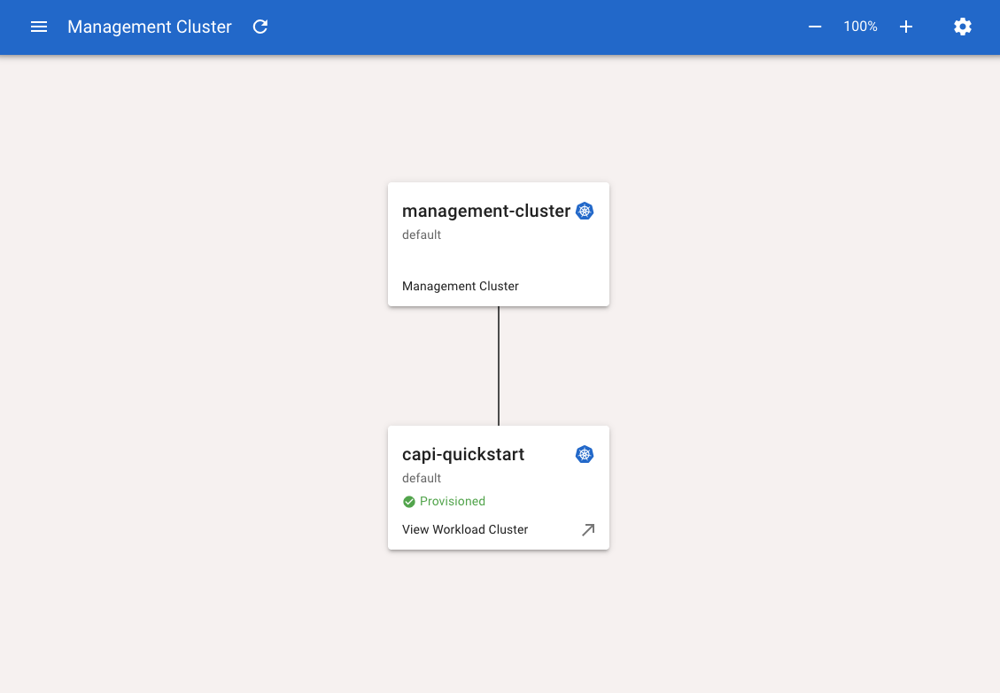
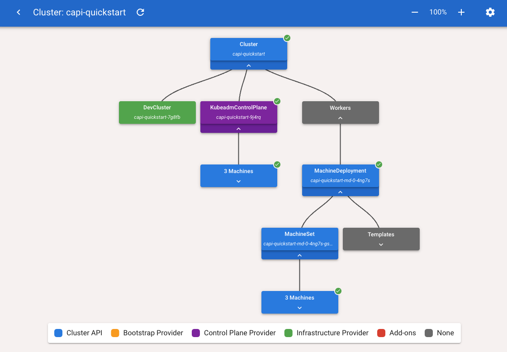

# Cluster API Visualizer 설치 및 확인

Cluster API 리소스 연관 관계 이해 및 디버깅 용도로 Visualzer 대시보드를 설치해보자.
- https://github.com/Jont828/cluster-api-visualizer/tree/main/helm
- Cluster API 리소스 자체는 ArgoCD로 봐도 대부분의 연관 관계가 보이지만, 위의 대시보드는 Cluster API를 기준으로 개발되었기에 좀 더 상세한 확인이 가능하다.

```bash
[root@k8s-node1 cluster-api]# helm repo add cluster-api-visualizer https://jont828.github.io/cluster-api-visualizer/charts
"cluster-api-visualizer" has been added to your repositories

[root@k8s-node1 cluster-api]# cat <<EOT > cluster-api-visualizer-values.yaml
replicas: 1

image:
  repository: ghcr.io/jont828
  name: cluster-api-visualizer
  imagePullPolicy: Always

label: 
  key: app
  value: capi-visualizer

service:
  type: NodePort # 이건 각자 환경에 맞게 설정하기.

EOT

[root@k8s-node1 cluster-api]# helm list
NAME    NAMESPACE       REVISION        UPDATED STATUS  CHART   APP VERSION


# 배포
[root@k8s-node1 cluster-api]# helm install cluster-api-visualizer cluster-api-visualizer/cluster-api-visualizer -n capi-system -f cluster-api-visualizer-values.yaml
NAME: cluster-api-visualizer
LAST DEPLOYED: Sun Feb 22 15:22:23 2026
NAMESPACE: capi-system
STATUS: deployed
REVISION: 1
TEST SUITE: None
```

이제 노출된 Service로 확인해보면, 첫 화면은 아래처럼 보인다.


방금 만든 `capi-quickstart` 클러스터를 클릭하면, 해당 클러스터의 Cluster API 리소스의 상세 연관 관계를 볼 수 있다.


이렇게 cluster-api-visualizer로 Management <-> Workload 연관 관계나, Cluster API 리소스 간의 연관 관계를 파악해볼 수 있다.